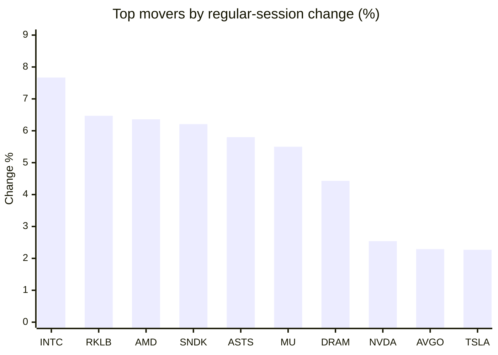
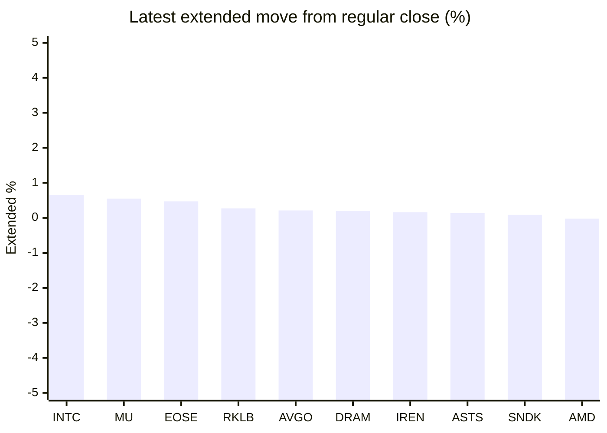

# Stock Brief - 2026-09-18

Generated at 2026-09-18 14:12 +07 from `watchlist.md`.
Prices are snapshots from Yahoo Finance public chart data. Extended/overnight is the latest available pre/post-market datapoint from the same feed.

## Market Snapshot

- SPY: close 762.60, latest extended 760.83, regular move +1.13%, extended move -0.23%
- QQQ: close 716.92, latest extended 715.80, regular move +1.73%, extended move -0.16%
- JEPQ: close 59.95, latest extended 59.90, regular move +1.46%, extended move -0.08%

## Watchlist Prices

| Ticker | Name | Regular close | Latest extended/overnight | Regular move | Extended move | Latest data time | Source |
|---|---|---:|---:|---:|---:|---|---|
| INTC | Intel Corporation | 108.80 USD | 109.50 USD | +7.67% | +0.65% | 2026-09-17 19:59 EDT | [Yahoo](https://finance.yahoo.com/quote/INTC/) |
| AVGO | Broadcom Inc. | 347.30 USD | 348.04 USD | +2.29% | +0.21% | 2026-09-17 19:59 EDT | [Yahoo](https://finance.yahoo.com/quote/AVGO/) |
| RKLB | Rocket Lab Corporation | 67.82 USD | 68.00 USD | +6.47% | +0.27% | 2026-09-17 19:59 EDT | [Yahoo](https://finance.yahoo.com/quote/RKLB/) |
| AAPL | Apple Inc. | 337.00 USD | 336.13 USD | +1.38% | -0.26% | 2026-09-17 19:59 EDT | [Yahoo](https://finance.yahoo.com/quote/AAPL/) |
| NVDA | NVIDIA Corporation | 219.34 USD | 219.23 USD | +2.54% | -0.05% | 2026-09-17 19:59 EDT | [Yahoo](https://finance.yahoo.com/quote/NVDA/) |
| TSLA | Tesla, Inc. | 366.20 USD | 365.65 USD | +2.27% | -0.15% | 2026-09-17 19:59 EDT | [Yahoo](https://finance.yahoo.com/quote/TSLA/) |
| SNDK | Sandisk Corporation | 1,614.39 USD | 1,615.90 USD | +6.21% | +0.09% | 2026-09-17 19:59 EDT | [Yahoo](https://finance.yahoo.com/quote/SNDK/) |
| QQQ | Invesco QQQ Trust, Series 1 | 716.92 USD | 715.80 USD | +1.73% | -0.16% | 2026-09-17 19:59 EDT | [Yahoo](https://finance.yahoo.com/quote/QQQ/) |
| SPY | State Street SPDR S&P 500 ETF T | 762.60 USD | 760.83 USD | +1.13% | -0.23% | 2026-09-17 20:00 EDT | [Yahoo](https://finance.yahoo.com/quote/SPY/) |
| JEPQ | JPMorgan Nasdaq Equity Premium  | 59.95 USD | 59.90 USD | +1.46% | -0.08% | 2026-09-17 19:59 EDT | [Yahoo](https://finance.yahoo.com/quote/JEPQ/) |
| ASTS | AST SpaceMobile, Inc. | 62.71 USD | 62.80 USD | +5.80% | +0.14% | 2026-09-17 19:59 EDT | [Yahoo](https://finance.yahoo.com/quote/ASTS/) |
| MU | Micron Technology, Inc. | 977.50 USD | 982.91 USD | +5.50% | +0.55% | 2026-09-17 19:59 EDT | [Yahoo](https://finance.yahoo.com/quote/MU/) |
| IREN | IREN LIMITED | 43.48 USD | 43.55 USD | +2.02% | +0.16% | 2026-09-17 19:59 EDT | [Yahoo](https://finance.yahoo.com/quote/IREN/) |
| EOSE | Eos Energy Enterprises, Inc. | 3.98 USD | 4.00 USD | +1.14% | +0.47% | 2026-09-17 19:59 EDT | [Yahoo](https://finance.yahoo.com/quote/EOSE/) |
| GOOG | Alphabet Inc. | 343.68 USD | 343.14 USD | +1.27% | -0.16% | 2026-09-17 19:59 EDT | [Yahoo](https://finance.yahoo.com/quote/GOOG/) |
| DRAM | Roundhill Memory ETF | 57.78 USD | 57.89 USD | +4.43% | +0.19% | 2026-09-17 19:59 EDT | [Yahoo](https://finance.yahoo.com/quote/DRAM/) |
| AMD | Advanced Micro Devices, Inc. | 545.09 USD | 545.00 USD | +6.36% | -0.02% | 2026-09-17 19:59 EDT | [Yahoo](https://finance.yahoo.com/quote/AMD/) |
| ASML | ASML Holding N.V. - New York Re | 1,629.67 USD | 1,626.46 USD | +1.71% | -0.20% | 2026-09-17 19:59 EDT | [Yahoo](https://finance.yahoo.com/quote/ASML/) |

## Charts

### Top Movers - Regular Session

### Extended / Overnight Move

### Quick Heatmap

| Group | Names in watchlist | Avg regular move | Avg extended move |
|---|---|---:|---:|
| Mega-cap tech | AVGO, AAPL, NVDA, TSLA, GOOG | +1.95% | -0.08% |
| Semis / memory | INTC, SNDK, MU, DRAM, AMD, ASML | +5.31% | +0.21% |
| Space / high beta | RKLB, ASTS, IREN, EOSE | +3.86% | +0.26% |
| ETFs | QQQ, SPY, JEPQ | +1.44% | -0.16% |

## News Headlines

- [Tesla vs SpaceX: Which Is the Better Elon Musk-Backed Stock to Buy?](https://www.fool.com/investing/2026/09/18/tesla-vs-spacex-which-is-the-better-elon-musk-back/?.tsrc=rss) (2026-09-18 13:50 Bangkok)
- [RKLB, ASTS, VOYG, LUNR Steal SpaceX’s Thunder — Here’s What Lit Up Space Stocks This Week](https://stocktwits.com/news-articles/markets/equity/rklb-asts-voyg-lunr-steal-spacex-thunder-what-lit-up-space-stocks-this-week/cZtuNpRRB3O?.tsrc=rss) (2026-09-18 13:44 Bangkok)
- [Micron's Largest Production Base Faces Strike Threats as Bonus Falls 'Short of Expectations,' Workers Demand Bigger Cut of AI-Driven Profits: Report](https://finance.yahoo.com/markets/stocks/articles/microns-largest-production-faces-strike-052010224.html?.tsrc=rss) (2026-09-18 12:20 Bangkok)
- [ASTS Retail Sentiment Nears 1-Year Low As SpaceX Turns Up The Heat In Global Mobile Race](https://stocktwits.com/news-articles/markets/equity/asts-retail-sentiment-1-year-low-spacex-turns-up-heat-global-mobile-race/cZtulTMRB33?.tsrc=rss) (2026-09-18 12:04 Bangkok)
- [Sandisk Unveiled an $14 Billion Buyback and Warren Buffett Has Something to Say About It](https://www.fool.com/investing/2026/09/18/sandisk-unveiled-an-14-billion-buyback-and-warren/?.tsrc=rss) (2026-09-18 11:20 Bangkok)
- [Early Uber Investor Sees ‘All Car Companies’ Joining Robotaxi Gold Rush — Lucid And Baidu Take It Global](https://stocktwits.com/news-articles/markets/equity/early-uber-investor-all-car-companies-robotaxi-gold-rush-lucid-baidu-global/cZtuKgwRBd6?.tsrc=rss) (2026-09-18 10:24 Bangkok)
- [INTC, AMD, MU, NVDA: Chip Stocks Rally As Investors Look Past AI Concerns](https://stocktwits.com/news-articles/markets/equity/intc-amd-mu-nvda-chip-stocks-rally-as-investors-look-past-ai-concerns/cZtuLZsRBdw?.tsrc=rss) (2026-09-18 09:17 Bangkok)
- [TSLA Trades About 20% Below Fair Value, Says Analyst — But Retail Stays Bearish Amid Cybercab Scrutiny, SpaceX Merger Buzz](https://stocktwits.com/news-articles/markets/equity/tsla-below-fair-value-analyst-retail-bearish-cybercab-scrutiny-spacex-merger-buzz/cZtuL7ERBdH?.tsrc=rss) (2026-09-18 09:03 Bangkok)

## Caveats

- This is not investment advice. Extended-hours prices can be thin and volatile.
- Yahoo public endpoints may lag official exchange data.
