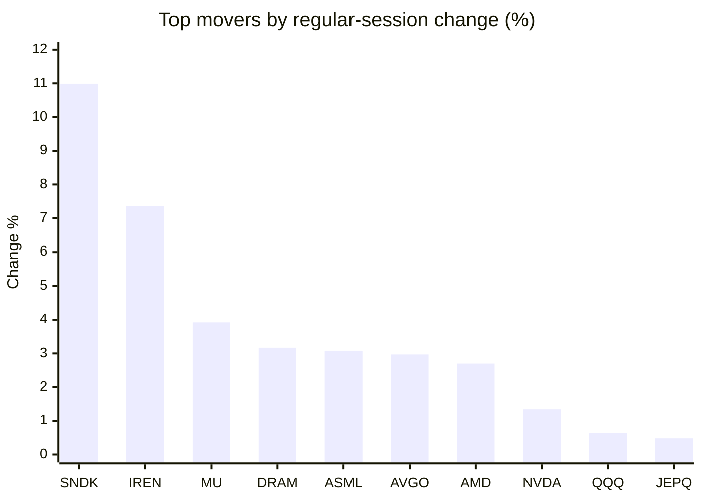
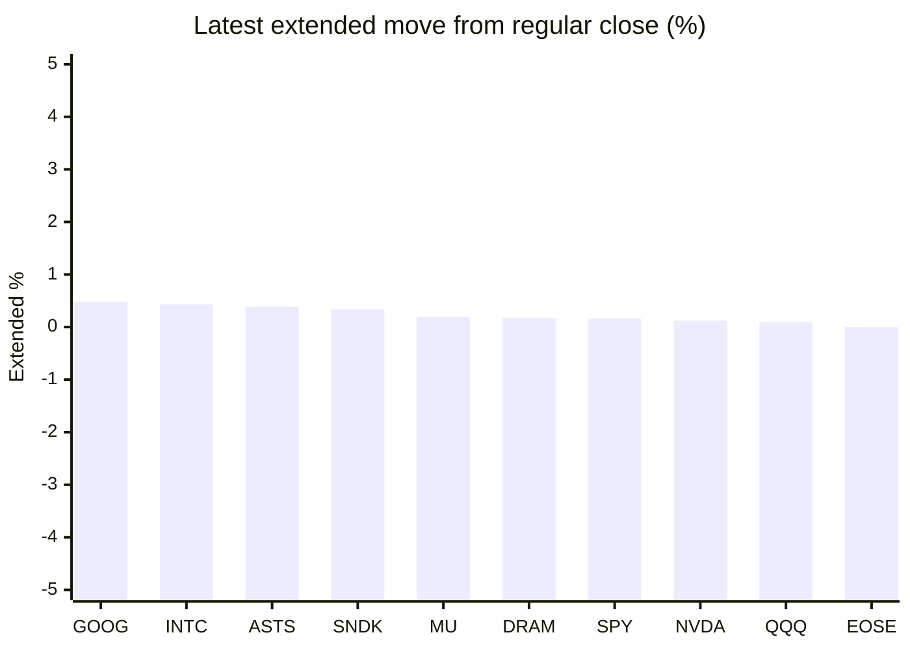

# Stock Brief - 2026-09-20

Generated at 2026-09-20 14:35 +07 from `watchlist.md`.
Prices are snapshots from Yahoo Finance public chart data. Extended/overnight is the latest available pre/post-market datapoint from the same feed.

## Market Snapshot

- SPY: close 761.69, latest extended 762.94, regular move -0.12%, extended move +0.16%
- QQQ: close 721.45, latest extended 722.10, regular move +0.63%, extended move +0.09%
- JEPQ: close 60.24, latest extended 60.22, regular move +0.48%, extended move -0.03%

## Watchlist Prices

| Ticker | Name | Regular close | Latest extended/overnight | Regular move | Extended move | Latest data time | Source |
|---|---|---:|---:|---:|---:|---|---|
| INTC | Intel Corporation | 108.60 USD | 109.07 USD | -0.18% | +0.43% | 2026-09-18 19:59 EDT | [Yahoo](https://finance.yahoo.com/quote/INTC/) |
| AVGO | Broadcom Inc. | 357.61 USD | 356.90 USD | +2.97% | -0.20% | 2026-09-18 19:59 EDT | [Yahoo](https://finance.yahoo.com/quote/AVGO/) |
| RKLB | Rocket Lab Corporation | 64.57 USD | 64.45 USD | -4.79% | -0.19% | 2026-09-18 19:59 EDT | [Yahoo](https://finance.yahoo.com/quote/RKLB/) |
| AAPL | Apple Inc. | 336.13 USD | 334.80 USD | -0.26% | -0.40% | 2026-09-18 19:59 EDT | [Yahoo](https://finance.yahoo.com/quote/AAPL/) |
| NVDA | NVIDIA Corporation | 222.27 USD | 222.53 USD | +1.34% | +0.12% | 2026-09-18 19:59 EDT | [Yahoo](https://finance.yahoo.com/quote/NVDA/) |
| TSLA | Tesla, Inc. | 364.27 USD | 364.18 USD | -0.53% | -0.02% | 2026-09-18 19:59 EDT | [Yahoo](https://finance.yahoo.com/quote/TSLA/) |
| SNDK | Sandisk Corporation | 1,791.82 USD | 1,798.00 USD | +10.99% | +0.34% | 2026-09-18 19:59 EDT | [Yahoo](https://finance.yahoo.com/quote/SNDK/) |
| QQQ | Invesco QQQ Trust, Series 1 | 721.45 USD | 722.10 USD | +0.63% | +0.09% | 2026-09-18 19:59 EDT | [Yahoo](https://finance.yahoo.com/quote/QQQ/) |
| SPY | State Street SPDR S&P 500 ETF T | 761.69 USD | 762.94 USD | -0.12% | +0.16% | 2026-09-18 19:59 EDT | [Yahoo](https://finance.yahoo.com/quote/SPY/) |
| JEPQ | JPMorgan Nasdaq Equity Premium  | 60.24 USD | 60.22 USD | +0.48% | -0.03% | 2026-09-18 19:59 EDT | [Yahoo](https://finance.yahoo.com/quote/JEPQ/) |
| ASTS | AST SpaceMobile, Inc. | 58.52 USD | 58.75 USD | -6.68% | +0.39% | 2026-09-18 19:59 EDT | [Yahoo](https://finance.yahoo.com/quote/ASTS/) |
| MU | Micron Technology, Inc. | 1,015.80 USD | 1,017.75 USD | +3.92% | +0.19% | 2026-09-18 19:59 EDT | [Yahoo](https://finance.yahoo.com/quote/MU/) |
| IREN | IREN LIMITED | 46.68 USD | 46.55 USD | +7.36% | -0.28% | 2026-09-18 19:59 EDT | [Yahoo](https://finance.yahoo.com/quote/IREN/) |
| EOSE | Eos Energy Enterprises, Inc. | 3.96 USD | 3.96 USD | -0.50% | -0.00% | 2026-09-18 19:59 EDT | [Yahoo](https://finance.yahoo.com/quote/EOSE/) |
| GOOG | Alphabet Inc. | 344.41 USD | 346.08 USD | +0.21% | +0.48% | 2026-09-18 19:59 EDT | [Yahoo](https://finance.yahoo.com/quote/GOOG/) |
| DRAM | Roundhill Memory ETF | 59.61 USD | 59.71 USD | +3.17% | +0.17% | 2026-09-18 19:59 EDT | [Yahoo](https://finance.yahoo.com/quote/DRAM/) |
| AMD | Advanced Micro Devices, Inc. | 559.82 USD | 557.98 USD | +2.70% | -0.33% | 2026-09-18 19:59 EDT | [Yahoo](https://finance.yahoo.com/quote/AMD/) |
| ASML | ASML Holding N.V. - New York Re | 1,679.92 USD | 1,670.57 USD | +3.08% | -0.56% | 2026-09-18 19:59 EDT | [Yahoo](https://finance.yahoo.com/quote/ASML/) |

## Charts

### Top Movers - Regular Session

### Extended / Overnight Move

### Quick Heatmap

| Group | Names in watchlist | Avg regular move | Avg extended move |
|---|---|---:|---:|
| Mega-cap tech | AVGO, AAPL, NVDA, TSLA, GOOG | +0.75% | -0.00% |
| Semis / memory | INTC, SNDK, MU, DRAM, AMD, ASML | +3.95% | +0.04% |
| Space / high beta | RKLB, ASTS, IREN, EOSE | -1.15% | -0.02% |
| ETFs | QQQ, SPY, JEPQ | +0.33% | +0.07% |

## News Headlines

- [This Overlooked Pipeline Stock Just Became a Rival's Joint-Venture Partner Without Anyone Noticing](https://www.fool.com/investing/2026/09/20/this-overlooked-pipeline-stock-just-became-a-rival/?.tsrc=rss) (2026-09-20 12:35 Bangkok)
- [SanDisk Stock Jumped 11% on S&P 100 News. Here’s What the Street Says.](https://www.tikr.com/blog/sandisk-stock-jumped-11-on-sp-100-news-heres-what-the-street-says?ref=yahoofinance&.tsrc=rss) (2026-09-20 11:28 Bangkok)
- [Prediction: Here's What a $1,000 Investment in Tesla (TSLA) Stock Could Be Worth By 2036](https://www.fool.com/investing/2026/09/19/prediction-what-1000-invested-in-tesla-tsla-stock/?.tsrc=rss) (2026-09-20 10:40 Bangkok)
- [Dow Jones Futures: Can The Market Rally Take Flight? Robinhood, Sandisk, AMD, Moderna Surge Into Buy Areas](https://finance.yahoo.com/m/832159c8-6dc5-38e6-b838-d7db7090ca09/dow-jones-futures%3A-can-the.html?.tsrc=rss) (2026-09-20 09:41 Bangkok)
- [Nvidia Stock And 2 US AI Infrastructure Plays Tied To Federal Defense Spending](https://finance.yahoo.com/technology/ai/articles/nvidia-stock-2-us-ai-021149518.html?.tsrc=rss) (2026-09-20 09:11 Bangkok)
- [Nine Years, Eight Delays, and Now Rocket Thrusters: Tesla Finally Sets a Roadster Date](https://finance.yahoo.com/markets/stocks/articles/nine-years-eight-delays-now-021106695.html?.tsrc=rss) (2026-09-20 09:11 Bangkok)
- [History Says Buying the Nasdaq-100 at the Dot-Com Peak Still (Eventually) Turned $10,000 Into About $72,000](https://www.fool.com/investing/2026/09/19/history-says-buying-the-nasdaq-100-at-the-dot-com-peak-still-eventually-turned-usd10-000-into-about-usd72-000/?.tsrc=rss) (2026-09-20 08:54 Bangkok)
- [Applied Materials vs. Nvidia: Which Tech Stock Is a Better Buy in 2026?](https://www.fool.com/coverage/better-buy/2026/09/19/applied-materials-vs-nvidia-which-tech-stock-is-a-better-buy-in-2026/?.tsrc=rss) (2026-09-20 08:35 Bangkok)

## Caveats

- This is not investment advice. Extended-hours prices can be thin and volatile.
- Yahoo public endpoints may lag official exchange data.
