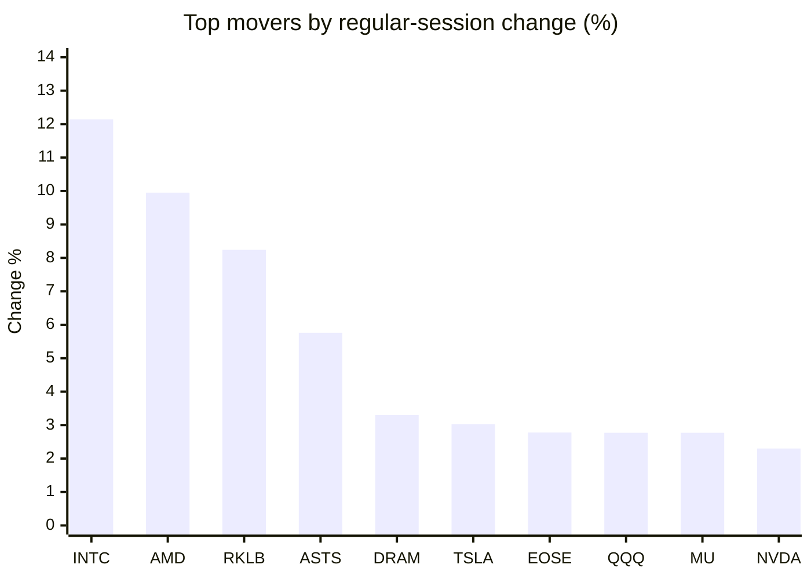
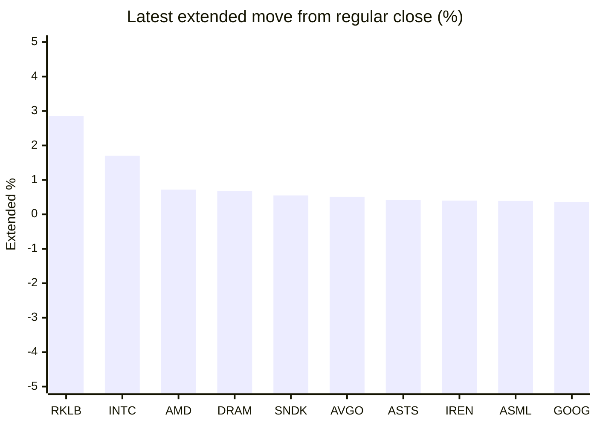

# Stock Brief - 2026-09-22

Generated at 2026-09-22 14:29 +07 from `watchlist.md`.
Prices are snapshots from Yahoo Finance public chart data. Extended/overnight is the latest available pre/post-market datapoint from the same feed.

## Market Snapshot

- SPY: close 773.50, latest extended 773.83, regular move +1.55%, extended move +0.04%
- QQQ: close 741.47, latest extended 742.99, regular move +2.77%, extended move +0.20%
- JEPQ: close 61.01, latest extended 61.04, regular move +1.28%, extended move +0.05%

## Watchlist Prices

| Ticker | Name | Regular close | Latest extended/overnight | Regular move | Extended move | Latest data time | Source |
|---|---|---:|---:|---:|---:|---|---|
| INTC | Intel Corporation | 121.78 USD | 123.85 USD | +12.14% | +1.70% | 2026-09-21 19:59 EDT | [Yahoo](https://finance.yahoo.com/quote/INTC/) |
| AVGO | Broadcom Inc. | 362.66 USD | 364.50 USD | +1.41% | +0.51% | 2026-09-21 19:59 EDT | [Yahoo](https://finance.yahoo.com/quote/AVGO/) |
| RKLB | Rocket Lab Corporation | 69.89 USD | 71.88 USD | +8.24% | +2.85% | 2026-09-21 19:59 EDT | [Yahoo](https://finance.yahoo.com/quote/RKLB/) |
| AAPL | Apple Inc. | 338.98 USD | 338.71 USD | +0.85% | -0.08% | 2026-09-21 19:59 EDT | [Yahoo](https://finance.yahoo.com/quote/AAPL/) |
| NVDA | NVIDIA Corporation | 227.38 USD | 227.29 USD | +2.30% | -0.04% | 2026-09-21 19:59 EDT | [Yahoo](https://finance.yahoo.com/quote/NVDA/) |
| TSLA | Tesla, Inc. | 375.30 USD | 375.28 USD | +3.03% | -0.01% | 2026-09-21 19:59 EDT | [Yahoo](https://finance.yahoo.com/quote/TSLA/) |
| SNDK | Sandisk Corporation | 1,766.64 USD | 1,776.34 USD | -1.41% | +0.55% | 2026-09-21 19:59 EDT | [Yahoo](https://finance.yahoo.com/quote/SNDK/) |
| QQQ | Invesco QQQ Trust, Series 1 | 741.47 USD | 742.99 USD | +2.77% | +0.20% | 2026-09-21 19:59 EDT | [Yahoo](https://finance.yahoo.com/quote/QQQ/) |
| SPY | State Street SPDR S&P 500 ETF T | 773.50 USD | 773.83 USD | +1.55% | +0.04% | 2026-09-21 19:59 EDT | [Yahoo](https://finance.yahoo.com/quote/SPY/) |
| JEPQ | JPMorgan Nasdaq Equity Premium  | 61.01 USD | 61.04 USD | +1.28% | +0.05% | 2026-09-21 19:59 EDT | [Yahoo](https://finance.yahoo.com/quote/JEPQ/) |
| ASTS | AST SpaceMobile, Inc. | 61.89 USD | 62.15 USD | +5.76% | +0.42% | 2026-09-21 19:59 EDT | [Yahoo](https://finance.yahoo.com/quote/ASTS/) |
| MU | Micron Technology, Inc. | 1,043.96 USD | 1,044.26 USD | +2.77% | +0.03% | 2026-09-21 19:59 EDT | [Yahoo](https://finance.yahoo.com/quote/MU/) |
| IREN | IREN LIMITED | 47.23 USD | 47.42 USD | +1.18% | +0.40% | 2026-09-21 19:59 EDT | [Yahoo](https://finance.yahoo.com/quote/IREN/) |
| EOSE | Eos Energy Enterprises, Inc. | 4.07 USD | 4.07 USD | +2.78% | -0.02% | 2026-09-21 19:59 EDT | [Yahoo](https://finance.yahoo.com/quote/EOSE/) |
| GOOG | Alphabet Inc. | 350.87 USD | 352.15 USD | +1.88% | +0.36% | 2026-09-21 19:59 EDT | [Yahoo](https://finance.yahoo.com/quote/GOOG/) |
| DRAM | Roundhill Memory ETF | 61.58 USD | 61.99 USD | +3.30% | +0.67% | 2026-09-21 19:59 EDT | [Yahoo](https://finance.yahoo.com/quote/DRAM/) |
| AMD | Advanced Micro Devices, Inc. | 615.52 USD | 619.98 USD | +9.95% | +0.72% | 2026-09-21 19:59 EDT | [Yahoo](https://finance.yahoo.com/quote/AMD/) |
| ASML | ASML Holding N.V. - New York Re | 1,711.32 USD | 1,717.99 USD | +1.87% | +0.39% | 2026-09-21 19:59 EDT | [Yahoo](https://finance.yahoo.com/quote/ASML/) |

## Charts

### Top Movers - Regular Session

### Extended / Overnight Move

### Quick Heatmap

| Group | Names in watchlist | Avg regular move | Avg extended move |
|---|---|---:|---:|
| Mega-cap tech | AVGO, AAPL, NVDA, TSLA, GOOG | +1.89% | +0.15% |
| Semis / memory | INTC, SNDK, MU, DRAM, AMD, ASML | +4.77% | +0.68% |
| Space / high beta | RKLB, ASTS, IREN, EOSE | +4.49% | +0.91% |
| ETFs | QQQ, SPY, JEPQ | +1.87% | +0.10% |

## News Headlines

- [Not Micron. Not Alphabet. Here's My Top Artificial Intelligence (AI) Stock Pick for the Next 3 Years.](https://www.fool.com/investing/2026/09/22/not-micron-not-alphabet-heres-my-top-artificial-in/?.tsrc=rss) (2026-09-22 13:50 Bangkok)
- [History Says a $1,000 Investment in Broadcom Will Be Worth This Much by 2028](https://www.fool.com/investing/2026/09/22/history-says-a-1000-investment-in-broadcom-will-be/?.tsrc=rss) (2026-09-22 13:35 Bangkok)
- [TSLA, SPCX, AAPL Could Be Next To ‘Rip’ After Meta’s Muse Rally, Analyst Says — Here Are The Catalysts](https://stocktwits.com/news-articles/markets/equity/tsla-spcx-aapl-next-to-rip-meta-muse-rally-analyst-here-are-the-catalysts/cZMPg4uRBe4?.tsrc=rss) (2026-09-22 13:02 Bangkok)
- [Intel (INTC) Sees AI CPU Demand Squeeze As CEO Flags 50% Fulfillment](https://finance.yahoo.com/technology/ai/articles/intel-intc-sees-ai-cpu-051505418.html?.tsrc=rss) (2026-09-22 12:15 Bangkok)
- [RKLB Stock Extends Rally Overnight: CEO Says Iridium Deal Will Forge A Self-Launching ‘Tier-1 Space Power’](https://stocktwits.com/news-articles/markets/equity/rklb-stock-ceo-iridium-deal-self-launching-tier-1-space-power/cZMPBHLRBIz?.tsrc=rss) (2026-09-22 10:58 Bangkok)
- [Nvidia's Forecast Assumes No Data Center Chip Sales to China. The Sept. 24 U.S.-China Summit Could Change That.](https://www.fool.com/investing/2026/09/21/nvidia-s-forecast-assumes-no-data-center-chip-sales-to-china-the-sept-24-u-s-china-summit-could-change-that/?.tsrc=rss) (2026-09-22 10:13 Bangkok)
- [Apple Launches New Products in Time for New CEO](https://www.fool.com/investing/2026/09/21/apple-launches-new-products-in-time-for-new-ceo/?.tsrc=rss) (2026-09-22 10:02 Bangkok)
- [How Tim Cook Set Up Apple Stock's Next Growth Era, Explains Jim Cramer](https://beincrypto.com/tim-cook-apple-stock-growth-cramer/?.tsrc=rss) (2026-09-22 09:35 Bangkok)

## Caveats

- This is not investment advice. Extended-hours prices can be thin and volatile.
- Yahoo public endpoints may lag official exchange data.
