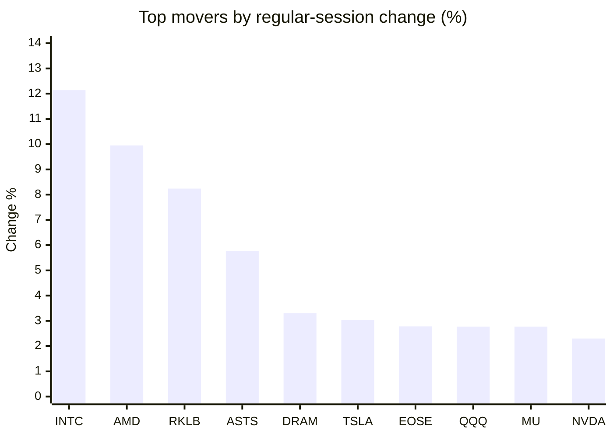
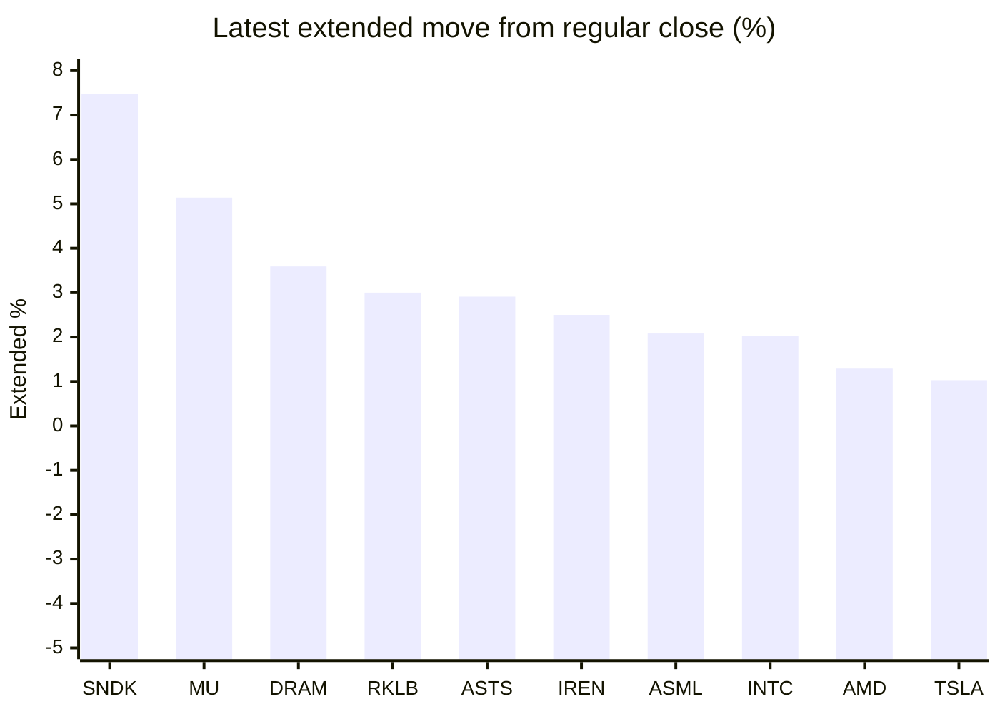

# Stock Brief - 2026-09-23

Generated at 2026-09-23 14:32 +07 from `watchlist.md`.
Prices are snapshots from Yahoo Finance public chart data. Extended/overnight is the latest available pre/post-market datapoint from the same feed.

## Market Snapshot

- SPY: close 773.50, latest extended 773.74, regular move +1.55%, extended move +0.03%
- QQQ: close 741.47, latest extended 748.32, regular move +2.77%, extended move +0.92%
- JEPQ: close 61.01, latest extended 61.25, regular move +1.28%, extended move +0.39%

## Watchlist Prices

| Ticker | Name | Regular close | Latest extended/overnight | Regular move | Extended move | Latest data time | Source |
|---|---|---:|---:|---:|---:|---|---|
| INTC | Intel Corporation | 121.78 USD | 124.24 USD | +12.14% | +2.02% | 2026-09-22 19:59 EDT | [Yahoo](https://finance.yahoo.com/quote/INTC/) |
| AVGO | Broadcom Inc. | 362.66 USD | 366.03 USD | +1.41% | +0.93% | 2026-09-22 19:59 EDT | [Yahoo](https://finance.yahoo.com/quote/AVGO/) |
| RKLB | Rocket Lab Corporation | 69.89 USD | 71.99 USD | +8.24% | +3.00% | 2026-09-22 19:59 EDT | [Yahoo](https://finance.yahoo.com/quote/RKLB/) |
| AAPL | Apple Inc. | 338.98 USD | 339.89 USD | +0.85% | +0.27% | 2026-09-22 19:59 EDT | [Yahoo](https://finance.yahoo.com/quote/AAPL/) |
| NVDA | NVIDIA Corporation | 227.38 USD | 228.56 USD | +2.30% | +0.52% | 2026-09-22 19:59 EDT | [Yahoo](https://finance.yahoo.com/quote/NVDA/) |
| TSLA | Tesla, Inc. | 375.30 USD | 379.15 USD | +3.03% | +1.03% | 2026-09-22 19:59 EDT | [Yahoo](https://finance.yahoo.com/quote/TSLA/) |
| SNDK | Sandisk Corporation | 1,766.64 USD | 1,898.69 USD | -1.41% | +7.47% | 2026-09-22 19:59 EDT | [Yahoo](https://finance.yahoo.com/quote/SNDK/) |
| QQQ | Invesco QQQ Trust, Series 1 | 741.47 USD | 748.32 USD | +2.77% | +0.92% | 2026-09-22 19:59 EDT | [Yahoo](https://finance.yahoo.com/quote/QQQ/) |
| SPY | State Street SPDR S&P 500 ETF T | 773.50 USD | 773.74 USD | +1.55% | +0.03% | 2026-09-22 19:59 EDT | [Yahoo](https://finance.yahoo.com/quote/SPY/) |
| JEPQ | JPMorgan Nasdaq Equity Premium  | 61.01 USD | 61.25 USD | +1.28% | +0.39% | 2026-09-22 19:59 EDT | [Yahoo](https://finance.yahoo.com/quote/JEPQ/) |
| ASTS | AST SpaceMobile, Inc. | 61.89 USD | 63.69 USD | +5.76% | +2.91% | 2026-09-22 19:59 EDT | [Yahoo](https://finance.yahoo.com/quote/ASTS/) |
| MU | Micron Technology, Inc. | 1,043.96 USD | 1,097.63 USD | +2.77% | +5.14% | 2026-09-22 19:59 EDT | [Yahoo](https://finance.yahoo.com/quote/MU/) |
| IREN | IREN LIMITED | 47.23 USD | 48.41 USD | +1.18% | +2.50% | 2026-09-22 19:59 EDT | [Yahoo](https://finance.yahoo.com/quote/IREN/) |
| EOSE | Eos Energy Enterprises, Inc. | 4.07 USD | 4.07 USD | +2.78% | -0.00% | 2026-09-22 19:59 EDT | [Yahoo](https://finance.yahoo.com/quote/EOSE/) |
| GOOG | Alphabet Inc. | 350.87 USD | 348.27 USD | +1.88% | -0.74% | 2026-09-22 19:59 EDT | [Yahoo](https://finance.yahoo.com/quote/GOOG/) |
| DRAM | Roundhill Memory ETF | 61.58 USD | 63.79 USD | +3.30% | +3.59% | 2026-09-22 19:59 EDT | [Yahoo](https://finance.yahoo.com/quote/DRAM/) |
| AMD | Advanced Micro Devices, Inc. | 615.52 USD | 623.47 USD | +9.95% | +1.29% | 2026-09-22 19:59 EDT | [Yahoo](https://finance.yahoo.com/quote/AMD/) |
| ASML | ASML Holding N.V. - New York Re | 1,711.32 USD | 1,746.92 USD | +1.87% | +2.08% | 2026-09-22 19:59 EDT | [Yahoo](https://finance.yahoo.com/quote/ASML/) |

## Charts

### Top Movers - Regular Session

### Extended / Overnight Move

### Quick Heatmap

| Group | Names in watchlist | Avg regular move | Avg extended move |
|---|---|---:|---:|
| Mega-cap tech | AVGO, AAPL, NVDA, TSLA, GOOG | +1.89% | +0.40% |
| Semis / memory | INTC, SNDK, MU, DRAM, AMD, ASML | +4.77% | +3.60% |
| Space / high beta | RKLB, ASTS, IREN, EOSE | +4.49% | +2.10% |
| ETFs | QQQ, SPY, JEPQ | +1.87% | +0.45% |

## News Headlines

- [If the Market Crashes, This Is the 1 Space Stock I Can't Wait to Buy](https://www.fool.com/investing/2026/09/23/if-the-market-crashes-this-is-the-1-space-stock-i/?.tsrc=rss) (2026-09-23 13:25 Bangkok)
- [Trump-Xi Summit Could Reset Trade Tensions. 3 Things Investors Are Watching.](https://finance.yahoo.com/m/cf5c08e0-b082-3348-82fb-63717b1ff78e/trump-xi-summit-could-reset.html?.tsrc=rss) (2026-09-23 13:00 Bangkok)
- [Why Is NVIDIA Getting Cheaper While Apple Hits New All-Time Highs](https://beincrypto.com/apple-shares-all-time-high-nvidia-valuation/?.tsrc=rss) (2026-09-23 12:35 Bangkok)
- [Michael Burry Picks Chip Suppliers Over Micron — But Warns Memory Producers Could Sell Off 'Intensely'](https://stocktwits.com/news-articles/markets/equity/michael-burry-chip-suppliers-over-micron-warns-memory-producers-sell-off-intensely/cZMEkjgRB7t?.tsrc=rss) (2026-09-23 12:32 Bangkok)
- [Elon Musk Is Going All In on Nvidia, but Are These Two Chip Stocks Better Buys?](https://www.fool.com/investing/2026/09/23/elon-musk-is-going-all-in-on-nvidia-but-are-these/?.tsrc=rss) (2026-09-23 12:20 Bangkok)
- [Gary Black Says Legacy Automakers Will Not License Tesla FSD, Instead Bet on In-House Self-Driving Efforts: ‘Inclined to Build’](https://finance.yahoo.com/markets/stocks/articles/gary-black-says-legacy-automakers-051148151.html?.tsrc=rss) (2026-09-23 12:11 Bangkok)
- [SK Hynix Is Eyeing Intel’s (INTC) Ohio Site. Why Micron (MU) Should Pay Attention](https://finance.yahoo.com/technology/articles/sk-hynix-eyeing-intel-intc-043316388.html?.tsrc=rss) (2026-09-23 11:33 Bangkok)
- [Pat Gelsinger Just Backed a $100 Million Challenge to Nvidia’s AI Networking Moat. AMD Could Benefit](https://finance.yahoo.com/technology/ai/articles/pat-gelsinger-just-backed-100-042433352.html?.tsrc=rss) (2026-09-23 11:24 Bangkok)

## Caveats

- This is not investment advice. Extended-hours prices can be thin and volatile.
- Yahoo public endpoints may lag official exchange data.
