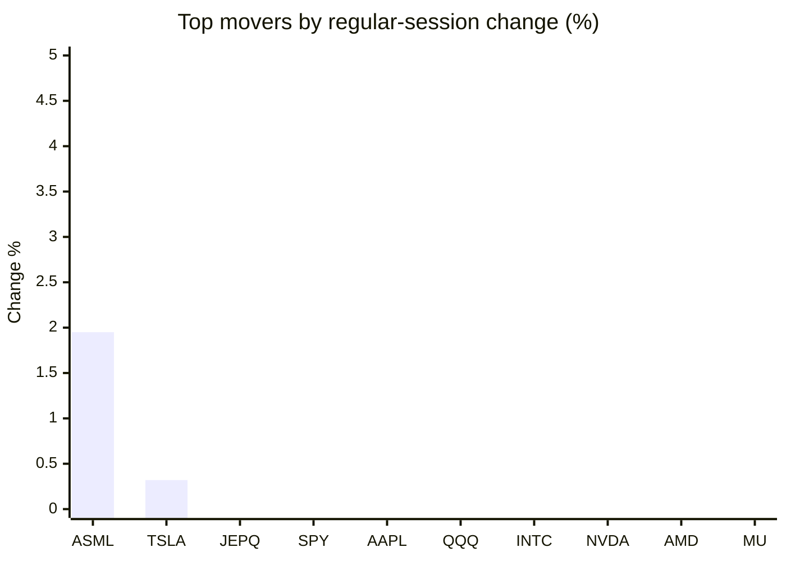
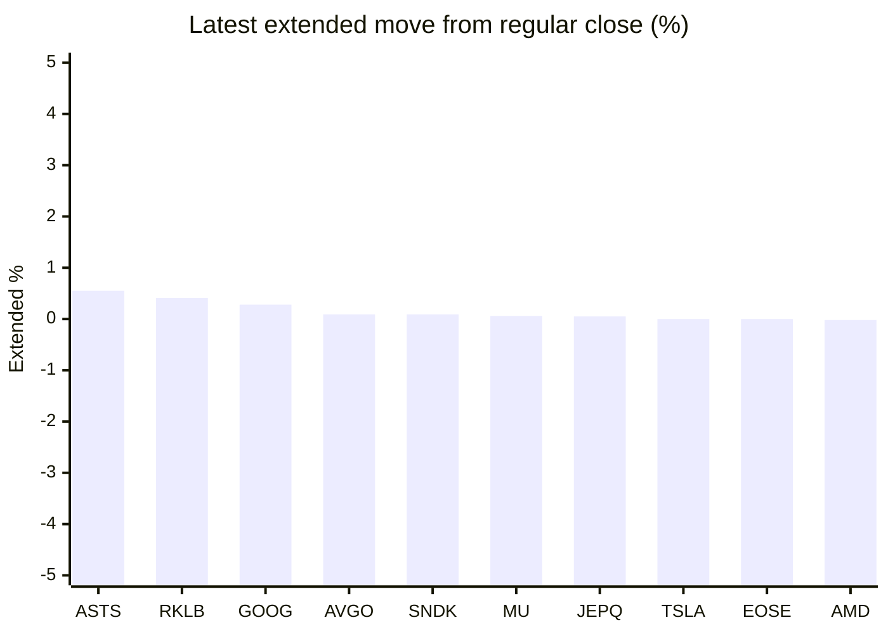

# Stock Brief - 2026-09-24

Generated at 2026-09-24 14:25 +07 from `watchlist.md`.
Prices are snapshots from Yahoo Finance public chart data. Extended/overnight is the latest available pre/post-market datapoint from the same feed.

## Market Snapshot

- SPY: close 767.81, latest extended 767.32, regular move -0.72%, extended move -0.06%
- QQQ: close 741.21, latest extended 740.80, regular move -0.84%, extended move -0.06%
- JEPQ: close 61.10, latest extended 61.13, regular move -0.11%, extended move +0.05%

## Watchlist Prices

| Ticker | Name | Regular close | Latest extended/overnight | Regular move | Extended move | Latest data time | Source |
|---|---|---:|---:|---:|---:|---|---|
| INTC | Intel Corporation | 122.60 USD | 122.12 USD | -1.02% | -0.39% | 2026-09-23 19:59 EDT | [Yahoo](https://finance.yahoo.com/quote/INTC/) |
| AVGO | Broadcom Inc. | 354.99 USD | 355.32 USD | -2.62% | +0.09% | 2026-09-23 19:59 EDT | [Yahoo](https://finance.yahoo.com/quote/AVGO/) |
| RKLB | Rocket Lab Corporation | 70.31 USD | 70.60 USD | -2.32% | +0.41% | 2026-09-23 19:59 EDT | [Yahoo](https://finance.yahoo.com/quote/RKLB/) |
| AAPL | Apple Inc. | 337.02 USD | 336.94 USD | -0.80% | -0.02% | 2026-09-23 19:59 EDT | [Yahoo](https://finance.yahoo.com/quote/AAPL/) |
| NVDA | NVIDIA Corporation | 225.51 USD | 225.04 USD | -1.47% | -0.21% | 2026-09-23 19:59 EDT | [Yahoo](https://finance.yahoo.com/quote/NVDA/) |
| TSLA | Tesla, Inc. | 380.12 USD | 380.13 USD | +0.32% | +0.00% | 2026-09-23 19:59 EDT | [Yahoo](https://finance.yahoo.com/quote/TSLA/) |
| SNDK | Sandisk Corporation | 1,816.57 USD | 1,818.18 USD | -3.73% | +0.09% | 2026-09-23 19:59 EDT | [Yahoo](https://finance.yahoo.com/quote/SNDK/) |
| QQQ | Invesco QQQ Trust, Series 1 | 741.21 USD | 740.80 USD | -0.84% | -0.06% | 2026-09-23 19:59 EDT | [Yahoo](https://finance.yahoo.com/quote/QQQ/) |
| SPY | State Street SPDR S&P 500 ETF T | 767.81 USD | 767.32 USD | -0.72% | -0.06% | 2026-09-23 19:59 EDT | [Yahoo](https://finance.yahoo.com/quote/SPY/) |
| JEPQ | JPMorgan Nasdaq Equity Premium  | 61.10 USD | 61.13 USD | -0.11% | +0.05% | 2026-09-23 19:56 EDT | [Yahoo](https://finance.yahoo.com/quote/JEPQ/) |
| ASTS | AST SpaceMobile, Inc. | 59.98 USD | 60.31 USD | -5.83% | +0.55% | 2026-09-23 19:59 EDT | [Yahoo](https://finance.yahoo.com/quote/ASTS/) |
| MU | Micron Technology, Inc. | 1,071.88 USD | 1,072.50 USD | -2.22% | +0.06% | 2026-09-23 19:59 EDT | [Yahoo](https://finance.yahoo.com/quote/MU/) |
| IREN | IREN LIMITED | 47.05 USD | 46.60 USD | -3.09% | -0.96% | 2026-09-23 19:59 EDT | [Yahoo](https://finance.yahoo.com/quote/IREN/) |
| EOSE | Eos Energy Enterprises, Inc. | 3.58 USD | 3.58 USD | -11.82% | -0.00% | 2026-09-23 19:59 EDT | [Yahoo](https://finance.yahoo.com/quote/EOSE/) |
| GOOG | Alphabet Inc. | 334.98 USD | 335.91 USD | -3.58% | +0.28% | 2026-09-23 19:59 EDT | [Yahoo](https://finance.yahoo.com/quote/GOOG/) |
| DRAM | Roundhill Memory ETF | 61.90 USD | 61.85 USD | -2.70% | -0.08% | 2026-09-23 19:59 EDT | [Yahoo](https://finance.yahoo.com/quote/DRAM/) |
| AMD | Advanced Micro Devices, Inc. | 614.61 USD | 614.51 USD | -1.47% | -0.02% | 2026-09-23 19:59 EDT | [Yahoo](https://finance.yahoo.com/quote/AMD/) |
| ASML | ASML Holding N.V. - New York Re | 1,744.61 USD | 1,743.15 USD | +1.95% | -0.08% | 2026-09-23 19:59 EDT | [Yahoo](https://finance.yahoo.com/quote/ASML/) |

## Charts

### Top Movers - Regular Session

### Extended / Overnight Move

### Quick Heatmap

| Group | Names in watchlist | Avg regular move | Avg extended move |
|---|---|---:|---:|
| Mega-cap tech | AVGO, AAPL, NVDA, TSLA, GOOG | -1.63% | +0.03% |
| Semis / memory | INTC, SNDK, MU, DRAM, AMD, ASML | -1.53% | -0.07% |
| Space / high beta | RKLB, ASTS, IREN, EOSE | -5.76% | +0.00% |
| ETFs | QQQ, SPY, JEPQ | -0.56% | -0.02% |

## News Headlines

- No Yahoo Finance RSS headlines were available during this run.

## Caveats

- This is not investment advice. Extended-hours prices can be thin and volatile.
- Yahoo public endpoints may lag official exchange data.
