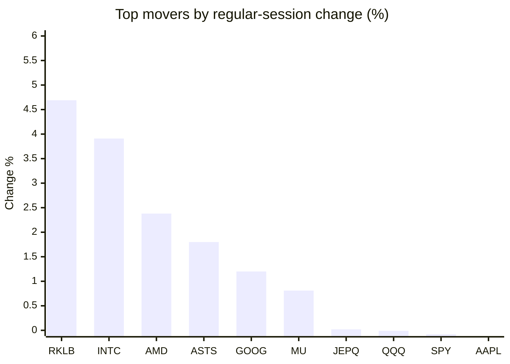
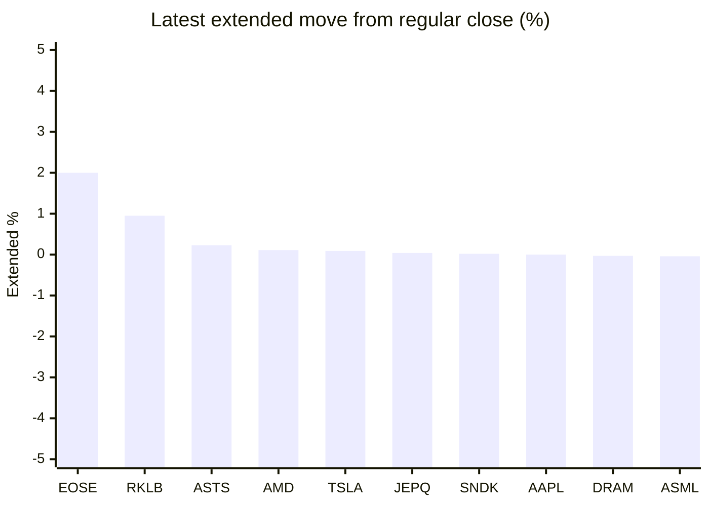

# Stock Brief - 2026-09-25

Generated at 2026-09-25 14:21 +07 from `watchlist.md`.
Prices are snapshots from Yahoo Finance public chart data. Extended/overnight is the latest available pre/post-market datapoint from the same feed.

## Market Snapshot

- SPY: close 767.18, latest extended 765.90, regular move -0.08%, extended move -0.17%
- QQQ: close 741.10, latest extended 739.41, regular move -0.01%, extended move -0.23%
- JEPQ: close 61.11, latest extended 61.13, regular move +0.02%, extended move +0.04%

## Watchlist Prices

| Ticker | Name | Regular close | Latest extended/overnight | Regular move | Extended move | Latest data time | Source |
|---|---|---:|---:|---:|---:|---|---|
| INTC | Intel Corporation | 127.39 USD | 127.01 USD | +3.91% | -0.30% | 2026-09-24 19:59 EDT | [Yahoo](https://finance.yahoo.com/quote/INTC/) |
| AVGO | Broadcom Inc. | 350.36 USD | 350.03 USD | -1.30% | -0.09% | 2026-09-24 19:59 EDT | [Yahoo](https://finance.yahoo.com/quote/AVGO/) |
| RKLB | Rocket Lab Corporation | 73.61 USD | 74.31 USD | +4.69% | +0.95% | 2026-09-24 19:59 EDT | [Yahoo](https://finance.yahoo.com/quote/RKLB/) |
| AAPL | Apple Inc. | 335.92 USD | 335.91 USD | -0.33% | -0.00% | 2026-09-24 19:59 EDT | [Yahoo](https://finance.yahoo.com/quote/AAPL/) |
| NVDA | NVIDIA Corporation | 224.58 USD | 223.82 USD | -0.41% | -0.34% | 2026-09-24 19:59 EDT | [Yahoo](https://finance.yahoo.com/quote/NVDA/) |
| TSLA | Tesla, Inc. | 377.94 USD | 378.27 USD | -0.57% | +0.09% | 2026-09-24 19:59 EDT | [Yahoo](https://finance.yahoo.com/quote/TSLA/) |
| SNDK | Sandisk Corporation | 1,753.62 USD | 1,753.99 USD | -3.47% | +0.02% | 2026-09-24 19:59 EDT | [Yahoo](https://finance.yahoo.com/quote/SNDK/) |
| QQQ | Invesco QQQ Trust, Series 1 | 741.10 USD | 739.41 USD | -0.01% | -0.23% | 2026-09-24 19:59 EDT | [Yahoo](https://finance.yahoo.com/quote/QQQ/) |
| SPY | State Street SPDR S&P 500 ETF T | 767.18 USD | 765.90 USD | -0.08% | -0.17% | 2026-09-24 19:59 EDT | [Yahoo](https://finance.yahoo.com/quote/SPY/) |
| JEPQ | JPMorgan Nasdaq Equity Premium  | 61.11 USD | 61.13 USD | +0.02% | +0.04% | 2026-09-24 19:59 EDT | [Yahoo](https://finance.yahoo.com/quote/JEPQ/) |
| ASTS | AST SpaceMobile, Inc. | 61.06 USD | 61.20 USD | +1.80% | +0.23% | 2026-09-24 19:59 EDT | [Yahoo](https://finance.yahoo.com/quote/ASTS/) |
| MU | Micron Technology, Inc. | 1,080.53 USD | 1,075.76 USD | +0.81% | -0.44% | 2026-09-24 19:59 EDT | [Yahoo](https://finance.yahoo.com/quote/MU/) |
| IREN | IREN LIMITED | 46.15 USD | 45.89 USD | -1.91% | -0.56% | 2026-09-24 19:59 EDT | [Yahoo](https://finance.yahoo.com/quote/IREN/) |
| EOSE | Eos Energy Enterprises, Inc. | 3.24 USD | 3.31 USD | -9.36% | +2.00% | 2026-09-24 19:59 EDT | [Yahoo](https://finance.yahoo.com/quote/EOSE/) |
| GOOG | Alphabet Inc. | 339.01 USD | 337.70 USD | +1.20% | -0.39% | 2026-09-24 19:59 EDT | [Yahoo](https://finance.yahoo.com/quote/GOOG/) |
| DRAM | Roundhill Memory ETF | 60.72 USD | 60.70 USD | -1.91% | -0.03% | 2026-09-24 19:59 EDT | [Yahoo](https://finance.yahoo.com/quote/DRAM/) |
| AMD | Advanced Micro Devices, Inc. | 629.26 USD | 629.98 USD | +2.38% | +0.11% | 2026-09-24 19:59 EDT | [Yahoo](https://finance.yahoo.com/quote/AMD/) |
| ASML | ASML Holding N.V. - New York Re | 1,722.50 USD | 1,721.81 USD | -1.27% | -0.04% | 2026-09-24 19:59 EDT | [Yahoo](https://finance.yahoo.com/quote/ASML/) |

## Charts

### Top Movers - Regular Session

### Extended / Overnight Move

### Quick Heatmap

| Group | Names in watchlist | Avg regular move | Avg extended move |
|---|---|---:|---:|
| Mega-cap tech | AVGO, AAPL, NVDA, TSLA, GOOG | -0.28% | -0.15% |
| Semis / memory | INTC, SNDK, MU, DRAM, AMD, ASML | +0.08% | -0.11% |
| Space / high beta | RKLB, ASTS, IREN, EOSE | -1.19% | +0.65% |
| ETFs | QQQ, SPY, JEPQ | -0.03% | -0.12% |

## News Headlines

- [TSLA Stock Climbs Overnight: Roadster Teaser Stokes SpaceX Buzz — Musk Calls New Semi A ‘Game-Changer’](https://stocktwits.com/news-articles/markets/equity/tsla-stock-roadster-teaser-spacex-buzz-musk-new-semi-game-changer/cZMay3XRBaQ?.tsrc=rss) (2026-09-25 12:45 Bangkok)
- [Broadcom vs. Marvell: Which Custom AI Chip Stock Has the Better Risk-Reward?](https://finance.yahoo.com/markets/stocks/articles/broadcom-vs-marvell-custom-ai-042642158.html?.tsrc=rss) (2026-09-25 11:26 Bangkok)
- [Is Micron Stock Going to $1,625? 1 Wall Street Analyst Think So.](https://www.fool.com/investing/2026/09/24/is-micron-stock-going-to-usd1-625-1-wall-street-analyst-think-so/?.tsrc=rss) (2026-09-25 10:50 Bangkok)
- [AMD, INTC Stocks Extend Rally As Meta's Muse Fuels Bets On An AI-Agent CPU Boom](https://stocktwits.com/news-articles/markets/equity/amd-intc-stocks-extend-rally-as-meta-s-muse-fuels-bets-on-an-ai-agent-cpu-boom/cZMaHl9RBaJ?.tsrc=rss) (2026-09-25 10:30 Bangkok)
- [Tesla has begun ‘high volume’ production of semi truck, Musk says](https://finance.yahoo.com/markets/stocks/articles/tesla-begun-high-volume-production-031247063.html?.tsrc=rss) (2026-09-25 10:12 Bangkok)
- [Dow Jones Futures: Market Rally Resilient As Yields, Oil Prices Keep Rising; Tesla Holds Semi Event](https://finance.yahoo.com/m/f20152d5-c38c-3d1c-80ad-574b31be1248/dow-jones-futures%3A-market.html?.tsrc=rss) (2026-09-25 10:07 Bangkok)
- [Where Will Robinhood Stock Be in 5 Years?](https://www.fool.com/investing/2026/09/25/where-will-robinhood-stock-be-in-5-years/?.tsrc=rss) (2026-09-25 13:50 Bangkok)
- [Meta's Muse Agent Makes Waves: Market Snapshot](https://finance.yahoo.com/video/metas-muse-agent-makes-waves-062946885.html?.tsrc=rss) (2026-09-25 13:29 Bangkok)

## Caveats

- This is not investment advice. Extended-hours prices can be thin and volatile.
- Yahoo public endpoints may lag official exchange data.
