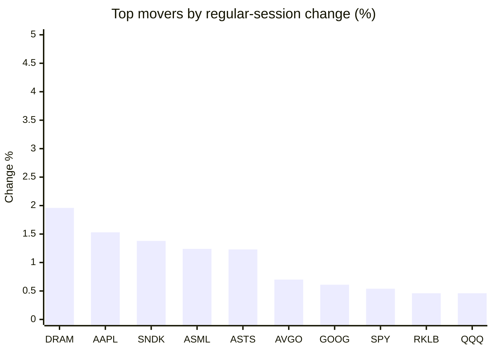
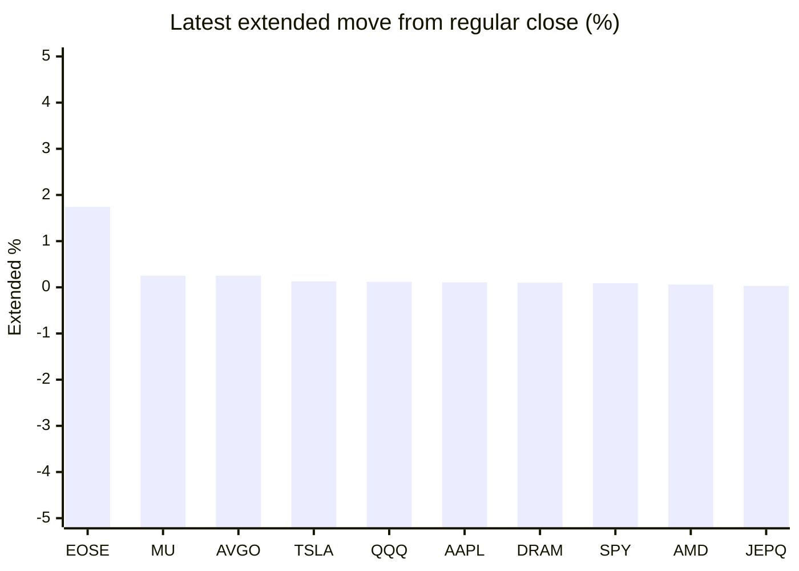

# Stock Brief - 2026-09-26

Generated at 2026-09-26 14:17 +07 from `watchlist.md`.
Prices are snapshots from Yahoo Finance public chart data. Extended/overnight is the latest available pre/post-market datapoint from the same feed.

## Market Snapshot

- SPY: close 771.35, latest extended 772.04, regular move +0.54%, extended move +0.09%
- QQQ: close 744.50, latest extended 745.40, regular move +0.46%, extended move +0.12%
- JEPQ: close 61.24, latest extended 61.26, regular move +0.21%, extended move +0.03%

## Watchlist Prices

| Ticker | Name | Regular close | Latest extended/overnight | Regular move | Extended move | Latest data time | Source |
|---|---|---:|---:|---:|---:|---|---|
| INTC | Intel Corporation | 123.00 USD | 122.95 USD | -3.45% | -0.04% | 2026-09-25 19:59 EDT | [Yahoo](https://finance.yahoo.com/quote/INTC/) |
| AVGO | Broadcom Inc. | 352.81 USD | 353.70 USD | +0.70% | +0.25% | 2026-09-25 19:59 EDT | [Yahoo](https://finance.yahoo.com/quote/AVGO/) |
| RKLB | Rocket Lab Corporation | 73.95 USD | 73.84 USD | +0.46% | -0.15% | 2026-09-25 19:59 EDT | [Yahoo](https://finance.yahoo.com/quote/RKLB/) |
| AAPL | Apple Inc. | 341.07 USD | 341.46 USD | +1.53% | +0.11% | 2026-09-25 19:59 EDT | [Yahoo](https://finance.yahoo.com/quote/AAPL/) |
| NVDA | NVIDIA Corporation | 225.07 USD | 225.00 USD | +0.22% | -0.03% | 2026-09-25 19:59 EDT | [Yahoo](https://finance.yahoo.com/quote/NVDA/) |
| TSLA | Tesla, Inc. | 372.11 USD | 372.59 USD | -1.54% | +0.13% | 2026-09-25 19:59 EDT | [Yahoo](https://finance.yahoo.com/quote/TSLA/) |
| SNDK | Sandisk Corporation | 1,777.80 USD | 1,772.10 USD | +1.38% | -0.32% | 2026-09-25 19:59 EDT | [Yahoo](https://finance.yahoo.com/quote/SNDK/) |
| QQQ | Invesco QQQ Trust, Series 1 | 744.50 USD | 745.40 USD | +0.46% | +0.12% | 2026-09-25 19:59 EDT | [Yahoo](https://finance.yahoo.com/quote/QQQ/) |
| SPY | State Street SPDR S&P 500 ETF T | 771.35 USD | 772.04 USD | +0.54% | +0.09% | 2026-09-25 19:59 EDT | [Yahoo](https://finance.yahoo.com/quote/SPY/) |
| JEPQ | JPMorgan Nasdaq Equity Premium  | 61.24 USD | 61.26 USD | +0.21% | +0.03% | 2026-09-25 19:59 EDT | [Yahoo](https://finance.yahoo.com/quote/JEPQ/) |
| ASTS | AST SpaceMobile, Inc. | 61.81 USD | 61.81 USD | +1.23% | +0.00% | 2026-09-25 19:59 EDT | [Yahoo](https://finance.yahoo.com/quote/ASTS/) |
| MU | Micron Technology, Inc. | 1,082.28 USD | 1,085.02 USD | +0.16% | +0.25% | 2026-09-25 19:59 EDT | [Yahoo](https://finance.yahoo.com/quote/MU/) |
| IREN | IREN LIMITED | 44.12 USD | 44.12 USD | -4.39% | -0.01% | 2026-09-25 19:59 EDT | [Yahoo](https://finance.yahoo.com/quote/IREN/) |
| EOSE | Eos Energy Enterprises, Inc. | 3.16 USD | 3.22 USD | -2.47% | +1.74% | 2026-09-25 19:59 EDT | [Yahoo](https://finance.yahoo.com/quote/EOSE/) |
| GOOG | Alphabet Inc. | 341.08 USD | 341.12 USD | +0.61% | +0.01% | 2026-09-25 19:59 EDT | [Yahoo](https://finance.yahoo.com/quote/GOOG/) |
| DRAM | Roundhill Memory ETF | 61.91 USD | 61.97 USD | +1.96% | +0.10% | 2026-09-25 19:59 EDT | [Yahoo](https://finance.yahoo.com/quote/DRAM/) |
| AMD | Advanced Micro Devices, Inc. | 630.63 USD | 630.99 USD | +0.22% | +0.06% | 2026-09-25 19:59 EDT | [Yahoo](https://finance.yahoo.com/quote/AMD/) |
| ASML | ASML Holding N.V. - New York Re | 1,743.94 USD | 1,744.24 USD | +1.24% | +0.02% | 2026-09-25 19:58 EDT | [Yahoo](https://finance.yahoo.com/quote/ASML/) |

## Charts

### Top Movers - Regular Session

### Extended / Overnight Move

### Quick Heatmap

| Group | Names in watchlist | Avg regular move | Avg extended move |
|---|---|---:|---:|
| Mega-cap tech | AVGO, AAPL, NVDA, TSLA, GOOG | +0.30% | +0.10% |
| Semis / memory | INTC, SNDK, MU, DRAM, AMD, ASML | +0.25% | +0.01% |
| Space / high beta | RKLB, ASTS, IREN, EOSE | -1.29% | +0.39% |
| ETFs | QQQ, SPY, JEPQ | +0.41% | +0.08% |

## News Headlines

- [Is Tesla’s (TSLA) Stock Really Priced Like a Car Company?](https://finance.yahoo.com/markets/stocks/articles/tesla-tsla-stock-really-priced-050301615.html?.tsrc=rss) (2026-09-26 12:03 Bangkok)
- [NVIDIA (NVDA) vs. Broadcom (AVGO): Which AI Chip Stock Has the Stronger Moat?](https://finance.yahoo.com/technology/ai/articles/nvidia-nvda-vs-broadcom-avgo-045101419.html?.tsrc=rss) (2026-09-26 11:51 Bangkok)
- [Fidelity’s Fundamental Large Cap Growth ETF, Explained in Plain English](https://247wallst.com/investing/etf/2026/09/25/fidelitys-fundamental-large-cap-growth-etf-explained-in-plain-english/?.tsrc=rss) (2026-09-26 10:46 Bangkok)
- [Tesla (TSLA) Sets an October 1 Roadster Unveiling. Can the Long-Delayed Car Restore Confidence?](https://finance.yahoo.com/markets/stocks/articles/tesla-tsla-sets-october-1-031844844.html?.tsrc=rss) (2026-09-26 10:18 Bangkok)
- [Tesla (TSLA) Gains U.S. EV Share as its Sales Fall. Can it Protect Automotive Margins?](https://finance.yahoo.com/markets/stocks/articles/tesla-tsla-gains-u-ev-031246693.html?.tsrc=rss) (2026-09-26 10:12 Bangkok)
- [MISSION SUCCESS: Rocket Lab Launches 97th Electron Mission](https://finance.yahoo.com/technology/articles/mission-success-rocket-lab-launches-014300201.html?.tsrc=rss) (2026-09-26 08:43 Bangkok)
- [If I Could Only Add 1 ETF to My Portfolio This Year, Here's Exactly What I'd Buy](https://www.fool.com/investing/2026/09/25/if-i-could-only-add-1-etf-to-my-portfolio-this-yea/?.tsrc=rss) (2026-09-26 08:35 Bangkok)
- [The Auto Weekly: Tesla's Semi Play, Rivian's Cheaper Model Promise And Detroit's Market Share Threat](https://stocktwits.com/news-articles/markets/equity/the-auto-weekly-tesla-s-semi-play-rivian-s-cheaper-model-promise-and-detroit-s-market-share-threat/cZMXzS0RBOF?.tsrc=rss) (2026-09-26 08:30 Bangkok)

## Caveats

- This is not investment advice. Extended-hours prices can be thin and volatile.
- Yahoo public endpoints may lag official exchange data.
