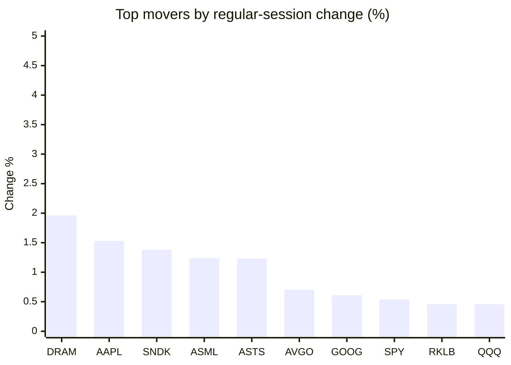
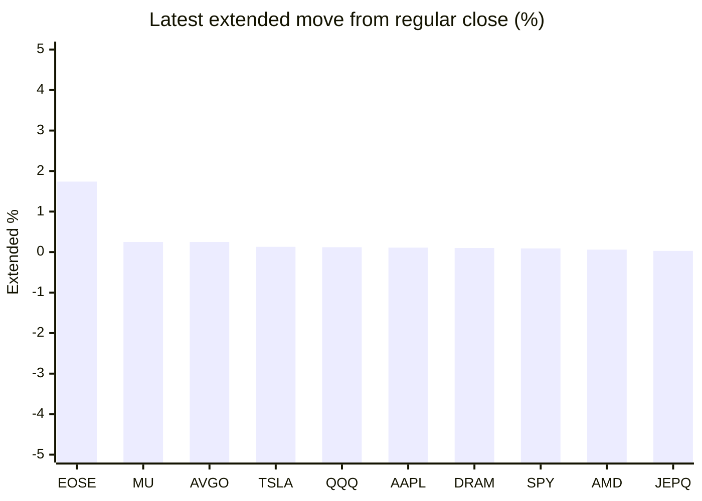

# Stock Brief - 2026-09-27

Generated at 2026-09-27 14:49 +07 from `watchlist.md`.
Prices are snapshots from Yahoo Finance public chart data. Extended/overnight is the latest available pre/post-market datapoint from the same feed.

## Market Snapshot

- SPY: close 771.35, latest extended 772.04, regular move +0.54%, extended move +0.09%
- QQQ: close 744.50, latest extended 745.40, regular move +0.46%, extended move +0.12%
- JEPQ: close 61.24, latest extended 61.26, regular move +0.21%, extended move +0.03%

## Watchlist Prices

| Ticker | Name | Regular close | Latest extended/overnight | Regular move | Extended move | Latest data time | Source |
|---|---|---:|---:|---:|---:|---|---|
| INTC | Intel Corporation | 123.00 USD | 122.95 USD | -3.45% | -0.04% | 2026-09-25 19:59 EDT | [Yahoo](https://finance.yahoo.com/quote/INTC/) |
| AVGO | Broadcom Inc. | 352.81 USD | 353.70 USD | +0.70% | +0.25% | 2026-09-25 19:59 EDT | [Yahoo](https://finance.yahoo.com/quote/AVGO/) |
| RKLB | Rocket Lab Corporation | 73.95 USD | 73.84 USD | +0.46% | -0.15% | 2026-09-25 19:59 EDT | [Yahoo](https://finance.yahoo.com/quote/RKLB/) |
| AAPL | Apple Inc. | 341.07 USD | 341.46 USD | +1.53% | +0.11% | 2026-09-25 19:59 EDT | [Yahoo](https://finance.yahoo.com/quote/AAPL/) |
| NVDA | NVIDIA Corporation | 225.07 USD | 225.00 USD | +0.22% | -0.03% | 2026-09-25 19:59 EDT | [Yahoo](https://finance.yahoo.com/quote/NVDA/) |
| TSLA | Tesla, Inc. | 372.11 USD | 372.59 USD | -1.54% | +0.13% | 2026-09-25 19:59 EDT | [Yahoo](https://finance.yahoo.com/quote/TSLA/) |
| SNDK | Sandisk Corporation | 1,777.80 USD | 1,772.10 USD | +1.38% | -0.32% | 2026-09-25 19:59 EDT | [Yahoo](https://finance.yahoo.com/quote/SNDK/) |
| QQQ | Invesco QQQ Trust, Series 1 | 744.50 USD | 745.40 USD | +0.46% | +0.12% | 2026-09-25 19:59 EDT | [Yahoo](https://finance.yahoo.com/quote/QQQ/) |
| SPY | State Street SPDR S&P 500 ETF T | 771.35 USD | 772.04 USD | +0.54% | +0.09% | 2026-09-25 19:59 EDT | [Yahoo](https://finance.yahoo.com/quote/SPY/) |
| JEPQ | JPMorgan Nasdaq Equity Premium  | 61.24 USD | 61.26 USD | +0.21% | +0.03% | 2026-09-25 19:59 EDT | [Yahoo](https://finance.yahoo.com/quote/JEPQ/) |
| ASTS | AST SpaceMobile, Inc. | 61.81 USD | 61.81 USD | +1.23% | +0.00% | 2026-09-25 19:59 EDT | [Yahoo](https://finance.yahoo.com/quote/ASTS/) |
| MU | Micron Technology, Inc. | 1,082.28 USD | 1,085.02 USD | +0.16% | +0.25% | 2026-09-25 19:59 EDT | [Yahoo](https://finance.yahoo.com/quote/MU/) |
| IREN | IREN LIMITED | 44.12 USD | 44.12 USD | -4.39% | -0.01% | 2026-09-25 19:59 EDT | [Yahoo](https://finance.yahoo.com/quote/IREN/) |
| EOSE | Eos Energy Enterprises, Inc. | 3.16 USD | 3.22 USD | -2.47% | +1.74% | 2026-09-25 19:59 EDT | [Yahoo](https://finance.yahoo.com/quote/EOSE/) |
| GOOG | Alphabet Inc. | 341.08 USD | 341.12 USD | +0.61% | +0.01% | 2026-09-25 19:59 EDT | [Yahoo](https://finance.yahoo.com/quote/GOOG/) |
| DRAM | Roundhill Memory ETF | 61.91 USD | 61.97 USD | +1.96% | +0.10% | 2026-09-25 19:59 EDT | [Yahoo](https://finance.yahoo.com/quote/DRAM/) |
| AMD | Advanced Micro Devices, Inc. | 630.63 USD | 630.99 USD | +0.22% | +0.06% | 2026-09-25 19:59 EDT | [Yahoo](https://finance.yahoo.com/quote/AMD/) |
| ASML | ASML Holding N.V. - New York Re | 1,743.94 USD | 1,744.24 USD | +1.24% | +0.02% | 2026-09-25 19:58 EDT | [Yahoo](https://finance.yahoo.com/quote/ASML/) |

## Charts

### Top Movers - Regular Session

### Extended / Overnight Move

### Quick Heatmap

| Group | Names in watchlist | Avg regular move | Avg extended move |
|---|---|---:|---:|
| Mega-cap tech | AVGO, AAPL, NVDA, TSLA, GOOG | +0.30% | +0.10% |
| Semis / memory | INTC, SNDK, MU, DRAM, AMD, ASML | +0.25% | +0.01% |
| Space / high beta | RKLB, ASTS, IREN, EOSE | -1.29% | +0.39% |
| ETFs | QQQ, SPY, JEPQ | +0.41% | +0.08% |

## News Headlines

- [Broadcom Stock Is Back Where It Ended 2025, but Its Earnings Are About 43% Higher. Is It a Buy?](https://www.fool.com/investing/2026/09/27/broadcom-stock-is-back-where-it-ended-2025-but-its-earnings-are-about-43-higher-is-it-a-buy/?.tsrc=rss) (2026-09-27 14:03 Bangkok)
- [A $1,000 Investment Split Between Alphabet and Nvidia Will Be Worth This Much by 2030](https://www.fool.com/investing/2026/09/26/a-1000-investment-split-between-alphabet-and-nvidi/?.tsrc=rss) (2026-09-27 09:35 Bangkok)
- [This 17% Yield Nasdaq Covered Call ETF Is Somehow Outperforming QQQ](https://247wallst.com/investing/etf/2026/09/26/this-17-yield-nasdaq-covered-call-etf-is-somehow-outperforming-qqq/?.tsrc=rss) (2026-09-27 08:02 Bangkok)
- [AST SpaceMobile COO Dumps 12,000 Shares for $707,000 Amid a 47% One-Year Return](https://www.fool.com/coverage/filings/2026/09/26/ast-spacemobile-coo-dumps-12-000-shares-for-usd707-000-amid-a-47-one-year-return/?.tsrc=rss) (2026-09-27 05:50 Bangkok)
- [Prediction: This Space Stock Will Outperform SpaceX Over the Next 10 Years](https://www.fool.com/investing/2026/09/27/prediction-this-space-stock-will-outperform-spacex/?.tsrc=rss) (2026-09-27 12:20 Bangkok)
- [Meta Stock Is Having Its Best Month Since 2013. History Says Every 20% Month Has Led to Gains a Year Later.](https://www.fool.com/investing/2026/09/26/meta-stock-is-having-its-best-month-since-2013-history-says-every-20-month-has-led-to-gains-a-year-later/?.tsrc=rss) (2026-09-27 10:12 Bangkok)
- [Prediction: Here's What a $5,000 Investment in AMD Could Be Worth by 2030](https://www.fool.com/investing/2026/09/26/prediction-heres-what-a-5000-investment-in-amd-cou/?.tsrc=rss) (2026-09-27 08:58 Bangkok)
- [History Says Alphabet Stock's 15% Pullbacks Have Usually Paid Off Within a Year](https://www.fool.com/investing/2026/09/26/history-says-alphabet-stock-s-15-pullbacks-have-usually-paid-off-within-a-year/?.tsrc=rss) (2026-09-27 08:07 Bangkok)

## Caveats

- This is not investment advice. Extended-hours prices can be thin and volatile.
- Yahoo public endpoints may lag official exchange data.
