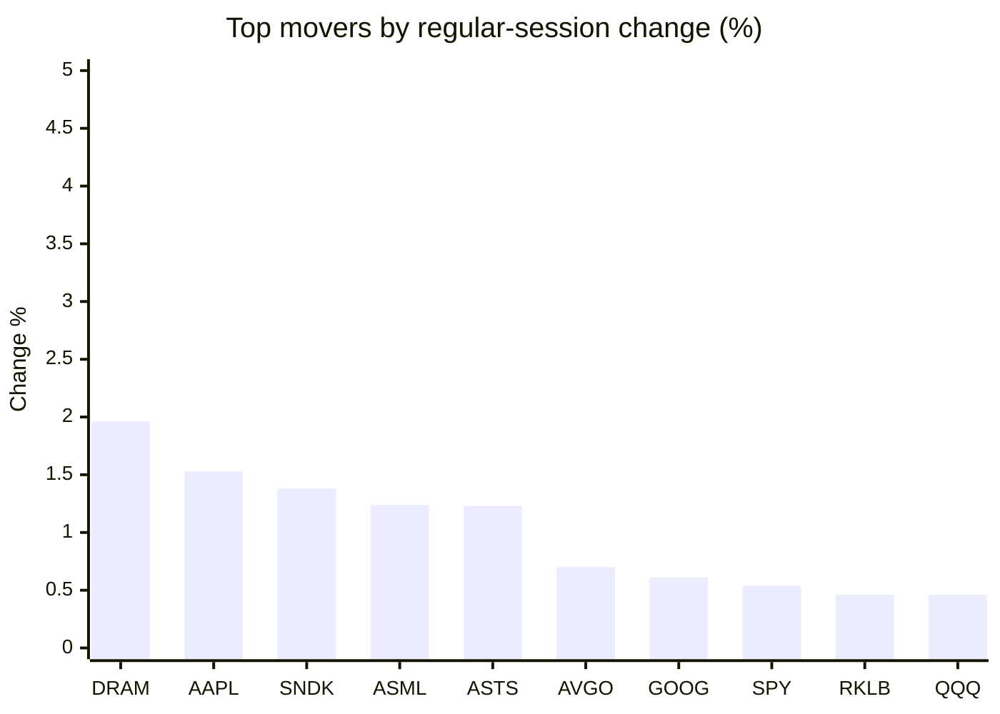
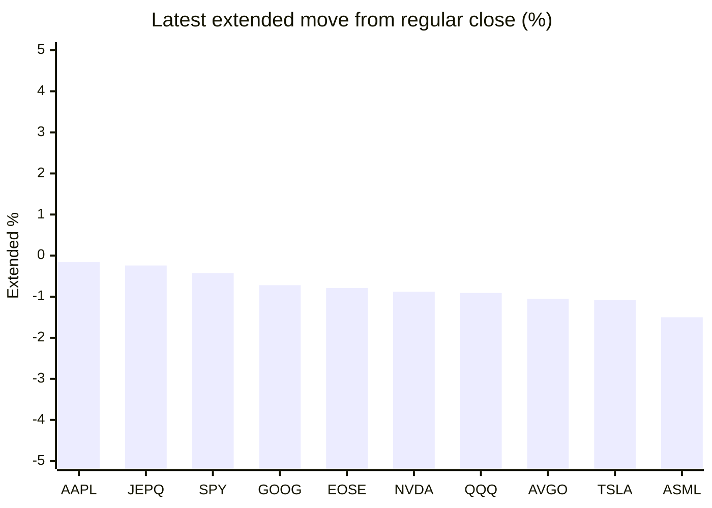

# Stock Brief - 2026-09-28

Generated at 2026-09-28 15:26 +07 from `watchlist.md`.
Prices are snapshots from Yahoo Finance public chart data. Extended/overnight is the latest available pre/post-market datapoint from the same feed.

## Market Snapshot

- SPY: close 771.35, latest extended 768.00, regular move +0.54%, extended move -0.43%
- QQQ: close 744.50, latest extended 737.73, regular move +0.46%, extended move -0.91%
- JEPQ: close 61.24, latest extended 61.09, regular move +0.21%, extended move -0.24%

## Watchlist Prices

| Ticker | Name | Regular close | Latest extended/overnight | Regular move | Extended move | Latest data time | Source |
|---|---|---:|---:|---:|---:|---|---|
| INTC | Intel Corporation | 123.00 USD | 118.87 USD | -3.45% | -3.36% | 2026-09-28 04:25 EDT | [Yahoo](https://finance.yahoo.com/quote/INTC/) |
| AVGO | Broadcom Inc. | 352.81 USD | 349.10 USD | +0.70% | -1.05% | 2026-09-28 04:26 EDT | [Yahoo](https://finance.yahoo.com/quote/AVGO/) |
| RKLB | Rocket Lab Corporation | 73.95 USD | 72.33 USD | +0.46% | -2.19% | 2026-09-28 04:25 EDT | [Yahoo](https://finance.yahoo.com/quote/RKLB/) |
| AAPL | Apple Inc. | 341.07 USD | 340.54 USD | +1.53% | -0.16% | 2026-09-28 04:25 EDT | [Yahoo](https://finance.yahoo.com/quote/AAPL/) |
| NVDA | NVIDIA Corporation | 225.07 USD | 223.10 USD | +0.22% | -0.88% | 2026-09-28 04:26 EDT | [Yahoo](https://finance.yahoo.com/quote/NVDA/) |
| TSLA | Tesla, Inc. | 372.11 USD | 368.11 USD | -1.54% | -1.08% | 2026-09-28 04:26 EDT | [Yahoo](https://finance.yahoo.com/quote/TSLA/) |
| SNDK | Sandisk Corporation | 1,777.80 USD | 1,717.98 USD | +1.38% | -3.37% | 2026-09-28 04:26 EDT | [Yahoo](https://finance.yahoo.com/quote/SNDK/) |
| QQQ | Invesco QQQ Trust, Series 1 | 744.50 USD | 737.73 USD | +0.46% | -0.91% | 2026-09-28 04:25 EDT | [Yahoo](https://finance.yahoo.com/quote/QQQ/) |
| SPY | State Street SPDR S&P 500 ETF T | 771.35 USD | 768.00 USD | +0.54% | -0.43% | 2026-09-28 04:24 EDT | [Yahoo](https://finance.yahoo.com/quote/SPY/) |
| JEPQ | JPMorgan Nasdaq Equity Premium  | 61.24 USD | 61.09 USD | +0.21% | -0.24% | 2026-09-28 04:26 EDT | [Yahoo](https://finance.yahoo.com/quote/JEPQ/) |
| ASTS | AST SpaceMobile, Inc. | 61.81 USD | 60.80 USD | +1.23% | -1.63% | 2026-09-28 04:26 EDT | [Yahoo](https://finance.yahoo.com/quote/ASTS/) |
| MU | Micron Technology, Inc. | 1,082.28 USD | 1,059.00 USD | +0.16% | -2.15% | 2026-09-28 04:25 EDT | [Yahoo](https://finance.yahoo.com/quote/MU/) |
| IREN | IREN LIMITED | 44.12 USD | 43.23 USD | -4.39% | -2.03% | 2026-09-28 04:25 EDT | [Yahoo](https://finance.yahoo.com/quote/IREN/) |
| EOSE | Eos Energy Enterprises, Inc. | 3.16 USD | 3.14 USD | -2.47% | -0.79% | 2026-09-28 04:26 EDT | [Yahoo](https://finance.yahoo.com/quote/EOSE/) |
| GOOG | Alphabet Inc. | 341.08 USD | 338.61 USD | +0.61% | -0.72% | 2026-09-28 04:25 EDT | [Yahoo](https://finance.yahoo.com/quote/GOOG/) |
| DRAM | Roundhill Memory ETF | 61.91 USD | 59.98 USD | +1.96% | -3.12% | 2026-09-28 04:24 EDT | [Yahoo](https://finance.yahoo.com/quote/DRAM/) |
| AMD | Advanced Micro Devices, Inc. | 630.63 USD | 617.00 USD | +0.22% | -2.16% | 2026-09-28 04:26 EDT | [Yahoo](https://finance.yahoo.com/quote/AMD/) |
| ASML | ASML Holding N.V. - New York Re | 1,743.94 USD | 1,717.85 USD | +1.24% | -1.50% | 2026-09-28 04:25 EDT | [Yahoo](https://finance.yahoo.com/quote/ASML/) |

## Charts

### Top Movers - Regular Session

### Extended / Overnight Move

### Quick Heatmap

| Group | Names in watchlist | Avg regular move | Avg extended move |
|---|---|---:|---:|
| Mega-cap tech | AVGO, AAPL, NVDA, TSLA, GOOG | +0.30% | -0.78% |
| Semis / memory | INTC, SNDK, MU, DRAM, AMD, ASML | +0.25% | -2.61% |
| Space / high beta | RKLB, ASTS, IREN, EOSE | -1.29% | -1.66% |
| ETFs | QQQ, SPY, JEPQ | +0.41% | -0.53% |

## News Headlines

- [Cluster Computing Global Market Report 2026: Capitalize on the surge to $85.27 billion by 2030 as NVIDIA, Huawei, Dell, Lenovo and HPE accelerate AI and hybrid HPC; secure the intelligence to outmaneuver rivals and maximize ROI.](https://finance.yahoo.com/technology/ai/articles/cluster-computing-global-market-report-080600229.html?.tsrc=rss) (2026-09-28 15:06 Bangkok)
- [Stocktwits Tech Watch: Micron’s Q4 Report, OpenAI Developer Conference Keep AI Trade In Focus This Week](https://stocktwits.com/news-articles/markets/equity/stocktwits-tech-watch-micron-s-q4-report-open-ai-developer-conference-keep-ai-trade-in-focus-this-week/cZMSZVwRBft?.tsrc=rss) (2026-09-28 14:00 Bangkok)
- [Nvidia Chips for Alibaba, ByteDance? China Reportedly Green Lights RTX PRO 5500 Amid US Curbs (UPDATED)](https://finance.yahoo.com/technology/ai/articles/nvidia-chips-alibaba-bytedance-china-064229123.html?.tsrc=rss) (2026-09-28 13:42 Bangkok)
- [China chipmaking stocks tumble as Beijing reportedly mulls allowing Nvidia sales](https://finance.yahoo.com/markets/stocks/articles/china-chipmaking-stocks-tumble-beijing-062228002.html?.tsrc=rss) (2026-09-28 13:22 Bangkok)
- [ASTS Stock Eyes Best Month Since May: New German Filing Puts 344-Satellite BlueBird Plan In Focus](https://stocktwits.com/news-articles/markets/equity/asts-stock-new-german-filing-344-satellite-bluebird-plan-focus/cZMSjcoRBfV?.tsrc=rss) (2026-09-28 12:25 Bangkok)
- [If You'd Invested $10,000 in Tesla (TSLA) 10 Years Ago, Here's How Much You'd Have Today](https://www.fool.com/investing/2026/09/28/you-invest-10000-tsla-10-years-ago-how-much/?.tsrc=rss) (2026-09-28 12:20 Bangkok)
- [Zacks Investment Ideas feature highlights: Alphabet, Apple and NVIDIA](https://finance.yahoo.com/markets/stocks/articles/zacks-investment-ideas-feature-highlights-051900169.html?.tsrc=rss) (2026-09-28 12:19 Bangkok)
- [Chinese Stocks Hit One-Year Low as Chip, Optical Firms Slide](https://finance.yahoo.com/markets/stocks/articles/chinese-stocks-hit-one-low-042212751.html?.tsrc=rss) (2026-09-28 11:22 Bangkok)

## Caveats

- This is not investment advice. Extended-hours prices can be thin and volatile.
- Yahoo public endpoints may lag official exchange data.
