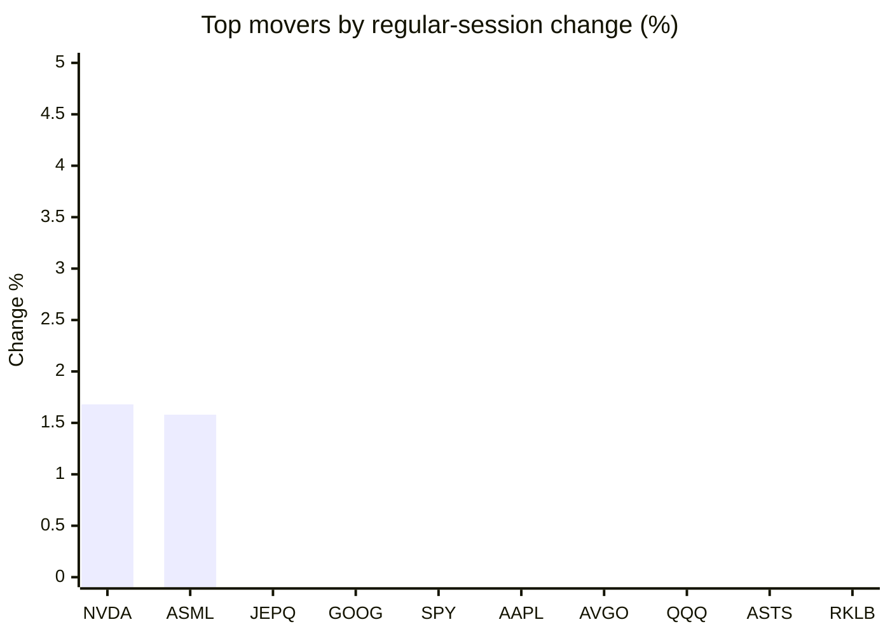
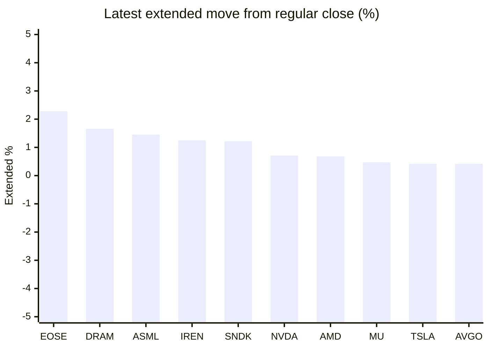

# Stock Brief - 2026-09-29

Generated at 2026-09-29 15:06 +07 from `watchlist.md`.
Prices are snapshots from Yahoo Finance public chart data. Extended/overnight is the latest available pre/post-market datapoint from the same feed.

## Market Snapshot

- SPY: close 765.61, latest extended 765.45, regular move -0.74%, extended move -0.02%
- QQQ: close 736.53, latest extended 737.45, regular move -1.07%, extended move +0.12%
- JEPQ: close 61.11, latest extended 61.20, regular move -0.21%, extended move +0.14%

## Watchlist Prices

| Ticker | Name | Regular close | Latest extended/overnight | Regular move | Extended move | Latest data time | Source |
|---|---|---:|---:|---:|---:|---|---|
| INTC | Intel Corporation | 116.03 USD | 116.48 USD | -5.67% | +0.39% | 2026-09-29 04:06 EDT | [Yahoo](https://finance.yahoo.com/quote/INTC/) |
| AVGO | Broadcom Inc. | 349.57 USD | 351.02 USD | -0.92% | +0.42% | 2026-09-29 04:06 EDT | [Yahoo](https://finance.yahoo.com/quote/AVGO/) |
| RKLB | Rocket Lab Corporation | 72.19 USD | 71.32 USD | -2.38% | -1.21% | 2026-09-29 04:05 EDT | [Yahoo](https://finance.yahoo.com/quote/RKLB/) |
| AAPL | Apple Inc. | 338.40 USD | 337.38 USD | -0.78% | -0.30% | 2026-09-29 04:06 EDT | [Yahoo](https://finance.yahoo.com/quote/AAPL/) |
| NVDA | NVIDIA Corporation | 228.86 USD | 230.49 USD | +1.68% | +0.71% | 2026-09-29 04:06 EDT | [Yahoo](https://finance.yahoo.com/quote/NVDA/) |
| TSLA | Tesla, Inc. | 357.45 USD | 358.95 USD | -3.94% | +0.42% | 2026-09-29 04:06 EDT | [Yahoo](https://finance.yahoo.com/quote/TSLA/) |
| SNDK | Sandisk Corporation | 1,712.89 USD | 1,733.72 USD | -3.65% | +1.22% | 2026-09-29 04:06 EDT | [Yahoo](https://finance.yahoo.com/quote/SNDK/) |
| QQQ | Invesco QQQ Trust, Series 1 | 736.53 USD | 737.45 USD | -1.07% | +0.12% | 2026-09-29 04:06 EDT | [Yahoo](https://finance.yahoo.com/quote/QQQ/) |
| SPY | State Street SPDR S&P 500 ETF T | 765.61 USD | 765.45 USD | -0.74% | -0.02% | 2026-09-29 04:05 EDT | [Yahoo](https://finance.yahoo.com/quote/SPY/) |
| JEPQ | JPMorgan Nasdaq Equity Premium  | 61.11 USD | 61.20 USD | -0.21% | +0.14% | 2026-09-29 04:04 EDT | [Yahoo](https://finance.yahoo.com/quote/JEPQ/) |
| ASTS | AST SpaceMobile, Inc. | 61.00 USD | 60.84 USD | -1.31% | -0.26% | 2026-09-29 04:06 EDT | [Yahoo](https://finance.yahoo.com/quote/ASTS/) |
| MU | Micron Technology, Inc. | 1,053.98 USD | 1,058.96 USD | -2.61% | +0.47% | 2026-09-29 04:06 EDT | [Yahoo](https://finance.yahoo.com/quote/MU/) |
| IREN | IREN LIMITED | 41.72 USD | 42.24 USD | -5.45% | +1.25% | 2026-09-29 04:06 EDT | [Yahoo](https://finance.yahoo.com/quote/IREN/) |
| EOSE | Eos Energy Enterprises, Inc. | 3.07 USD | 3.14 USD | -3.00% | +2.28% | 2026-09-29 04:05 EDT | [Yahoo](https://finance.yahoo.com/quote/EOSE/) |
| GOOG | Alphabet Inc. | 339.16 USD | 338.32 USD | -0.56% | -0.25% | 2026-09-29 04:05 EDT | [Yahoo](https://finance.yahoo.com/quote/GOOG/) |
| DRAM | Roundhill Memory ETF | 59.70 USD | 60.69 USD | -3.57% | +1.66% | 2026-09-29 04:05 EDT | [Yahoo](https://finance.yahoo.com/quote/DRAM/) |
| AMD | Advanced Micro Devices, Inc. | 607.87 USD | 612.00 USD | -3.61% | +0.68% | 2026-09-29 04:06 EDT | [Yahoo](https://finance.yahoo.com/quote/AMD/) |
| ASML | ASML Holding N.V. - New York Re | 1,771.41 USD | 1,797.15 USD | +1.58% | +1.45% | 2026-09-29 04:06 EDT | [Yahoo](https://finance.yahoo.com/quote/ASML/) |

## Charts

### Top Movers - Regular Session

### Extended / Overnight Move

### Quick Heatmap

| Group | Names in watchlist | Avg regular move | Avg extended move |
|---|---|---:|---:|
| Mega-cap tech | AVGO, AAPL, NVDA, TSLA, GOOG | -0.90% | +0.20% |
| Semis / memory | INTC, SNDK, MU, DRAM, AMD, ASML | -2.92% | +0.98% |
| Space / high beta | RKLB, ASTS, IREN, EOSE | -3.04% | +0.51% |
| ETFs | QQQ, SPY, JEPQ | -0.68% | +0.08% |

## News Headlines

- [Michael Burry Says Jensen Huang Is 'Becoming A Bit Like' Palantir's Alex Karp After Nvidia CEO's Media Blitz](https://stocktwits.com/news-articles/markets/equity/michael-burry-says-jensen-huang-is-becoming-a-bit-like-palantir-s-alex-karp-after-nvidia-ceo-s-media-blitz/cZMmtrcRBg2?.tsrc=rss) (2026-09-29 14:38 Bangkok)
- [Stocks Battling AI Safety Headwind: Market Analysis](https://finance.yahoo.com/video/stocks-battling-ai-safety-headwind-072316489.html?.tsrc=rss) (2026-09-29 14:23 Bangkok)
- [Sept. 30 Could Be the Start of a New Paradigm for Micron](https://www.fool.com/investing/2026/09/29/sept-30-could-be-the-start-of-a-new-paradigm-for-m/?.tsrc=rss) (2026-09-29 14:23 Bangkok)
- [The Stock Market Is Flashing a Warning Sign, but History Has Good News for Long-Term Investors](https://www.fool.com/investing/2026/09/29/stock-market-flashing-warning-history-says-good/?.tsrc=rss) (2026-09-29 14:20 Bangkok)
- [The Zacks Analyst Blog Highlights Seagate, Western Digital, Micron and Sandisk](https://finance.yahoo.com/markets/stocks/articles/zacks-analyst-blog-highlights-seagate-061400412.html?.tsrc=rss) (2026-09-29 13:14 Bangkok)
- [What Does Apple (AAPL) Appeal Mean After A $5.7 Billion Patent Verdict?](https://finance.yahoo.com/markets/stocks/articles/does-apple-aapl-appeal-mean-061206860.html?.tsrc=rss) (2026-09-29 13:12 Bangkok)
- [Is AST SpaceMobile (ASTS) Above Fair Value As Launch Nears?](https://finance.yahoo.com/markets/stocks/articles/ast-spacemobile-asts-above-fair-060942581.html?.tsrc=rss) (2026-09-29 13:09 Bangkok)
- [Nvidia turns to insurers to spread risk of AI build-out - FT](https://finance.yahoo.com/technology/ai/articles/nvidia-turns-insurers-spread-risk-052145747.html?.tsrc=rss) (2026-09-29 12:21 Bangkok)

## Caveats

- This is not investment advice. Extended-hours prices can be thin and volatile.
- Yahoo public endpoints may lag official exchange data.
