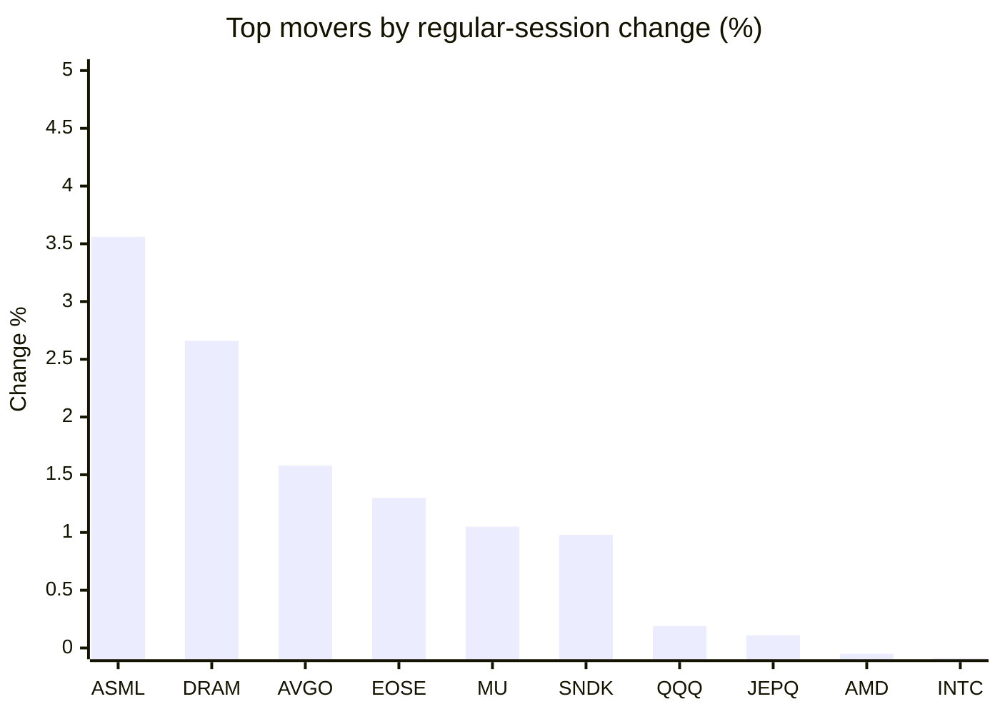
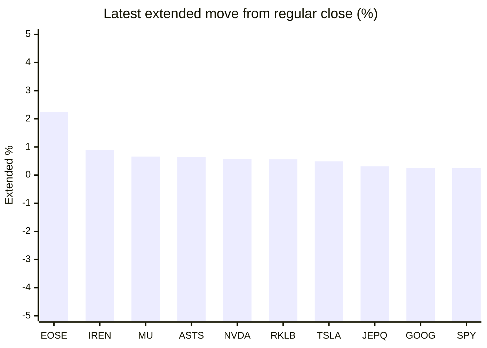

# Stock Brief - 2026-09-30

Generated at 2026-09-30 15:11 +07 from `watchlist.md`.
Prices are snapshots from Yahoo Finance public chart data. Extended/overnight is the latest available pre/post-market datapoint from the same feed.

## Market Snapshot

- SPY: close 764.20, latest extended 766.12, regular move -0.18%, extended move +0.25%
- QQQ: close 737.93, latest extended 739.25, regular move +0.19%, extended move +0.18%
- JEPQ: close 61.18, latest extended 61.37, regular move +0.11%, extended move +0.31%

## Watchlist Prices

| Ticker | Name | Regular close | Latest extended/overnight | Regular move | Extended move | Latest data time | Source |
|---|---|---:|---:|---:|---:|---|---|
| INTC | Intel Corporation | 115.93 USD | 116.15 USD | -0.09% | +0.19% | 2026-09-30 04:11 EDT | [Yahoo](https://finance.yahoo.com/quote/INTC/) |
| AVGO | Broadcom Inc. | 355.10 USD | 355.87 USD | +1.58% | +0.22% | 2026-09-30 04:11 EDT | [Yahoo](https://finance.yahoo.com/quote/AVGO/) |
| RKLB | Rocket Lab Corporation | 69.70 USD | 70.09 USD | -3.45% | +0.56% | 2026-09-30 04:11 EDT | [Yahoo](https://finance.yahoo.com/quote/RKLB/) |
| AAPL | Apple Inc. | 329.40 USD | 330.12 USD | -2.66% | +0.22% | 2026-09-30 04:11 EDT | [Yahoo](https://finance.yahoo.com/quote/AAPL/) |
| NVDA | NVIDIA Corporation | 227.21 USD | 228.51 USD | -0.72% | +0.57% | 2026-09-30 04:11 EDT | [Yahoo](https://finance.yahoo.com/quote/NVDA/) |
| TSLA | Tesla, Inc. | 352.84 USD | 354.58 USD | -1.29% | +0.49% | 2026-09-30 04:11 EDT | [Yahoo](https://finance.yahoo.com/quote/TSLA/) |
| SNDK | Sandisk Corporation | 1,729.76 USD | 1,728.45 USD | +0.98% | -0.08% | 2026-09-30 04:11 EDT | [Yahoo](https://finance.yahoo.com/quote/SNDK/) |
| QQQ | Invesco QQQ Trust, Series 1 | 737.93 USD | 739.25 USD | +0.19% | +0.18% | 2026-09-30 04:11 EDT | [Yahoo](https://finance.yahoo.com/quote/QQQ/) |
| SPY | State Street SPDR S&P 500 ETF T | 764.20 USD | 766.12 USD | -0.18% | +0.25% | 2026-09-30 04:09 EDT | [Yahoo](https://finance.yahoo.com/quote/SPY/) |
| JEPQ | JPMorgan Nasdaq Equity Premium  | 61.18 USD | 61.37 USD | +0.11% | +0.31% | 2026-09-30 04:11 EDT | [Yahoo](https://finance.yahoo.com/quote/JEPQ/) |
| ASTS | AST SpaceMobile, Inc. | 59.40 USD | 59.78 USD | -2.62% | +0.64% | 2026-09-30 04:11 EDT | [Yahoo](https://finance.yahoo.com/quote/ASTS/) |
| MU | Micron Technology, Inc. | 1,065.08 USD | 1,072.09 USD | +1.05% | +0.66% | 2026-09-30 04:11 EDT | [Yahoo](https://finance.yahoo.com/quote/MU/) |
| IREN | IREN LIMITED | 41.38 USD | 41.75 USD | -0.81% | +0.89% | 2026-09-30 04:11 EDT | [Yahoo](https://finance.yahoo.com/quote/IREN/) |
| EOSE | Eos Energy Enterprises, Inc. | 3.11 USD | 3.18 USD | +1.30% | +2.25% | 2026-09-30 04:10 EDT | [Yahoo](https://finance.yahoo.com/quote/EOSE/) |
| GOOG | Alphabet Inc. | 337.32 USD | 338.21 USD | -0.54% | +0.26% | 2026-09-30 04:11 EDT | [Yahoo](https://finance.yahoo.com/quote/GOOG/) |
| DRAM | Roundhill Memory ETF | 61.29 USD | 60.89 USD | +2.66% | -0.65% | 2026-09-30 04:11 EDT | [Yahoo](https://finance.yahoo.com/quote/DRAM/) |
| AMD | Advanced Micro Devices, Inc. | 607.57 USD | 608.99 USD | -0.05% | +0.23% | 2026-09-30 04:11 EDT | [Yahoo](https://finance.yahoo.com/quote/AMD/) |
| ASML | ASML Holding N.V. - New York Re | 1,834.39 USD | 1,838.68 USD | +3.56% | +0.23% | 2026-09-30 04:11 EDT | [Yahoo](https://finance.yahoo.com/quote/ASML/) |

## Charts

### Top Movers - Regular Session

### Extended / Overnight Move

### Quick Heatmap

| Group | Names in watchlist | Avg regular move | Avg extended move |
|---|---|---:|---:|
| Mega-cap tech | AVGO, AAPL, NVDA, TSLA, GOOG | -0.73% | +0.35% |
| Semis / memory | INTC, SNDK, MU, DRAM, AMD, ASML | +1.35% | +0.10% |
| Space / high beta | RKLB, ASTS, IREN, EOSE | -1.40% | +1.09% |
| ETFs | QQQ, SPY, JEPQ | +0.04% | +0.25% |

## News Headlines

- [History Says Broadcom Stock's Best Season Starts Now. It Has Risen in 13 Straight Fourth Quarters.](https://www.fool.com/investing/2026/09/30/history-says-broadcom-stock-s-best-season-starts-now-it-has-risen-in-13-straight-fourth-quarters/?.tsrc=rss) (2026-09-30 14:58 Bangkok)
- [Chip Stocks Roar Back: AMD, Intel Power SOXX Toward Best Month Since June](https://stocktwits.com/news-articles/markets/equity/chip-stocks-roar-back-amd-intel-power-soxx-toward-best-month-since-june/cZMFGEiRBhP?.tsrc=rss) (2026-09-30 14:48 Bangkok)
- [ASTS Stock Rises Overnight: Partner AT&T Questions SpaceX’s Plan To Disrupt Wireless Carriers](https://stocktwits.com/news-articles/markets/equity/asts-stock-partner-atandt-spacex-plan-disrupt-wireless-carriers/cZMnziGRBWC?.tsrc=rss) (2026-09-30 13:43 Bangkok)
- [Nvidia (NVDA) Ships an AI Safety Platform After Huang Called Rival Warnings Odd](https://finance.yahoo.com/technology/ai/articles/nvidia-nvda-ships-ai-safety-063441658.html?.tsrc=rss) (2026-09-30 13:34 Bangkok)
- [Zacks Investment Ideas feature highlights: Advanced Micro Devices, Micron, Nebius, Alphabet, Meta Platform and Apple](https://finance.yahoo.com/technology/ai/articles/zacks-investment-ideas-feature-highlights-061700846.html?.tsrc=rss) (2026-09-30 13:17 Bangkok)
- [Amazon (AMZN) and Apple (AAPL) Must Face a UK Class Action Over Marketplace Sales](https://finance.yahoo.com/markets/stocks/articles/amazon-amzn-apple-aapl-must-060818438.html?.tsrc=rss) (2026-09-30 13:08 Bangkok)
- [Zacks Investment Ideas feature highlights: Tesla](https://finance.yahoo.com/markets/stocks/articles/zacks-investment-ideas-feature-highlights-054600634.html?.tsrc=rss) (2026-09-30 12:46 Bangkok)
- [Apple iPhone 18 Pro sales rise 12% in China launch week - Counterpoint](https://finance.yahoo.com/markets/stocks/articles/apple-iphone-18-pro-sales-054440924.html?.tsrc=rss) (2026-09-30 12:44 Bangkok)

## Caveats

- This is not investment advice. Extended-hours prices can be thin and volatile.
- Yahoo public endpoints may lag official exchange data.
