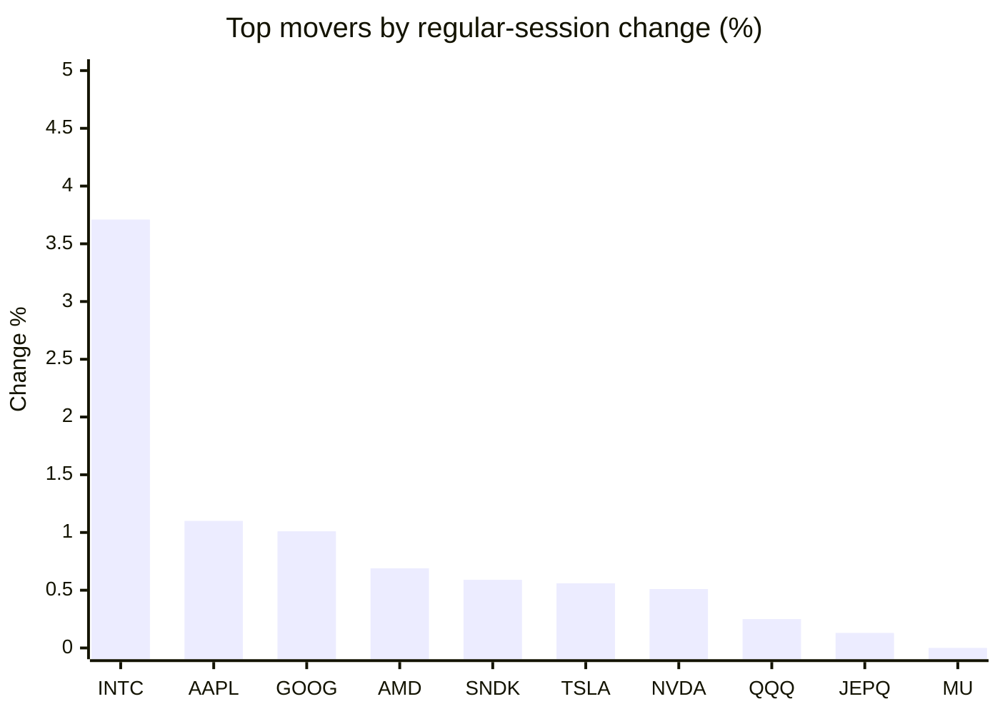
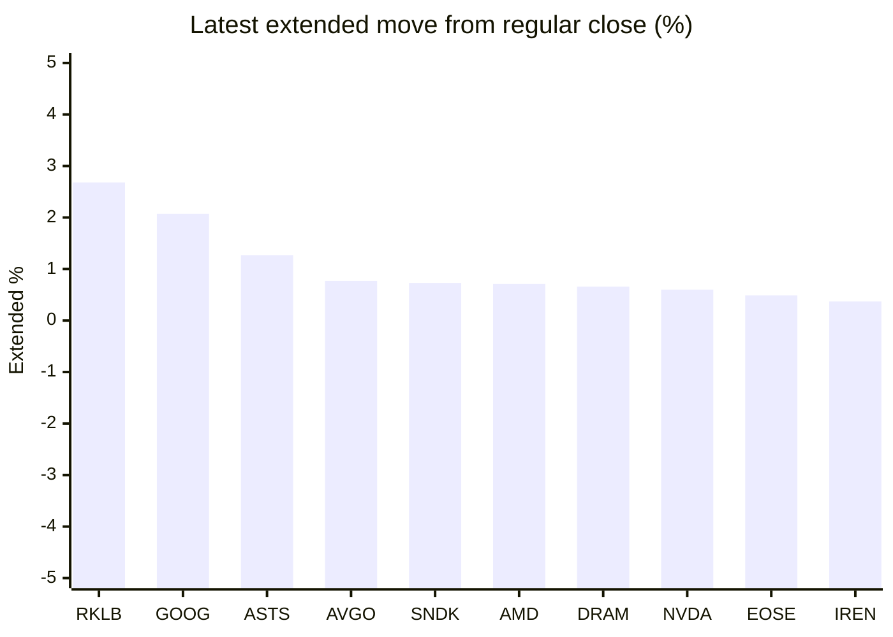

# Stock Brief - 2026-10-01

Generated at 2026-10-01 15:34 +07 from `watchlist.md`.
Prices are snapshots from Yahoo Finance public chart data. Extended/overnight is the latest available pre/post-market datapoint from the same feed.

## Market Snapshot

- SPY: close 762.63, latest extended 762.11, regular move -0.21%, extended move -0.07%
- QQQ: close 739.77, latest extended 741.78, regular move +0.25%, extended move +0.27%
- JEPQ: close 61.26, latest extended 60.82, regular move +0.13%, extended move -0.72%

## Watchlist Prices

| Ticker | Name | Regular close | Latest extended/overnight | Regular move | Extended move | Latest data time | Source |
|---|---|---:|---:|---:|---:|---|---|
| INTC | Intel Corporation | 120.23 USD | 120.54 USD | +3.71% | +0.26% | 2026-10-01 04:34 EDT | [Yahoo](https://finance.yahoo.com/quote/INTC/) |
| AVGO | Broadcom Inc. | 351.19 USD | 353.90 USD | -1.10% | +0.77% | 2026-10-01 04:34 EDT | [Yahoo](https://finance.yahoo.com/quote/AVGO/) |
| RKLB | Rocket Lab Corporation | 69.68 USD | 71.55 USD | -0.03% | +2.68% | 2026-10-01 04:34 EDT | [Yahoo](https://finance.yahoo.com/quote/RKLB/) |
| AAPL | Apple Inc. | 333.02 USD | 332.33 USD | +1.10% | -0.21% | 2026-10-01 04:34 EDT | [Yahoo](https://finance.yahoo.com/quote/AAPL/) |
| NVDA | NVIDIA Corporation | 228.38 USD | 229.75 USD | +0.51% | +0.60% | 2026-10-01 04:34 EDT | [Yahoo](https://finance.yahoo.com/quote/NVDA/) |
| TSLA | Tesla, Inc. | 354.81 USD | 354.80 USD | +0.56% | -0.00% | 2026-10-01 04:34 EDT | [Yahoo](https://finance.yahoo.com/quote/TSLA/) |
| SNDK | Sandisk Corporation | 1,739.89 USD | 1,752.65 USD | +0.59% | +0.73% | 2026-10-01 04:34 EDT | [Yahoo](https://finance.yahoo.com/quote/SNDK/) |
| QQQ | Invesco QQQ Trust, Series 1 | 739.77 USD | 741.78 USD | +0.25% | +0.27% | 2026-10-01 04:34 EDT | [Yahoo](https://finance.yahoo.com/quote/QQQ/) |
| SPY | State Street SPDR S&P 500 ETF T | 762.63 USD | 762.11 USD | -0.21% | -0.07% | 2026-10-01 04:33 EDT | [Yahoo](https://finance.yahoo.com/quote/SPY/) |
| JEPQ | JPMorgan Nasdaq Equity Premium  | 61.26 USD | 60.82 USD | +0.13% | -0.72% | 2026-10-01 04:33 EDT | [Yahoo](https://finance.yahoo.com/quote/JEPQ/) |
| ASTS | AST SpaceMobile, Inc. | 58.86 USD | 59.61 USD | -0.91% | +1.27% | 2026-10-01 04:34 EDT | [Yahoo](https://finance.yahoo.com/quote/ASTS/) |
| MU | Micron Technology, Inc. | 1,065.11 USD | 1,054.95 USD | +0.00% | -0.95% | 2026-10-01 04:34 EDT | [Yahoo](https://finance.yahoo.com/quote/MU/) |
| IREN | IREN LIMITED | 40.88 USD | 41.03 USD | -1.21% | +0.37% | 2026-10-01 04:34 EDT | [Yahoo](https://finance.yahoo.com/quote/IREN/) |
| EOSE | Eos Energy Enterprises, Inc. | 3.07 USD | 3.08 USD | -1.45% | +0.49% | 2026-10-01 04:32 EDT | [Yahoo](https://finance.yahoo.com/quote/EOSE/) |
| GOOG | Alphabet Inc. | 340.74 USD | 347.81 USD | +1.01% | +2.07% | 2026-10-01 04:34 EDT | [Yahoo](https://finance.yahoo.com/quote/GOOG/) |
| DRAM | Roundhill Memory ETF | 60.36 USD | 60.76 USD | -1.52% | +0.66% | 2026-10-01 04:34 EDT | [Yahoo](https://finance.yahoo.com/quote/DRAM/) |
| AMD | Advanced Micro Devices, Inc. | 611.76 USD | 616.11 USD | +0.69% | +0.71% | 2026-10-01 04:34 EDT | [Yahoo](https://finance.yahoo.com/quote/AMD/) |
| ASML | ASML Holding N.V. - New York Re | 1,811.67 USD | 1,796.82 USD | -1.24% | -0.82% | 2026-10-01 04:34 EDT | [Yahoo](https://finance.yahoo.com/quote/ASML/) |

## Charts

### Top Movers - Regular Session

### Extended / Overnight Move

### Quick Heatmap

| Group | Names in watchlist | Avg regular move | Avg extended move |
|---|---|---:|---:|
| Mega-cap tech | AVGO, AAPL, NVDA, TSLA, GOOG | +0.42% | +0.65% |
| Semis / memory | INTC, SNDK, MU, DRAM, AMD, ASML | +0.37% | +0.10% |
| Space / high beta | RKLB, ASTS, IREN, EOSE | -0.90% | +1.20% |
| ETFs | QQQ, SPY, JEPQ | +0.06% | -0.17% |

## News Headlines

- [Stock market today: Dow, S&P 500, Nasdaq mixed as Micron earnings boost tech](https://finance.yahoo.com/markets/live/stock-market-today-thursday-oct-1-dow-sp-500-nasdaq-080602402.html?.tsrc=rss) (2026-10-01 15:06 Bangkok)
- [Michael Burry's New Bet Against Micron Stock Expires in June 2027. I Think His Timing Is Off.](https://www.fool.com/investing/2026/10/01/michael-burry-s-new-bet-against-micron-stock-expires-in-june-2027-i-think-his-timing-is-off/?.tsrc=rss) (2026-10-01 14:57 Bangkok)
- [Asian tech firms stand out on mixed day for stocks](https://finance.yahoo.com/markets/world-indices/articles/asian-stocks-mixed-positive-us-030749694.html?.tsrc=rss) (2026-10-01 14:35 Bangkok)
- [Jim Cramer Says 'Buy' Apple Stock Because of iPhone Duo, Not On Smart Home Device Buzz: Calls the $1,999 Foldable 'Amazing'](https://finance.yahoo.com/markets/stocks/articles/jim-cramer-says-buy-apple-071654391.html?.tsrc=rss) (2026-10-01 14:16 Bangkok)
- [Amazon Stock Pays $0 in Dividends. Here's Why Long-Term Investors Should Own It Anyway.](https://www.fool.com/investing/2026/10/01/amazon-stock-pays-0-in-dividends-heres-why-long-te/?.tsrc=rss) (2026-10-01 13:50 Bangkok)
- [Zacks Earnings Trends Highlights: Micron, Nvidia and Alphabet](https://finance.yahoo.com/markets/stocks/articles/zacks-earnings-trends-highlights-micron-063000600.html?.tsrc=rss) (2026-10-01 13:30 Bangkok)
- [History Says AMD Stock's $1 Trillion Milestone Isn't a Ceiling](https://www.fool.com/investing/2026/10/01/history-says-amd-stock-s-usd1-trillion-milestone-isn-t-a-ceiling/?.tsrc=rss) (2026-10-01 13:01 Bangkok)
- [Japanese chipmakers rally as Micron earnings boost AI trade](https://finance.yahoo.com/technology/ai/articles/japanese-chipmakers-rally-micron-earnings-045459000.html?.tsrc=rss) (2026-10-01 11:54 Bangkok)

## Caveats

- This is not investment advice. Extended-hours prices can be thin and volatile.
- Yahoo public endpoints may lag official exchange data.
