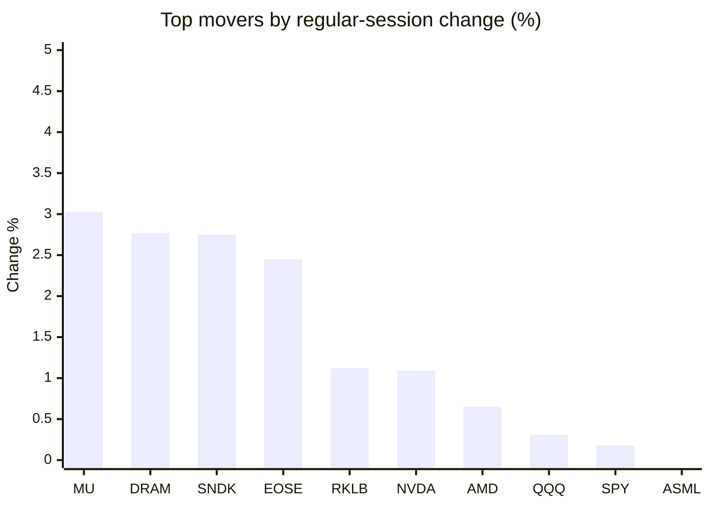
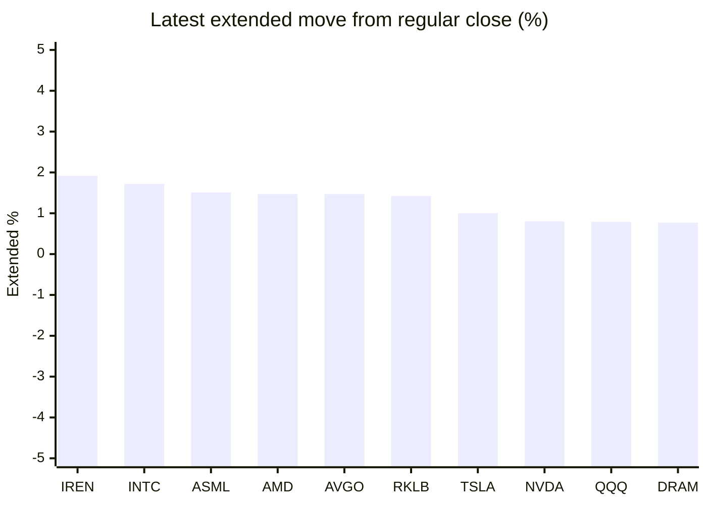

# Stock Brief - 2026-10-02

Generated at 2026-10-02 15:09 +07 from `watchlist.md`.
Prices are snapshots from Yahoo Finance public chart data. Extended/overnight is the latest available pre/post-market datapoint from the same feed.

## Market Snapshot

- SPY: close 763.99, latest extended 767.91, regular move +0.18%, extended move +0.51%
- QQQ: close 742.03, latest extended 747.88, regular move +0.31%, extended move +0.79%
- JEPQ: close 60.81, latest extended 61.02, regular move -0.73%, extended move +0.35%

## Watchlist Prices

| Ticker | Name | Regular close | Latest extended/overnight | Regular move | Extended move | Latest data time | Source |
|---|---|---:|---:|---:|---:|---|---|
| INTC | Intel Corporation | 120.00 USD | 122.06 USD | -0.19% | +1.72% | 2026-10-02 04:09 EDT | [Yahoo](https://finance.yahoo.com/quote/INTC/) |
| AVGO | Broadcom Inc. | 343.64 USD | 348.69 USD | -2.15% | +1.47% | 2026-10-02 04:09 EDT | [Yahoo](https://finance.yahoo.com/quote/AVGO/) |
| RKLB | Rocket Lab Corporation | 70.46 USD | 71.46 USD | +1.12% | +1.42% | 2026-10-02 04:09 EDT | [Yahoo](https://finance.yahoo.com/quote/RKLB/) |
| AAPL | Apple Inc. | 330.32 USD | 331.35 USD | -0.81% | +0.31% | 2026-10-02 04:09 EDT | [Yahoo](https://finance.yahoo.com/quote/AAPL/) |
| NVDA | NVIDIA Corporation | 230.86 USD | 232.71 USD | +1.09% | +0.80% | 2026-10-02 04:09 EDT | [Yahoo](https://finance.yahoo.com/quote/NVDA/) |
| TSLA | Tesla, Inc. | 354.11 USD | 357.64 USD | -0.20% | +1.00% | 2026-10-02 04:09 EDT | [Yahoo](https://finance.yahoo.com/quote/TSLA/) |
| SNDK | Sandisk Corporation | 1,787.69 USD | 1,796.12 USD | +2.75% | +0.47% | 2026-10-02 04:09 EDT | [Yahoo](https://finance.yahoo.com/quote/SNDK/) |
| QQQ | Invesco QQQ Trust, Series 1 | 742.03 USD | 747.88 USD | +0.31% | +0.79% | 2026-10-02 04:09 EDT | [Yahoo](https://finance.yahoo.com/quote/QQQ/) |
| SPY | State Street SPDR S&P 500 ETF T | 763.99 USD | 767.91 USD | +0.18% | +0.51% | 2026-10-02 04:09 EDT | [Yahoo](https://finance.yahoo.com/quote/SPY/) |
| JEPQ | JPMorgan Nasdaq Equity Premium  | 60.81 USD | 61.02 USD | -0.73% | +0.35% | 2026-10-02 04:09 EDT | [Yahoo](https://finance.yahoo.com/quote/JEPQ/) |
| ASTS | AST SpaceMobile, Inc. | 57.04 USD | 57.32 USD | -3.09% | +0.48% | 2026-10-02 04:09 EDT | [Yahoo](https://finance.yahoo.com/quote/ASTS/) |
| MU | Micron Technology, Inc. | 1,097.39 USD | 1,098.00 USD | +3.03% | +0.06% | 2026-10-02 04:09 EDT | [Yahoo](https://finance.yahoo.com/quote/MU/) |
| IREN | IREN LIMITED | 40.65 USD | 41.43 USD | -0.56% | +1.92% | 2026-10-02 04:09 EDT | [Yahoo](https://finance.yahoo.com/quote/IREN/) |
| EOSE | Eos Energy Enterprises, Inc. | 3.14 USD | 3.16 USD | +2.45% | +0.64% | 2026-10-02 04:06 EDT | [Yahoo](https://finance.yahoo.com/quote/EOSE/) |
| GOOG | Alphabet Inc. | 334.93 USD | 337.44 USD | -1.71% | +0.75% | 2026-10-02 04:09 EDT | [Yahoo](https://finance.yahoo.com/quote/GOOG/) |
| DRAM | Roundhill Memory ETF | 62.03 USD | 62.51 USD | +2.77% | +0.77% | 2026-10-02 04:08 EDT | [Yahoo](https://finance.yahoo.com/quote/DRAM/) |
| AMD | Advanced Micro Devices, Inc. | 615.73 USD | 624.80 USD | +0.65% | +1.47% | 2026-10-02 04:09 EDT | [Yahoo](https://finance.yahoo.com/quote/AMD/) |
| ASML | ASML Holding N.V. - New York Re | 1,808.49 USD | 1,835.84 USD | -0.18% | +1.51% | 2026-10-02 04:09 EDT | [Yahoo](https://finance.yahoo.com/quote/ASML/) |

## Charts

### Top Movers - Regular Session

### Extended / Overnight Move

### Quick Heatmap

| Group | Names in watchlist | Avg regular move | Avg extended move |
|---|---|---:|---:|
| Mega-cap tech | AVGO, AAPL, NVDA, TSLA, GOOG | -0.76% | +0.87% |
| Semis / memory | INTC, SNDK, MU, DRAM, AMD, ASML | +1.47% | +1.00% |
| Space / high beta | RKLB, ASTS, IREN, EOSE | -0.02% | +1.11% |
| ETFs | QQQ, SPY, JEPQ | -0.08% | +0.55% |

## News Headlines

- [Artificial Intelligence in Healthcare Market Forecasts Growth from $36.67B (2026) to $194.79B by 2031, Profiling Philips, Microsoft, Siemens Healthineers & NVIDIA](https://finance.yahoo.com/healthcare/articles/artificial-intelligence-healthcare-market-forecasts-080500135.html?.tsrc=rss) (2026-10-02 15:05 Bangkok)
- [Stocktwits AI Roundup: Micron’s Blowout Quarter, Nvidia’s $150B Buyback And The Race For AI Agents](https://stocktwits.com/news-articles/markets/equity/stocktwits-ai-roundup-micron-s-blowout-quarter-nvidia-s-150-b-buyback-and-the-race-for-ai-agents/cZDj2YGRB0x?.tsrc=rss) (2026-10-02 14:11 Bangkok)
- [SPCX Stock Climbs Overnight: Musk Teases ‘Big Deal’ Nvidia AI Milestone — Industry Insider Flags Up To 25% Higher Power](https://stocktwits.com/news-articles/markets/equity/spcx-stock-musk-big-deal-nvidia-ai-industry-insider-higher-power/cZDjbQERB0H?.tsrc=rss) (2026-10-02 12:44 Bangkok)
- [Here’s Why Investors Keep Buying Nvidia (NVDA)](https://finance.yahoo.com/markets/stocks/articles/why-investors-keep-buying-nvidia-054248249.html?.tsrc=rss) (2026-10-02 12:42 Bangkok)
- [Broadcom starts amassing $60 bln to fund chips for Anthropic- Bloomberg](https://finance.yahoo.com/technology/ai/articles/broadcom-starts-amassing-60-bln-050839573.html?.tsrc=rss) (2026-10-02 12:08 Bangkok)
- [Amazon seeks to offload $8 bln of Nvidia chips to investors- FT](https://finance.yahoo.com/technology/ai/articles/amazon-seeks-offload-8-bln-044847290.html?.tsrc=rss) (2026-10-02 11:48 Bangkok)
- [RKLB Stock’s 2-Week Rally Is On The Line — But Cathie Wood’s ARK Is Loading Up As Wall Street Sees 55% Upside](https://stocktwits.com/news-articles/markets/equity/rklb-stock-cathie-wood-ark-loading-up-wall-street-upside/cZDSCSORB0A?.tsrc=rss) (2026-10-02 11:35 Bangkok)
- [Dividend, Earnings Upgrade and Options Activity Might Change The Case For Investing In Helios (HLIO)](https://finance.yahoo.com/markets/stocks/articles/dividend-earnings-upgrade-options-activity-070824708.html?.tsrc=rss) (2026-10-02 14:08 Bangkok)

## Caveats

- This is not investment advice. Extended-hours prices can be thin and volatile.
- Yahoo public endpoints may lag official exchange data.
