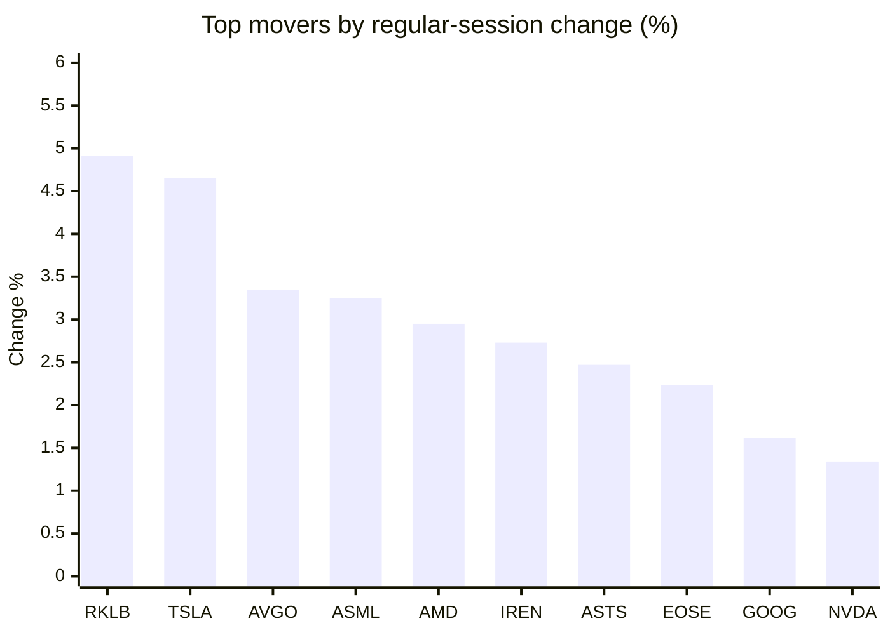
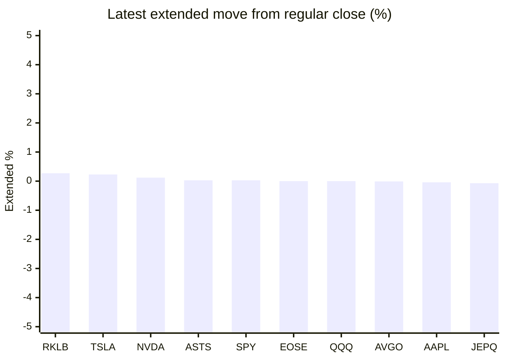

# Stock Brief - 2026-10-03

Generated at 2026-10-03 14:47 +07 from `watchlist.md`.
Prices are snapshots from Yahoo Finance public chart data. Extended/overnight is the latest available pre/post-market datapoint from the same feed.

## Market Snapshot

- SPY: close 769.64, latest extended 769.86, regular move +0.74%, extended move +0.03%
- QQQ: close 749.58, latest extended 749.56, regular move +1.02%, extended move -0.00%
- JEPQ: close 61.04, latest extended 61.00, regular move +0.38%, extended move -0.07%

## Watchlist Prices

| Ticker | Name | Regular close | Latest extended/overnight | Regular move | Extended move | Latest data time | Source |
|---|---|---:|---:|---:|---:|---|---|
| INTC | Intel Corporation | 119.33 USD | 119.19 USD | -0.56% | -0.12% | 2026-10-02 19:59 EDT | [Yahoo](https://finance.yahoo.com/quote/INTC/) |
| AVGO | Broadcom Inc. | 355.14 USD | 355.09 USD | +3.35% | -0.01% | 2026-10-02 19:59 EDT | [Yahoo](https://finance.yahoo.com/quote/AVGO/) |
| RKLB | Rocket Lab Corporation | 73.92 USD | 74.12 USD | +4.91% | +0.27% | 2026-10-02 19:59 EDT | [Yahoo](https://finance.yahoo.com/quote/RKLB/) |
| AAPL | Apple Inc. | 333.69 USD | 333.54 USD | +1.02% | -0.04% | 2026-10-02 19:59 EDT | [Yahoo](https://finance.yahoo.com/quote/AAPL/) |
| NVDA | NVIDIA Corporation | 233.95 USD | 234.22 USD | +1.34% | +0.12% | 2026-10-02 19:59 EDT | [Yahoo](https://finance.yahoo.com/quote/NVDA/) |
| TSLA | Tesla, Inc. | 370.59 USD | 371.45 USD | +4.65% | +0.23% | 2026-10-02 19:59 EDT | [Yahoo](https://finance.yahoo.com/quote/TSLA/) |
| SNDK | Sandisk Corporation | 1,719.99 USD | 1,717.27 USD | -3.79% | -0.16% | 2026-10-02 19:59 EDT | [Yahoo](https://finance.yahoo.com/quote/SNDK/) |
| QQQ | Invesco QQQ Trust, Series 1 | 749.58 USD | 749.56 USD | +1.02% | -0.00% | 2026-10-02 19:59 EDT | [Yahoo](https://finance.yahoo.com/quote/QQQ/) |
| SPY | State Street SPDR S&P 500 ETF T | 769.64 USD | 769.86 USD | +0.74% | +0.03% | 2026-10-02 19:59 EDT | [Yahoo](https://finance.yahoo.com/quote/SPY/) |
| JEPQ | JPMorgan Nasdaq Equity Premium  | 61.04 USD | 61.00 USD | +0.38% | -0.07% | 2026-10-02 19:59 EDT | [Yahoo](https://finance.yahoo.com/quote/JEPQ/) |
| ASTS | AST SpaceMobile, Inc. | 58.45 USD | 58.47 USD | +2.47% | +0.03% | 2026-10-02 19:59 EDT | [Yahoo](https://finance.yahoo.com/quote/ASTS/) |
| MU | Micron Technology, Inc. | 1,074.89 USD | 1,069.15 USD | -2.05% | -0.53% | 2026-10-02 19:59 EDT | [Yahoo](https://finance.yahoo.com/quote/MU/) |
| IREN | IREN LIMITED | 41.76 USD | 41.72 USD | +2.73% | -0.10% | 2026-10-02 19:59 EDT | [Yahoo](https://finance.yahoo.com/quote/IREN/) |
| EOSE | Eos Energy Enterprises, Inc. | 3.21 USD | 3.21 USD | +2.23% | -0.00% | 2026-10-02 19:57 EDT | [Yahoo](https://finance.yahoo.com/quote/EOSE/) |
| GOOG | Alphabet Inc. | 340.35 USD | 340.05 USD | +1.62% | -0.09% | 2026-10-02 19:59 EDT | [Yahoo](https://finance.yahoo.com/quote/GOOG/) |
| DRAM | Roundhill Memory ETF | 61.78 USD | 61.55 USD | -0.40% | -0.36% | 2026-10-02 19:59 EDT | [Yahoo](https://finance.yahoo.com/quote/DRAM/) |
| AMD | Advanced Micro Devices, Inc. | 633.91 USD | 633.00 USD | +2.95% | -0.14% | 2026-10-02 19:59 EDT | [Yahoo](https://finance.yahoo.com/quote/AMD/) |
| ASML | ASML Holding N.V. - New York Re | 1,867.31 USD | 1,865.92 USD | +3.25% | -0.07% | 2026-10-02 19:59 EDT | [Yahoo](https://finance.yahoo.com/quote/ASML/) |

## Charts

### Top Movers - Regular Session

### Extended / Overnight Move

### Quick Heatmap

| Group | Names in watchlist | Avg regular move | Avg extended move |
|---|---|---:|---:|
| Mega-cap tech | AVGO, AAPL, NVDA, TSLA, GOOG | +2.40% | +0.04% |
| Semis / memory | INTC, SNDK, MU, DRAM, AMD, ASML | -0.10% | -0.23% |
| Space / high beta | RKLB, ASTS, IREN, EOSE | +3.09% | +0.05% |
| ETFs | QQQ, SPY, JEPQ | +0.71% | -0.01% |

## News Headlines

- [Broadcom’s $42 Billion Loan to Anthropic Turns the Chipmaker Into Its Customer’s Bank](https://finance.yahoo.com/technology/ai/articles/broadcom-42-billion-loan-anthropic-073843155.html?.tsrc=rss) (2026-10-03 14:38 Bangkok)
- [Dan Ives Says Tesla Could Have A ‘Golden Year’ In 2027 — Robotaxis, Optimus And Cybercab In Focus](https://stocktwits.com/news-articles/markets/equity/dan-ives-tesla-big-ai-pivot-golden-year-2027-robotaxi-optimus-cybercab/cZDZ9s8RBKC?.tsrc=rss) (2026-10-03 14:09 Bangkok)
- [Chinese Savers Want to Invest in U.S. Stocks. Now There’s an Easier Way.](https://finance.yahoo.com/m/b4ac4fe2-3aee-3505-9c2c-054a6768492a/chinese-savers-want-to-invest.html?.tsrc=rss) (2026-10-03 14:00 Bangkok)
- [If I Could Only Buy 1 Space Stock for the Next Decade, It Wouldn't Be SpaceX or Rocket Lab](https://www.fool.com/investing/2026/10/03/if-i-could-only-buy-1-space-stock-for-the-next-dec/?.tsrc=rss) (2026-10-03 13:25 Bangkok)
- [Got $1,000? 2 Growth Stocks Securing Every AI Data Center.](https://www.fool.com/investing/2026/10/03/got-1000-2-growth-stocks-securing-every-ai-data-ce/?.tsrc=rss) (2026-10-03 12:20 Bangkok)
- [Stock-Split Watch: Is Sandisk Next?](https://www.fool.com/investing/2026/10/03/stock-split-watch-is-sandisk-next/?.tsrc=rss) (2026-10-03 11:20 Bangkok)
- [Better Artificial Intelligence Stock: NVIDIA vs. SK Hynix](https://www.fool.com/coverage/better-buy/2026/10/02/better-artificial-intelligence-stock-nvidia-vs-sk-hynix/?.tsrc=rss) (2026-10-03 10:15 Bangkok)
- [Why the iShares Semiconductor ETF Gained 11% in September](https://www.fool.com/investing/2026/10/02/why-the-ishares-semiconductor-etf-gained-11-in-september/?.tsrc=rss) (2026-10-03 09:05 Bangkok)

## Caveats

- This is not investment advice. Extended-hours prices can be thin and volatile.
- Yahoo public endpoints may lag official exchange data.
