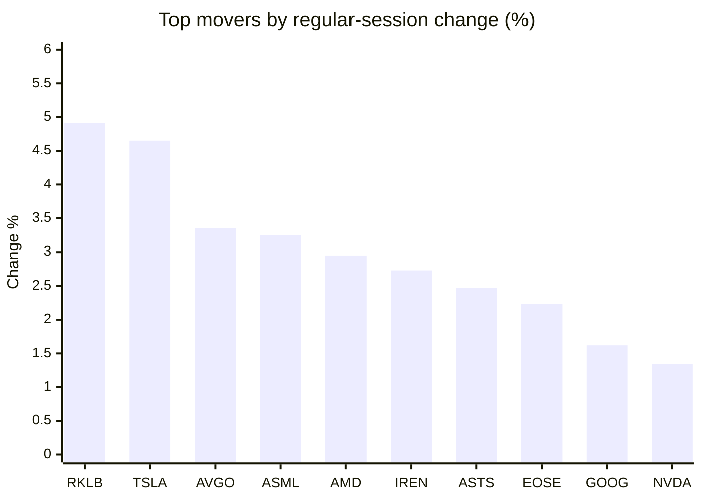
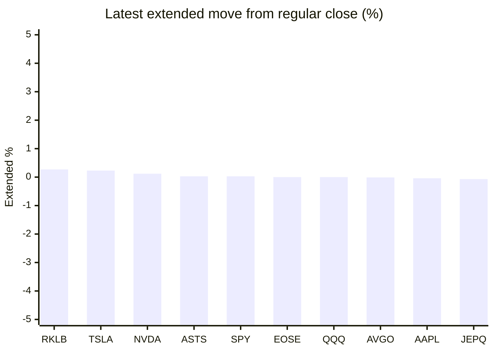

# Stock Brief - 2026-10-04

Generated at 2026-10-04 14:56 +07 from `watchlist.md`.
Prices are snapshots from Yahoo Finance public chart data. Extended/overnight is the latest available pre/post-market datapoint from the same feed.

## Market Snapshot

- SPY: close 769.64, latest extended 769.86, regular move +0.74%, extended move +0.03%
- QQQ: close 749.58, latest extended 749.56, regular move +1.02%, extended move -0.00%
- JEPQ: close 61.04, latest extended 61.00, regular move +0.38%, extended move -0.07%

## Watchlist Prices

| Ticker | Name | Regular close | Latest extended/overnight | Regular move | Extended move | Latest data time | Source |
|---|---|---:|---:|---:|---:|---|---|
| INTC | Intel Corporation | 119.33 USD | 119.19 USD | -0.56% | -0.12% | 2026-10-02 19:59 EDT | [Yahoo](https://finance.yahoo.com/quote/INTC/) |
| AVGO | Broadcom Inc. | 355.14 USD | 355.09 USD | +3.35% | -0.01% | 2026-10-02 19:59 EDT | [Yahoo](https://finance.yahoo.com/quote/AVGO/) |
| RKLB | Rocket Lab Corporation | 73.92 USD | 74.12 USD | +4.91% | +0.27% | 2026-10-02 19:59 EDT | [Yahoo](https://finance.yahoo.com/quote/RKLB/) |
| AAPL | Apple Inc. | 333.69 USD | 333.54 USD | +1.02% | -0.04% | 2026-10-02 19:59 EDT | [Yahoo](https://finance.yahoo.com/quote/AAPL/) |
| NVDA | NVIDIA Corporation | 233.95 USD | 234.22 USD | +1.34% | +0.12% | 2026-10-02 19:59 EDT | [Yahoo](https://finance.yahoo.com/quote/NVDA/) |
| TSLA | Tesla, Inc. | 370.59 USD | 371.45 USD | +4.65% | +0.23% | 2026-10-02 19:59 EDT | [Yahoo](https://finance.yahoo.com/quote/TSLA/) |
| SNDK | Sandisk Corporation | 1,719.99 USD | 1,717.27 USD | -3.79% | -0.16% | 2026-10-02 19:59 EDT | [Yahoo](https://finance.yahoo.com/quote/SNDK/) |
| QQQ | Invesco QQQ Trust, Series 1 | 749.58 USD | 749.56 USD | +1.02% | -0.00% | 2026-10-02 19:59 EDT | [Yahoo](https://finance.yahoo.com/quote/QQQ/) |
| SPY | State Street SPDR S&P 500 ETF T | 769.64 USD | 769.86 USD | +0.74% | +0.03% | 2026-10-02 19:59 EDT | [Yahoo](https://finance.yahoo.com/quote/SPY/) |
| JEPQ | JPMorgan Nasdaq Equity Premium  | 61.04 USD | 61.00 USD | +0.38% | -0.07% | 2026-10-02 19:59 EDT | [Yahoo](https://finance.yahoo.com/quote/JEPQ/) |
| ASTS | AST SpaceMobile, Inc. | 58.45 USD | 58.47 USD | +2.47% | +0.03% | 2026-10-02 19:59 EDT | [Yahoo](https://finance.yahoo.com/quote/ASTS/) |
| MU | Micron Technology, Inc. | 1,074.89 USD | 1,069.15 USD | -2.05% | -0.53% | 2026-10-02 19:59 EDT | [Yahoo](https://finance.yahoo.com/quote/MU/) |
| IREN | IREN LIMITED | 41.76 USD | 41.72 USD | +2.73% | -0.10% | 2026-10-02 19:59 EDT | [Yahoo](https://finance.yahoo.com/quote/IREN/) |
| EOSE | Eos Energy Enterprises, Inc. | 3.21 USD | 3.21 USD | +2.23% | -0.00% | 2026-10-02 19:57 EDT | [Yahoo](https://finance.yahoo.com/quote/EOSE/) |
| GOOG | Alphabet Inc. | 340.35 USD | 340.05 USD | +1.62% | -0.09% | 2026-10-02 19:59 EDT | [Yahoo](https://finance.yahoo.com/quote/GOOG/) |
| DRAM | Roundhill Memory ETF | 61.78 USD | 61.55 USD | -0.40% | -0.36% | 2026-10-02 19:59 EDT | [Yahoo](https://finance.yahoo.com/quote/DRAM/) |
| AMD | Advanced Micro Devices, Inc. | 633.91 USD | 633.00 USD | +2.95% | -0.14% | 2026-10-02 19:59 EDT | [Yahoo](https://finance.yahoo.com/quote/AMD/) |
| ASML | ASML Holding N.V. - New York Re | 1,867.31 USD | 1,865.92 USD | +3.25% | -0.07% | 2026-10-02 19:59 EDT | [Yahoo](https://finance.yahoo.com/quote/ASML/) |

## Charts

### Top Movers - Regular Session

### Extended / Overnight Move

### Quick Heatmap

| Group | Names in watchlist | Avg regular move | Avg extended move |
|---|---|---:|---:|
| Mega-cap tech | AVGO, AAPL, NVDA, TSLA, GOOG | +2.40% | +0.04% |
| Semis / memory | INTC, SNDK, MU, DRAM, AMD, ASML | -0.10% | -0.23% |
| Space / high beta | RKLB, ASTS, IREN, EOSE | +3.09% | +0.05% |
| ETFs | QQQ, SPY, JEPQ | +0.71% | -0.01% |

## News Headlines

- [How Supreme Court Battles Involving Apple, Exxon, and Intel Could Hit Your Portfolio](https://finance.yahoo.com/m/73cd22ed-bdb4-3144-b852-c95810d02024/how-supreme-court-battles.html?.tsrc=rss) (2026-10-04 13:00 Bangkok)
- [Micron Technology vs. Qualcomm: What Revenue Trends Tell Investors About These Tech Companies](https://www.fool.com/coverage/charts/2026/10/04/micron-technology-vs-qualcomm-what-revenue-trends-tell-investors-about-these-tech-companies/?.tsrc=rss) (2026-10-04 12:40 Bangkok)
- [Nvidia CEO Jensen Huang Just Reaffirmed His Jaw-Dropping Projection for 2030](https://www.fool.com/investing/2026/10/04/nvidia-ceo-jensen-huang-just-reaffirmed-his-jaw-dr/?.tsrc=rss) (2026-10-04 11:50 Bangkok)
- [Western Digital vs. Sandisk: The Better Way to Play the Hard-Drive Side of the AI Storage Boom](https://www.fool.com/investing/2026/10/04/western-digital-vs-sandisk-the-better-way-to-play/?.tsrc=rss) (2026-10-04 11:20 Bangkok)
- [How Investors May Respond To Rocket Lab (RKLB) Winning Synspective’s Record 20-Launch Electron Contract](https://finance.yahoo.com/markets/stocks/articles/investors-may-respond-rocket-lab-041427273.html?.tsrc=rss) (2026-10-04 11:14 Bangkok)
- [3 No-Brainer Stocks to Buy If Data Center Expenditures Hit $3 Trillion by 2030](https://www.fool.com/investing/2026/10/03/3-no-brainer-stocks-to-buy-if-data-center-expendit/?.tsrc=rss) (2026-10-04 08:20 Bangkok)
- [3 Investing Rules That CNBC's Jim Cramer Swears By](https://www.fool.com/investing/2026/10/03/3-investing-rules-that-cnbcs-jim-cramer-swears-by/?.tsrc=rss) (2026-10-04 07:20 Bangkok)
- [Greg Abel-Led Berkshire Hathaway Owns 3 Consumer Stocks. Here's the One I'd Buy First.](https://www.fool.com/investing/2026/10/04/greg-abel-led-berkshire-hathaway-owns-3-consumer-s/?.tsrc=rss) (2026-10-04 14:25 Bangkok)

## Caveats

- This is not investment advice. Extended-hours prices can be thin and volatile.
- Yahoo public endpoints may lag official exchange data.
