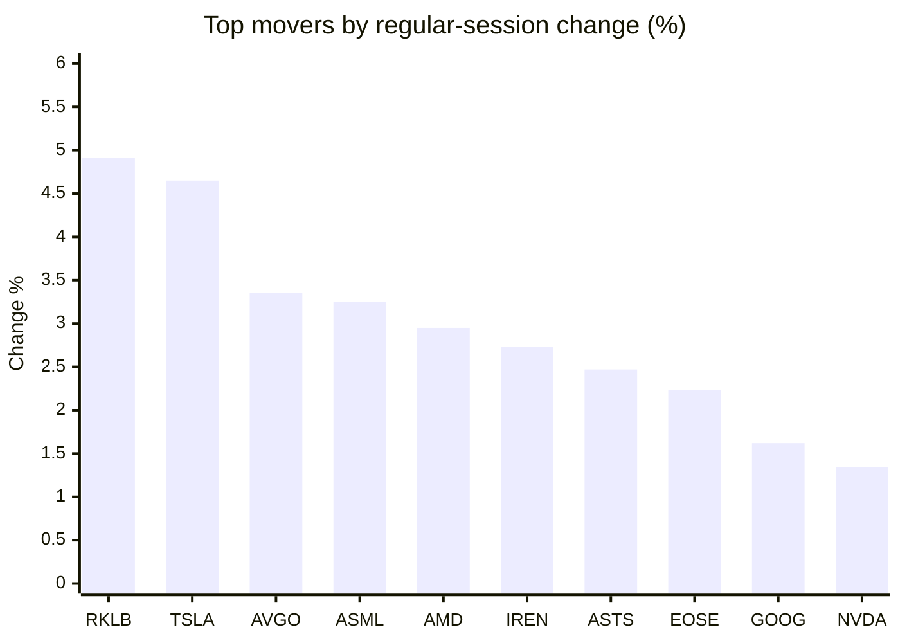
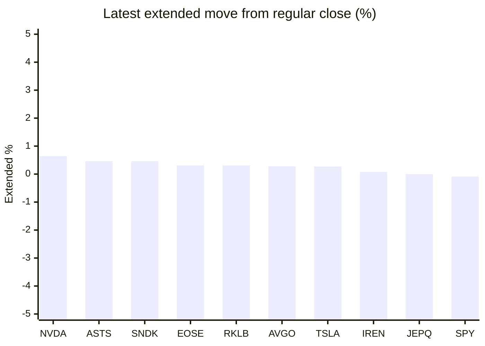

# Stock Brief - 2026-10-05

Generated at 2026-10-05 15:39 +07 from `watchlist.md`.
Prices are snapshots from Yahoo Finance public chart data. Extended/overnight is the latest available pre/post-market datapoint from the same feed.

## Market Snapshot

- SPY: close 769.64, latest extended 768.93, regular move +0.74%, extended move -0.09%
- QQQ: close 749.58, latest extended 748.84, regular move +1.02%, extended move -0.10%
- JEPQ: close 61.04, latest extended 61.04, regular move +0.38%, extended move -0.00%

## Watchlist Prices

| Ticker | Name | Regular close | Latest extended/overnight | Regular move | Extended move | Latest data time | Source |
|---|---|---:|---:|---:|---:|---|---|
| INTC | Intel Corporation | 119.33 USD | 115.64 USD | -0.56% | -3.10% | 2026-10-05 04:39 EDT | [Yahoo](https://finance.yahoo.com/quote/INTC/) |
| AVGO | Broadcom Inc. | 355.14 USD | 356.14 USD | +3.35% | +0.28% | 2026-10-05 04:39 EDT | [Yahoo](https://finance.yahoo.com/quote/AVGO/) |
| RKLB | Rocket Lab Corporation | 73.92 USD | 74.15 USD | +4.91% | +0.31% | 2026-10-05 04:39 EDT | [Yahoo](https://finance.yahoo.com/quote/RKLB/) |
| AAPL | Apple Inc. | 333.69 USD | 332.90 USD | +1.02% | -0.24% | 2026-10-05 04:39 EDT | [Yahoo](https://finance.yahoo.com/quote/AAPL/) |
| NVDA | NVIDIA Corporation | 233.95 USD | 235.45 USD | +1.34% | +0.64% | 2026-10-05 04:39 EDT | [Yahoo](https://finance.yahoo.com/quote/NVDA/) |
| TSLA | Tesla, Inc. | 370.59 USD | 371.61 USD | +4.65% | +0.27% | 2026-10-05 04:39 EDT | [Yahoo](https://finance.yahoo.com/quote/TSLA/) |
| SNDK | Sandisk Corporation | 1,719.99 USD | 1,727.85 USD | -3.79% | +0.46% | 2026-10-05 04:39 EDT | [Yahoo](https://finance.yahoo.com/quote/SNDK/) |
| QQQ | Invesco QQQ Trust, Series 1 | 749.58 USD | 748.84 USD | +1.02% | -0.10% | 2026-10-05 04:39 EDT | [Yahoo](https://finance.yahoo.com/quote/QQQ/) |
| SPY | State Street SPDR S&P 500 ETF T | 769.64 USD | 768.93 USD | +0.74% | -0.09% | 2026-10-05 04:39 EDT | [Yahoo](https://finance.yahoo.com/quote/SPY/) |
| JEPQ | JPMorgan Nasdaq Equity Premium  | 61.04 USD | 61.04 USD | +0.38% | -0.00% | 2026-10-05 04:39 EDT | [Yahoo](https://finance.yahoo.com/quote/JEPQ/) |
| ASTS | AST SpaceMobile, Inc. | 58.45 USD | 58.72 USD | +2.47% | +0.46% | 2026-10-05 04:39 EDT | [Yahoo](https://finance.yahoo.com/quote/ASTS/) |
| MU | Micron Technology, Inc. | 1,074.89 USD | 1,072.65 USD | -2.05% | -0.21% | 2026-10-05 04:39 EDT | [Yahoo](https://finance.yahoo.com/quote/MU/) |
| IREN | IREN LIMITED | 41.76 USD | 41.79 USD | +2.73% | +0.08% | 2026-10-05 04:39 EDT | [Yahoo](https://finance.yahoo.com/quote/IREN/) |
| EOSE | Eos Energy Enterprises, Inc. | 3.21 USD | 3.22 USD | +2.23% | +0.31% | 2026-10-05 04:39 EDT | [Yahoo](https://finance.yahoo.com/quote/EOSE/) |
| GOOG | Alphabet Inc. | 340.35 USD | 339.51 USD | +1.62% | -0.25% | 2026-10-05 04:39 EDT | [Yahoo](https://finance.yahoo.com/quote/GOOG/) |
| DRAM | Roundhill Memory ETF | 61.78 USD | 61.64 USD | -0.40% | -0.23% | 2026-10-05 04:37 EDT | [Yahoo](https://finance.yahoo.com/quote/DRAM/) |
| AMD | Advanced Micro Devices, Inc. | 633.91 USD | 632.93 USD | +2.95% | -0.15% | 2026-10-05 04:39 EDT | [Yahoo](https://finance.yahoo.com/quote/AMD/) |
| ASML | ASML Holding N.V. - New York Re | 1,867.31 USD | 1,850.88 USD | +3.25% | -0.88% | 2026-10-05 04:39 EDT | [Yahoo](https://finance.yahoo.com/quote/ASML/) |

## Charts

### Top Movers - Regular Session

### Extended / Overnight Move

### Quick Heatmap

| Group | Names in watchlist | Avg regular move | Avg extended move |
|---|---|---:|---:|
| Mega-cap tech | AVGO, AAPL, NVDA, TSLA, GOOG | +2.40% | +0.14% |
| Semis / memory | INTC, SNDK, MU, DRAM, AMD, ASML | -0.10% | -0.68% |
| Space / high beta | RKLB, ASTS, IREN, EOSE | +3.09% | +0.29% |
| ETFs | QQQ, SPY, JEPQ | +0.71% | -0.06% |

## News Headlines

- [President Donald Trump's Proposed $5,000 "Trump Dividend" Could Epically Backfire for 2 Key Reasons](https://www.fool.com/investing/2026/10/05/donald-trump-proposed-5000-trump-dividend-epically-backfire-2-key-reasons/?.tsrc=rss) (2026-10-05 15:26 Bangkok)
- [Prediction: Alphabet's Profit Growth Carries It to $5 Trillion Before 2028](https://www.fool.com/investing/2026/10/05/prediction-alphabet-s-profit-growth-carries-it-to-usd5-trillion-before-2028/?.tsrc=rss) (2026-10-05 14:57 Bangkok)
- [3 Market-Beating Stocks to Research Further](https://finance.yahoo.com/markets/stocks/articles/3-market-beating-stocks-research-075454030.html?.tsrc=rss) (2026-10-05 14:54 Bangkok)
- [Nvidia Partner Hon Hai Beats Sales Estimates Due to AI Frenzy](https://finance.yahoo.com/technology/ai/articles/nvidia-partner-hon-hai-beats-074315755.html?.tsrc=rss) (2026-10-05 14:43 Bangkok)
- [Nvidia’s Valuations Show AI Rally Isn’t a Bubble, DBS Says](https://finance.yahoo.com/markets/stocks/articles/nvidia-valuations-show-ai-rally-070429645.html?.tsrc=rss) (2026-10-05 14:04 Bangkok)
- [8 Years of History Warns What a September Rate Hike Could Mean for Stocks](https://www.fool.com/investing/2026/10/05/8-years-of-history-warns-what-a-september-rate-hik/?.tsrc=rss) (2026-10-05 13:35 Bangkok)
- [Broadcom (AVGO) Trades Above Its Own Average Multiple While Growth Cools. Is the Premium Fair?](https://finance.yahoo.com/markets/stocks/articles/broadcom-avgo-trades-above-own-062859716.html?.tsrc=rss) (2026-10-05 13:28 Bangkok)
- [Micron (MU) Posts 87% Gross Margins, Yet Trades at 6 Times Earnings. Is the Cycle Different?](https://finance.yahoo.com/markets/stocks/articles/micron-mu-posts-87-gross-061642765.html?.tsrc=rss) (2026-10-05 13:16 Bangkok)

## Caveats

- This is not investment advice. Extended-hours prices can be thin and volatile.
- Yahoo public endpoints may lag official exchange data.
