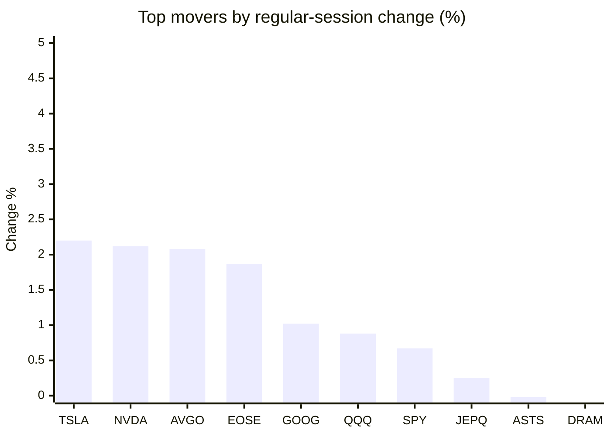
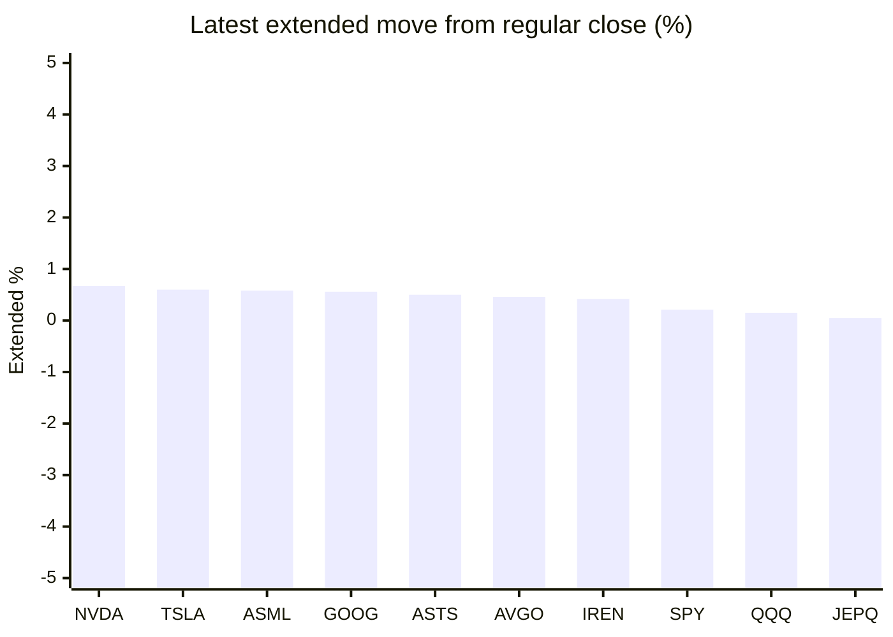

# Stock Brief - 2026-10-06

Generated at 2026-10-06 15:44 +07 from `watchlist.md`.
Prices are snapshots from Yahoo Finance public chart data. Extended/overnight is the latest available pre/post-market datapoint from the same feed.

## Market Snapshot

- SPY: close 774.83, latest extended 776.45, regular move +0.67%, extended move +0.21%
- QQQ: close 756.20, latest extended 757.32, regular move +0.88%, extended move +0.15%
- JEPQ: close 61.19, latest extended 61.22, regular move +0.25%, extended move +0.05%

## Watchlist Prices

| Ticker | Name | Regular close | Latest extended/overnight | Regular move | Extended move | Latest data time | Source |
|---|---|---:|---:|---:|---:|---|---|
| INTC | Intel Corporation | 116.19 USD | 115.93 USD | -2.63% | -0.22% | 2026-10-06 04:44 EDT | [Yahoo](https://finance.yahoo.com/quote/INTC/) |
| AVGO | Broadcom Inc. | 362.51 USD | 364.18 USD | +2.08% | +0.46% | 2026-10-06 04:44 EDT | [Yahoo](https://finance.yahoo.com/quote/AVGO/) |
| RKLB | Rocket Lab Corporation | 73.02 USD | 72.93 USD | -1.22% | -0.12% | 2026-10-06 04:44 EDT | [Yahoo](https://finance.yahoo.com/quote/RKLB/) |
| AAPL | Apple Inc. | 332.89 USD | 333.01 USD | -0.24% | +0.04% | 2026-10-06 04:44 EDT | [Yahoo](https://finance.yahoo.com/quote/AAPL/) |
| NVDA | NVIDIA Corporation | 238.90 USD | 240.50 USD | +2.12% | +0.67% | 2026-10-06 04:44 EDT | [Yahoo](https://finance.yahoo.com/quote/NVDA/) |
| TSLA | Tesla, Inc. | 378.73 USD | 380.99 USD | +2.20% | +0.60% | 2026-10-06 04:44 EDT | [Yahoo](https://finance.yahoo.com/quote/TSLA/) |
| SNDK | Sandisk Corporation | 1,704.16 USD | 1,692.50 USD | -0.92% | -0.68% | 2026-10-06 04:44 EDT | [Yahoo](https://finance.yahoo.com/quote/SNDK/) |
| QQQ | Invesco QQQ Trust, Series 1 | 756.20 USD | 757.32 USD | +0.88% | +0.15% | 2026-10-06 04:44 EDT | [Yahoo](https://finance.yahoo.com/quote/QQQ/) |
| SPY | State Street SPDR S&P 500 ETF T | 774.83 USD | 776.45 USD | +0.67% | +0.21% | 2026-10-06 04:43 EDT | [Yahoo](https://finance.yahoo.com/quote/SPY/) |
| JEPQ | JPMorgan Nasdaq Equity Premium  | 61.19 USD | 61.22 USD | +0.25% | +0.05% | 2026-10-06 04:44 EDT | [Yahoo](https://finance.yahoo.com/quote/JEPQ/) |
| ASTS | AST SpaceMobile, Inc. | 58.44 USD | 58.73 USD | -0.02% | +0.50% | 2026-10-06 04:44 EDT | [Yahoo](https://finance.yahoo.com/quote/ASTS/) |
| MU | Micron Technology, Inc. | 1,063.96 USD | 1,056.71 USD | -1.02% | -0.68% | 2026-10-06 04:44 EDT | [Yahoo](https://finance.yahoo.com/quote/MU/) |
| IREN | IREN LIMITED | 40.48 USD | 40.65 USD | -3.07% | +0.42% | 2026-10-06 04:44 EDT | [Yahoo](https://finance.yahoo.com/quote/IREN/) |
| EOSE | Eos Energy Enterprises, Inc. | 3.27 USD | 3.27 USD | +1.87% | +0.00% | 2026-10-06 04:43 EDT | [Yahoo](https://finance.yahoo.com/quote/EOSE/) |
| GOOG | Alphabet Inc. | 343.83 USD | 345.75 USD | +1.02% | +0.56% | 2026-10-06 04:44 EDT | [Yahoo](https://finance.yahoo.com/quote/GOOG/) |
| DRAM | Roundhill Memory ETF | 61.67 USD | 60.91 USD | -0.18% | -1.23% | 2026-10-06 04:39 EDT | [Yahoo](https://finance.yahoo.com/quote/DRAM/) |
| AMD | Advanced Micro Devices, Inc. | 631.75 USD | 631.06 USD | -0.34% | -0.11% | 2026-10-06 04:44 EDT | [Yahoo](https://finance.yahoo.com/quote/AMD/) |
| ASML | ASML Holding N.V. - New York Re | 1,859.86 USD | 1,870.73 USD | -0.40% | +0.58% | 2026-10-06 04:43 EDT | [Yahoo](https://finance.yahoo.com/quote/ASML/) |

## Charts

### Top Movers - Regular Session

### Extended / Overnight Move

### Quick Heatmap

| Group | Names in watchlist | Avg regular move | Avg extended move |
|---|---|---:|---:|
| Mega-cap tech | AVGO, AAPL, NVDA, TSLA, GOOG | +1.43% | +0.46% |
| Semis / memory | INTC, SNDK, MU, DRAM, AMD, ASML | -0.91% | -0.39% |
| Space / high beta | RKLB, ASTS, IREN, EOSE | -0.61% | +0.20% |
| ETFs | QQQ, SPY, JEPQ | +0.60% | +0.14% |

## News Headlines

- [Anthropic Is Aiming for the Biggest IPO Ever -- Here's the Chip Stock to Buy Before It Lists](https://www.fool.com/investing/2026/10/06/anthropic-is-aiming-for-the-biggest-ipo-ever-here-s-the-chip-stock-to-buy-before-it-lists/?.tsrc=rss) (2026-10-06 15:07 Bangkok)
- [The Overlooked AI Stock Poised to Outperform Nvidia and Palantir](https://www.fool.com/investing/2026/10/06/the-overlooked-ai-stock-poised-to-outperform-nvidi/?.tsrc=rss) (2026-10-06 14:55 Bangkok)
- [Michael Burry Quoted a 1968 Book to Answer Nvidia (NVDA). The Passage Is Uncomfortable](https://finance.yahoo.com/markets/stocks/articles/michael-burry-quoted-1968-book-074259586.html?.tsrc=rss) (2026-10-06 14:42 Bangkok)
- [Will Intel Bring Back Its Dividend Now That Its Stock Has Tripled?](https://www.fool.com/investing/2026/10/06/will-intel-bring-back-its-dividend-now-that-its-stock-has-tripled/?.tsrc=rss) (2026-10-06 14:36 Bangkok)
- [Elon Musk's Trump Admin 'Return' Puts Tesla, SpaceX in Focus: Analyst Says TSLA Faces 'Key Test' — Prediction Market Weighs in](https://www.benzinga.com/markets/prediction-markets/26/10/62181981/elon-musk-trump-admin-return-tesla-spacex-tsla-key-test-prediction-market?utm_source=yahooFinance&utm_campaign=partner_feed&utm_medium=referral&.tsrc=rss) (2026-10-06 14:33 Bangkok)
- [New Strong Buy Stocks for October 6th](https://finance.yahoo.com/markets/stocks/articles/strong-buy-stocks-october-6th-064900050.html?.tsrc=rss) (2026-10-06 13:49 Bangkok)
- [RKLB Stock Rises Overnight: Cathie Wood’s ARK Sees ‘Enormous Opportunity’ As SpaceX Eyes Falcon 9 Retirement](https://stocktwits.com/news-articles/markets/equity/rklb-stock-cathie-wood-ark-enormous-opportunity-spacex-falcon9-retirement/cZDsH9wRBka?.tsrc=rss) (2026-10-06 13:35 Bangkok)
- [Do Not Miss Out On This AI Memory Winner](https://247wallst.com/videos/do-not-miss-out-on-this-ai-memory-winner/?.tsrc=rss) (2026-10-06 12:49 Bangkok)

## Caveats

- This is not investment advice. Extended-hours prices can be thin and volatile.
- Yahoo public endpoints may lag official exchange data.
