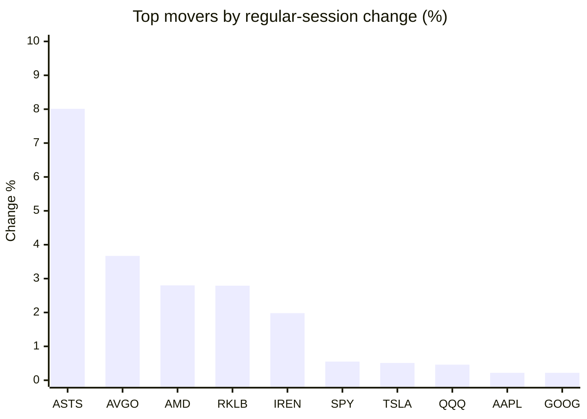
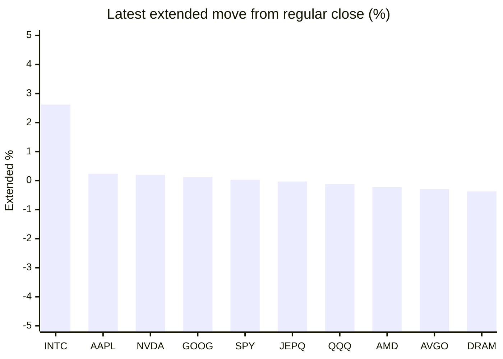

# Stock Brief - 2026-10-07

Generated at 2026-10-07 15:19 +07 from `watchlist.md`.
Prices are snapshots from Yahoo Finance public chart data. Extended/overnight is the latest available pre/post-market datapoint from the same feed.

## Market Snapshot

- SPY: close 779.09, latest extended 779.34, regular move +0.55%, extended move +0.03%
- QQQ: close 759.66, latest extended 758.75, regular move +0.46%, extended move -0.12%
- JEPQ: close 61.25, latest extended 61.23, regular move +0.10%, extended move -0.03%

## Watchlist Prices

| Ticker | Name | Regular close | Latest extended/overnight | Regular move | Extended move | Latest data time | Source |
|---|---|---:|---:|---:|---:|---|---|
| INTC | Intel Corporation | 112.50 USD | 115.45 USD | -3.18% | +2.62% | 2026-10-07 04:19 EDT | [Yahoo](https://finance.yahoo.com/quote/INTC/) |
| AVGO | Broadcom Inc. | 375.81 USD | 374.73 USD | +3.67% | -0.29% | 2026-10-07 04:19 EDT | [Yahoo](https://finance.yahoo.com/quote/AVGO/) |
| RKLB | Rocket Lab Corporation | 75.06 USD | 74.16 USD | +2.79% | -1.20% | 2026-10-07 04:18 EDT | [Yahoo](https://finance.yahoo.com/quote/RKLB/) |
| AAPL | Apple Inc. | 333.63 USD | 334.43 USD | +0.22% | +0.24% | 2026-10-07 04:18 EDT | [Yahoo](https://finance.yahoo.com/quote/AAPL/) |
| NVDA | NVIDIA Corporation | 239.24 USD | 239.73 USD | +0.14% | +0.20% | 2026-10-07 04:18 EDT | [Yahoo](https://finance.yahoo.com/quote/NVDA/) |
| TSLA | Tesla, Inc. | 380.68 USD | 378.74 USD | +0.51% | -0.51% | 2026-10-07 04:18 EDT | [Yahoo](https://finance.yahoo.com/quote/TSLA/) |
| SNDK | Sandisk Corporation | 1,660.46 USD | 1,635.64 USD | -2.56% | -1.49% | 2026-10-07 04:18 EDT | [Yahoo](https://finance.yahoo.com/quote/SNDK/) |
| QQQ | Invesco QQQ Trust, Series 1 | 759.66 USD | 758.75 USD | +0.46% | -0.12% | 2026-10-07 04:19 EDT | [Yahoo](https://finance.yahoo.com/quote/QQQ/) |
| SPY | State Street SPDR S&P 500 ETF T | 779.09 USD | 779.34 USD | +0.55% | +0.03% | 2026-10-07 04:13 EDT | [Yahoo](https://finance.yahoo.com/quote/SPY/) |
| JEPQ | JPMorgan Nasdaq Equity Premium  | 61.25 USD | 61.23 USD | +0.10% | -0.03% | 2026-10-07 04:11 EDT | [Yahoo](https://finance.yahoo.com/quote/JEPQ/) |
| ASTS | AST SpaceMobile, Inc. | 63.12 USD | 62.09 USD | +8.01% | -1.63% | 2026-10-07 04:11 EDT | [Yahoo](https://finance.yahoo.com/quote/ASTS/) |
| MU | Micron Technology, Inc. | 1,045.56 USD | 1,034.40 USD | -1.73% | -1.07% | 2026-10-07 04:18 EDT | [Yahoo](https://finance.yahoo.com/quote/MU/) |
| IREN | IREN LIMITED | 41.28 USD | 40.88 USD | +1.98% | -0.97% | 2026-10-07 04:18 EDT | [Yahoo](https://finance.yahoo.com/quote/IREN/) |
| EOSE | Eos Energy Enterprises, Inc. | 3.26 USD | 3.23 USD | -0.31% | -0.87% | 2026-10-07 04:11 EDT | [Yahoo](https://finance.yahoo.com/quote/EOSE/) |
| GOOG | Alphabet Inc. | 344.59 USD | 344.99 USD | +0.22% | +0.12% | 2026-10-07 04:14 EDT | [Yahoo](https://finance.yahoo.com/quote/GOOG/) |
| DRAM | Roundhill Memory ETF | 59.52 USD | 59.30 USD | -3.49% | -0.37% | 2026-10-07 04:18 EDT | [Yahoo](https://finance.yahoo.com/quote/DRAM/) |
| AMD | Advanced Micro Devices, Inc. | 649.42 USD | 647.99 USD | +2.80% | -0.22% | 2026-10-07 04:19 EDT | [Yahoo](https://finance.yahoo.com/quote/AMD/) |
| ASML | ASML Holding N.V. - New York Re | 1,834.10 USD | 1,816.21 USD | -1.39% | -0.98% | 2026-10-07 04:18 EDT | [Yahoo](https://finance.yahoo.com/quote/ASML/) |

## Charts

### Top Movers - Regular Session

### Extended / Overnight Move

### Quick Heatmap

| Group | Names in watchlist | Avg regular move | Avg extended move |
|---|---|---:|---:|
| Mega-cap tech | AVGO, AAPL, NVDA, TSLA, GOOG | +0.95% | -0.05% |
| Semis / memory | INTC, SNDK, MU, DRAM, AMD, ASML | -1.59% | -0.25% |
| Space / high beta | RKLB, ASTS, IREN, EOSE | +3.12% | -1.17% |
| ETFs | QQQ, SPY, JEPQ | +0.37% | -0.04% |

## News Headlines

- [INTC Stock Jumps Overnight: CEO Says Intel Will Keep Working With Musk's Terafab Amid TSMC Partnership Buzz](https://stocktwits.com/news-articles/markets/equity/intc-stock-jumps-overnight-ceo-says-intel-will-keep-working-with-musk-s-terafab-amid-tsmc-partnership-buzz/cZDv2eMRBmE?.tsrc=rss) (2026-10-07 14:42 Bangkok)
- [Micron workers at Taiwan plant vote in favour of strike](https://finance.yahoo.com/markets/stocks/articles/micron-workers-taiwan-plant-vote-074005592.html?.tsrc=rss) (2026-10-07 14:40 Bangkok)
- [The $500 Billion Question Causing Waves Across Every AI Stock: How Much Are Nvidia GPUs Actually Worth?](https://www.fool.com/investing/2026/10/07/the-500-billion-question-causing-waves-across-ever/?.tsrc=rss) (2026-10-07 14:37 Bangkok)
- [New Strong Buy Stocks for October 7th](https://finance.yahoo.com/markets/stocks/articles/strong-buy-stocks-october-7th-063100317.html?.tsrc=rss) (2026-10-07 13:31 Bangkok)
- [Zacks Investment Ideas feature highlights: Advanced Micro, Tesla, Meta and SpaceX](https://finance.yahoo.com/markets/stocks/articles/zacks-investment-ideas-feature-highlights-054400647.html?.tsrc=rss) (2026-10-07 12:44 Bangkok)
- [Marvell Now Sees as Much as $90 Billion in Annual Sales by Fiscal 2031. Here's Why It's a Chip Stock to Buy.](https://www.fool.com/investing/2026/10/07/marvell-now-sees-as-much-as-usd90-billion-in-annual-sales-by-fiscal-2031-here-s-why-it-s-a-chip-stock-to-buy/?.tsrc=rss) (2026-10-07 15:03 Bangkok)
- [Regulators Cleared a Small Modular Reactor for Construction. It Isn't a NuScale Design.](https://www.fool.com/investing/2026/10/07/regulators-cleared-a-small-modular-reactor-for-construction-it-isn-t-a-nuscale-design/?.tsrc=rss) (2026-10-07 14:29 Bangkok)
- [IonQ (IONQ) Could Be 10% Below Fair Value After FIU Quantum Deal](https://finance.yahoo.com/markets/stocks/articles/ionq-ionq-could-10-below-071544713.html?.tsrc=rss) (2026-10-07 14:15 Bangkok)

## Caveats

- This is not investment advice. Extended-hours prices can be thin and volatile.
- Yahoo public endpoints may lag official exchange data.
