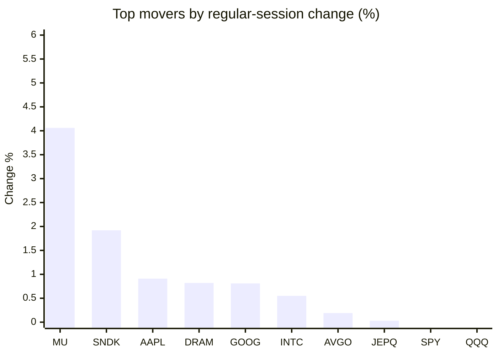
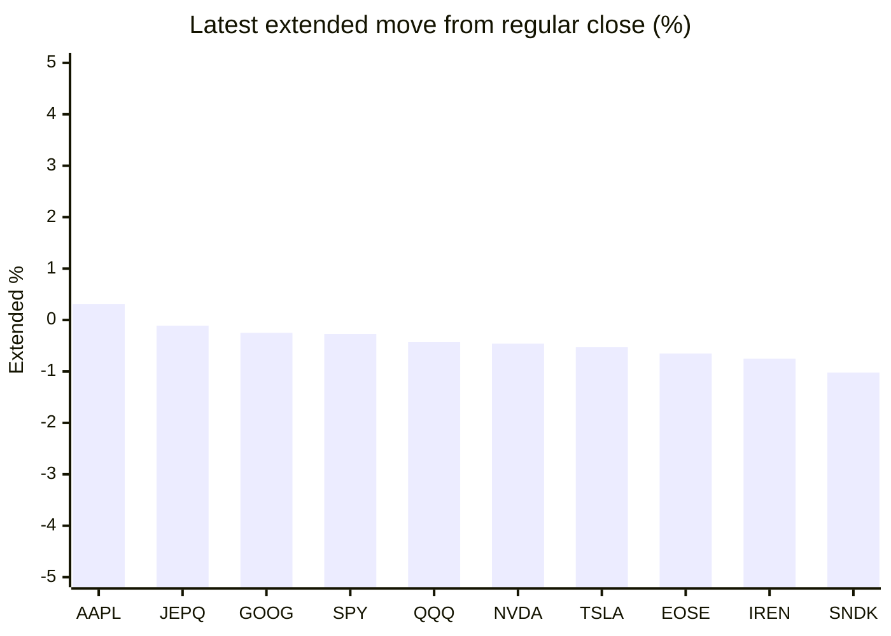

# Stock Brief - 2026-10-08

Generated at 2026-10-08 15:35 +07 from `watchlist.md`.
Prices are snapshots from Yahoo Finance public chart data. Extended/overnight is the latest available pre/post-market datapoint from the same feed.

## Market Snapshot

- SPY: close 777.22, latest extended 775.16, regular move -0.24%, extended move -0.27%
- QQQ: close 757.73, latest extended 754.46, regular move -0.25%, extended move -0.43%
- JEPQ: close 61.27, latest extended 61.20, regular move +0.03%, extended move -0.11%

## Watchlist Prices

| Ticker | Name | Regular close | Latest extended/overnight | Regular move | Extended move | Latest data time | Source |
|---|---|---:|---:|---:|---:|---|---|
| INTC | Intel Corporation | 113.12 USD | 111.10 USD | +0.55% | -1.79% | 2026-10-08 04:35 EDT | [Yahoo](https://finance.yahoo.com/quote/INTC/) |
| AVGO | Broadcom Inc. | 376.51 USD | 371.95 USD | +0.19% | -1.21% | 2026-10-08 04:34 EDT | [Yahoo](https://finance.yahoo.com/quote/AVGO/) |
| RKLB | Rocket Lab Corporation | 71.92 USD | 70.98 USD | -4.18% | -1.31% | 2026-10-08 04:32 EDT | [Yahoo](https://finance.yahoo.com/quote/RKLB/) |
| AAPL | Apple Inc. | 336.67 USD | 337.71 USD | +0.91% | +0.31% | 2026-10-08 04:34 EDT | [Yahoo](https://finance.yahoo.com/quote/AAPL/) |
| NVDA | NVIDIA Corporation | 237.47 USD | 236.38 USD | -0.74% | -0.46% | 2026-10-08 04:35 EDT | [Yahoo](https://finance.yahoo.com/quote/NVDA/) |
| TSLA | Tesla, Inc. | 377.81 USD | 375.80 USD | -0.75% | -0.53% | 2026-10-08 04:34 EDT | [Yahoo](https://finance.yahoo.com/quote/TSLA/) |
| SNDK | Sandisk Corporation | 1,692.42 USD | 1,675.22 USD | +1.92% | -1.02% | 2026-10-08 04:33 EDT | [Yahoo](https://finance.yahoo.com/quote/SNDK/) |
| QQQ | Invesco QQQ Trust, Series 1 | 757.73 USD | 754.46 USD | -0.25% | -0.43% | 2026-10-08 04:35 EDT | [Yahoo](https://finance.yahoo.com/quote/QQQ/) |
| SPY | State Street SPDR S&P 500 ETF T | 777.22 USD | 775.16 USD | -0.24% | -0.27% | 2026-10-08 04:33 EDT | [Yahoo](https://finance.yahoo.com/quote/SPY/) |
| JEPQ | JPMorgan Nasdaq Equity Premium  | 61.27 USD | 61.20 USD | +0.03% | -0.11% | 2026-10-08 04:23 EDT | [Yahoo](https://finance.yahoo.com/quote/JEPQ/) |
| ASTS | AST SpaceMobile, Inc. | 60.65 USD | 59.54 USD | -3.91% | -1.83% | 2026-10-08 04:32 EDT | [Yahoo](https://finance.yahoo.com/quote/ASTS/) |
| MU | Micron Technology, Inc. | 1,088.00 USD | 1,072.48 USD | +4.06% | -1.43% | 2026-10-08 04:35 EDT | [Yahoo](https://finance.yahoo.com/quote/MU/) |
| IREN | IREN LIMITED | 38.69 USD | 38.40 USD | -6.27% | -0.75% | 2026-10-08 04:34 EDT | [Yahoo](https://finance.yahoo.com/quote/IREN/) |
| EOSE | Eos Energy Enterprises, Inc. | 3.10 USD | 3.08 USD | -4.91% | -0.65% | 2026-10-08 04:32 EDT | [Yahoo](https://finance.yahoo.com/quote/EOSE/) |
| GOOG | Alphabet Inc. | 347.37 USD | 346.51 USD | +0.81% | -0.25% | 2026-10-08 04:33 EDT | [Yahoo](https://finance.yahoo.com/quote/GOOG/) |
| DRAM | Roundhill Memory ETF | 60.01 USD | 58.84 USD | +0.82% | -1.95% | 2026-10-08 04:35 EDT | [Yahoo](https://finance.yahoo.com/quote/DRAM/) |
| AMD | Advanced Micro Devices, Inc. | 645.86 USD | 638.39 USD | -0.55% | -1.16% | 2026-10-08 04:32 EDT | [Yahoo](https://finance.yahoo.com/quote/AMD/) |
| ASML | ASML Holding N.V. - New York Re | 1,804.96 USD | 1,786.50 USD | -1.59% | -1.02% | 2026-10-08 04:35 EDT | [Yahoo](https://finance.yahoo.com/quote/ASML/) |

## Charts

### Top Movers - Regular Session

### Extended / Overnight Move

### Quick Heatmap

| Group | Names in watchlist | Avg regular move | Avg extended move |
|---|---|---:|---:|
| Mega-cap tech | AVGO, AAPL, NVDA, TSLA, GOOG | +0.08% | -0.43% |
| Semis / memory | INTC, SNDK, MU, DRAM, AMD, ASML | +0.87% | -1.39% |
| Space / high beta | RKLB, ASTS, IREN, EOSE | -4.82% | -1.13% |
| ETFs | QQQ, SPY, JEPQ | -0.15% | -0.27% |

## News Headlines

- [Should You Buy Stocks in October? History’s Answer is Strikingly Clear.](https://www.fool.com/investing/2026/10/08/should-you-buy-stocks-in-october-history-s-answer-is-strikingly-clear/?.tsrc=rss) (2026-10-08 15:22 Bangkok)
- [Update: Market Chatter: Micron Technology's Taiwan Workers Authorize Strike Over Bonus Dispute](https://finance.yahoo.com/markets/stocks/articles/market-chatter-micron-technology-apos-082145334.html?.tsrc=rss) (2026-10-08 15:21 Bangkok)
- [If You Had Invested $10,000 in Apple Stock 10 Years Ago, Here's How Much You'd Have Today](https://www.fool.com/investing/2026/10/08/if-you-had-invested-10000-in-apple-stock-10-years/?.tsrc=rss) (2026-10-08 15:15 Bangkok)
- [Norway Electric Vehicle Market Size and Forecast 2026-2030 - Q2 2026 Databook | 13.8% CAGR to Lift Market to US$190.9 Million by 2030, Led by Affordable EVs and Fleet Charging](https://finance.yahoo.com/energy/articles/norway-electric-vehicle-market-size-080300769.html?.tsrc=rss) (2026-10-08 15:03 Bangkok)
- [OneKey Launches OneKey Pro 2: First Hardware Wallet With Portfolio View](https://finance.yahoo.com/markets/crypto/articles/onekey-launches-onekey-pro-2-080000811.html?.tsrc=rss) (2026-10-08 15:00 Bangkok)
- [Prediction: The Number That Will Move Intel Stock in October Isn't Revenue](https://www.fool.com/investing/2026/10/08/prediction-the-number-that-will-move-intel-stock-in-october-isn-t-revenue/?.tsrc=rss) (2026-10-08 14:39 Bangkok)
- [MU, TSM Stocks Dip Overnight As Samsung Forecasts Record $80B Operating Profit In Q3](https://stocktwits.com/news-articles/markets/equity/mu-tsm-stocks-dip-overnight-as-samsung-forecasts-record-80-b-operating-profit-in-q3/cZDUBzORBZx?.tsrc=rss) (2026-10-08 14:26 Bangkok)
- [Intel (INTC) Stock Could Be 46% Overvalued As Terafab Questions Linger](https://finance.yahoo.com/markets/stocks/articles/intel-intc-stock-could-46-071506651.html?.tsrc=rss) (2026-10-08 14:15 Bangkok)

## Caveats

- This is not investment advice. Extended-hours prices can be thin and volatile.
- Yahoo public endpoints may lag official exchange data.
