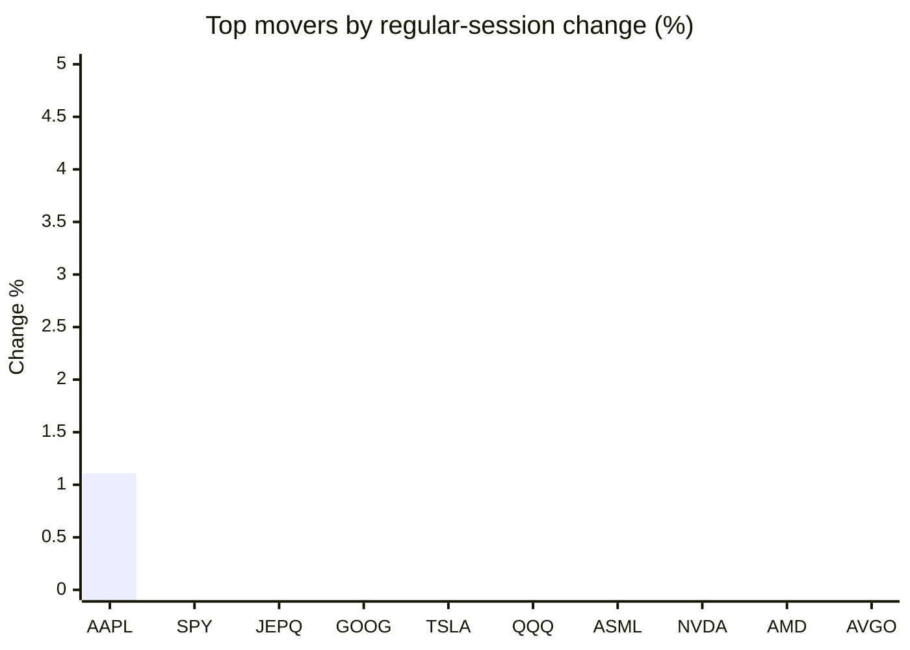
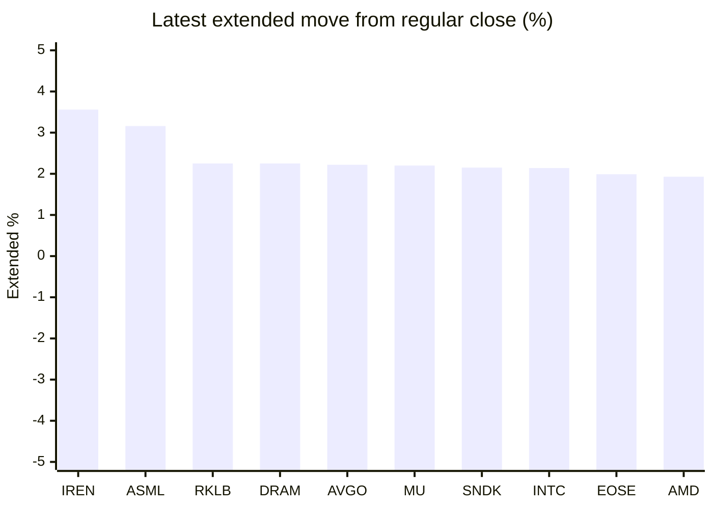

# Stock Brief - 2026-10-09

Generated at 2026-10-09 15:40 +07 from `watchlist.md`.
Prices are snapshots from Yahoo Finance public chart data. Extended/overnight is the latest available pre/post-market datapoint from the same feed.

## Market Snapshot

- SPY: close 773.93, latest extended 777.27, regular move -0.42%, extended move +0.43%
- QQQ: close 747.58, latest extended 754.35, regular move -1.34%, extended move +0.91%
- JEPQ: close 60.93, latest extended 61.25, regular move -0.55%, extended move +0.53%

## Watchlist Prices

| Ticker | Name | Regular close | Latest extended/overnight | Regular move | Extended move | Latest data time | Source |
|---|---|---:|---:|---:|---:|---|---|
| INTC | Intel Corporation | 107.08 USD | 109.37 USD | -5.34% | +2.14% | 2026-10-09 04:40 EDT | [Yahoo](https://finance.yahoo.com/quote/INTC/) |
| AVGO | Broadcom Inc. | 360.14 USD | 368.12 USD | -4.35% | +2.22% | 2026-10-09 04:40 EDT | [Yahoo](https://finance.yahoo.com/quote/AVGO/) |
| RKLB | Rocket Lab Corporation | 68.40 USD | 69.94 USD | -4.89% | +2.25% | 2026-10-09 04:38 EDT | [Yahoo](https://finance.yahoo.com/quote/RKLB/) |
| AAPL | Apple Inc. | 340.42 USD | 333.56 USD | +1.11% | -2.02% | 2026-10-09 04:40 EDT | [Yahoo](https://finance.yahoo.com/quote/AAPL/) |
| NVDA | NVIDIA Corporation | 230.48 USD | 234.66 USD | -2.94% | +1.81% | 2026-10-09 04:40 EDT | [Yahoo](https://finance.yahoo.com/quote/NVDA/) |
| TSLA | Tesla, Inc. | 375.00 USD | 379.99 USD | -0.74% | +1.33% | 2026-10-09 04:40 EDT | [Yahoo](https://finance.yahoo.com/quote/TSLA/) |
| SNDK | Sandisk Corporation | 1,609.46 USD | 1,644.00 USD | -4.90% | +2.15% | 2026-10-09 04:37 EDT | [Yahoo](https://finance.yahoo.com/quote/SNDK/) |
| QQQ | Invesco QQQ Trust, Series 1 | 747.58 USD | 754.35 USD | -1.34% | +0.91% | 2026-10-09 04:40 EDT | [Yahoo](https://finance.yahoo.com/quote/QQQ/) |
| SPY | State Street SPDR S&P 500 ETF T | 773.93 USD | 777.27 USD | -0.42% | +0.43% | 2026-10-09 04:40 EDT | [Yahoo](https://finance.yahoo.com/quote/SPY/) |
| JEPQ | JPMorgan Nasdaq Equity Premium  | 60.93 USD | 61.25 USD | -0.55% | +0.53% | 2026-10-09 04:24 EDT | [Yahoo](https://finance.yahoo.com/quote/JEPQ/) |
| ASTS | AST SpaceMobile, Inc. | 56.93 USD | 55.65 USD | -6.13% | -2.25% | 2026-10-09 04:40 EDT | [Yahoo](https://finance.yahoo.com/quote/ASTS/) |
| MU | Micron Technology, Inc. | 1,035.84 USD | 1,058.60 USD | -4.79% | +2.20% | 2026-10-09 04:40 EDT | [Yahoo](https://finance.yahoo.com/quote/MU/) |
| IREN | IREN LIMITED | 35.71 USD | 36.98 USD | -7.70% | +3.56% | 2026-10-09 04:40 EDT | [Yahoo](https://finance.yahoo.com/quote/IREN/) |
| EOSE | Eos Energy Enterprises, Inc. | 2.77 USD | 2.82 USD | -10.81% | +1.99% | 2026-10-09 04:38 EDT | [Yahoo](https://finance.yahoo.com/quote/EOSE/) |
| GOOG | Alphabet Inc. | 344.86 USD | 347.61 USD | -0.72% | +0.80% | 2026-10-09 04:39 EDT | [Yahoo](https://finance.yahoo.com/quote/GOOG/) |
| DRAM | Roundhill Memory ETF | 56.93 USD | 58.21 USD | -5.13% | +2.25% | 2026-10-09 04:37 EDT | [Yahoo](https://finance.yahoo.com/quote/DRAM/) |
| AMD | Advanced Micro Devices, Inc. | 620.68 USD | 632.65 USD | -3.90% | +1.93% | 2026-10-09 04:38 EDT | [Yahoo](https://finance.yahoo.com/quote/AMD/) |
| ASML | ASML Holding N.V. - New York Re | 1,769.79 USD | 1,825.63 USD | -1.95% | +3.16% | 2026-10-09 04:38 EDT | [Yahoo](https://finance.yahoo.com/quote/ASML/) |

## Charts

### Top Movers - Regular Session

### Extended / Overnight Move

### Quick Heatmap

| Group | Names in watchlist | Avg regular move | Avg extended move |
|---|---|---:|---:|
| Mega-cap tech | AVGO, AAPL, NVDA, TSLA, GOOG | -1.53% | +0.83% |
| Semis / memory | INTC, SNDK, MU, DRAM, AMD, ASML | -4.34% | +2.30% |
| Space / high beta | RKLB, ASTS, IREN, EOSE | -7.38% | +1.39% |
| ETFs | QQQ, SPY, JEPQ | -0.77% | +0.62% |

## News Headlines

- [Asian stocks mostly up as traders weigh AI, oil dips after surge](https://finance.yahoo.com/markets/world-indices/articles/asian-stocks-mixed-amid-ai-031816763.html?.tsrc=rss) (2026-10-09 15:25 Bangkok)
- [Is iPhone 18 Pro Demand Slowing? Apple Reportedly Cuts October Component Orders, Stock Slips Premarket](https://stocktwits.com/news-articles/markets/equity/is-i-phone-18-pro-demand-slowing-apple-reportedly-cuts-october-component-orders-stock-slips-premarket/cZD6S7ZRBVr?.tsrc=rss) (2026-10-09 15:08 Bangkok)
- [Stocktwits Passport Portfolio: Wall Street Outpaces Asia As AI Trade Wobbles And Bond Yields Climb](https://stocktwits.com/news-articles/markets/equity/stocktwits-passport-portfolio-wall-street-outpaces-asia-as-ai-trade-wobbles-and-bond-yields-climb/cZD60nORBVY?.tsrc=rss) (2026-10-09 14:08 Bangkok)
- [Apple cuts iPhone18 Pro component orders amid sluggish demand- Nikkei](https://finance.yahoo.com/technology/articles/apple-cuts-iphone18-pro-component-065118012.html?.tsrc=rss) (2026-10-09 13:51 Bangkok)
- [Stocktwits AI Roundup: OpenAI Revenue Woes Rattle Chip Stocks, SoftBank Hunts $100B, Microsoft Goes AI-First](https://stocktwits.com/news-articles/markets/equity/stocktwits-ai-roundup-open-ai-revenue-woes-rattle-chip-stocks-soft-bank-hunts-100-b-microsoft-goes-ai-first/cZD6Ly7RBV8?.tsrc=rss) (2026-10-09 13:43 Bangkok)
- [Apple Names a New M&A Chief: What It Means for $100 Billion a Year in Buybacks](https://www.tikr.com/blog/apple-names-a-new-ma-chief-what-it-means-for-100-billion-a-year-in-buybacks?ref=yahoofinance&.tsrc=rss) (2026-10-09 13:31 Bangkok)
- [Michael Burry Says Trump Will ‘Pull Out All The Stops’ For AI — ‘Dean Of Valuation’ Holds 5 Mag Seven Stocks, Adds Cash](https://stocktwits.com/news-articles/markets/equity/michael-burry-trump-pull-out-stops-ai-dean-of-valuation-holds-5-mag-seven-stocks-adds-cash/cZD6hzXRBVm?.tsrc=rss) (2026-10-09 13:05 Bangkok)
- [Here's Where Palantir and 4 Other AI Software Stocks Could Be in 5 Years](https://www.fool.com/investing/2026/10/09/where-palantir-ai-software-stock-crwd-soun-app/?.tsrc=rss) (2026-10-09 15:35 Bangkok)

## Caveats

- This is not investment advice. Extended-hours prices can be thin and volatile.
- Yahoo public endpoints may lag official exchange data.
