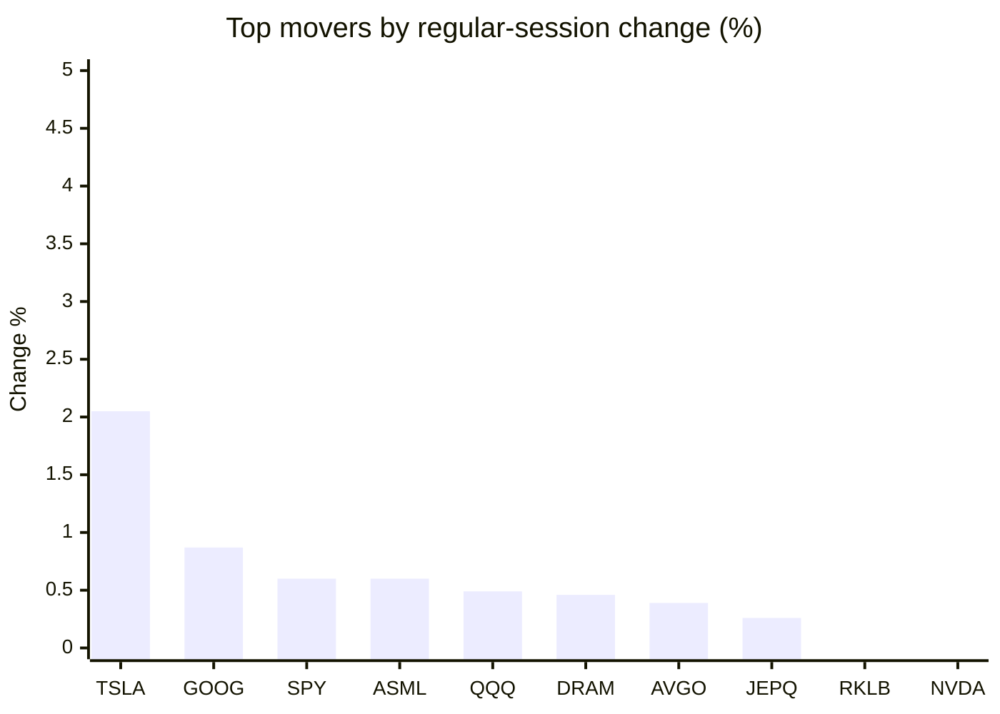
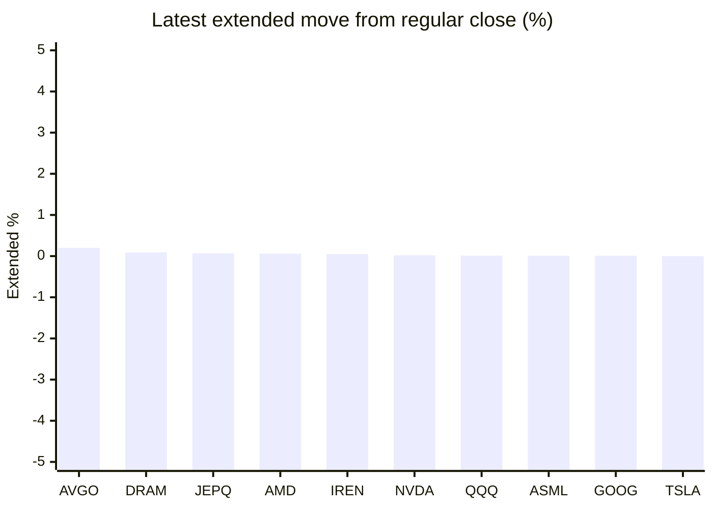

# Stock Brief - 2026-10-10

Generated at 2026-10-10 15:14 +07 from `watchlist.md`.
Prices are snapshots from Yahoo Finance public chart data. Extended/overnight is the latest available pre/post-market datapoint from the same feed.

## Market Snapshot

- SPY: close 778.57, latest extended 778.57, regular move +0.60%, extended move -0.00%
- QQQ: close 751.27, latest extended 751.38, regular move +0.49%, extended move +0.01%
- JEPQ: close 61.09, latest extended 61.13, regular move +0.26%, extended move +0.07%

## Watchlist Prices

| Ticker | Name | Regular close | Latest extended/overnight | Regular move | Extended move | Latest data time | Source |
|---|---|---:|---:|---:|---:|---|---|
| INTC | Intel Corporation | 104.70 USD | 104.43 USD | -2.22% | -0.26% | 2026-10-09 19:59 EDT | [Yahoo](https://finance.yahoo.com/quote/INTC/) |
| AVGO | Broadcom Inc. | 361.54 USD | 362.25 USD | +0.39% | +0.20% | 2026-10-09 19:59 EDT | [Yahoo](https://finance.yahoo.com/quote/AVGO/) |
| RKLB | Rocket Lab Corporation | 68.21 USD | 68.20 USD | -0.28% | -0.01% | 2026-10-09 19:58 EDT | [Yahoo](https://finance.yahoo.com/quote/RKLB/) |
| AAPL | Apple Inc. | 336.64 USD | 336.08 USD | -1.11% | -0.17% | 2026-10-09 19:59 EDT | [Yahoo](https://finance.yahoo.com/quote/AAPL/) |
| NVDA | NVIDIA Corporation | 229.28 USD | 229.33 USD | -0.52% | +0.02% | 2026-10-09 19:59 EDT | [Yahoo](https://finance.yahoo.com/quote/NVDA/) |
| TSLA | Tesla, Inc. | 382.70 USD | 382.72 USD | +2.05% | +0.00% | 2026-10-09 19:59 EDT | [Yahoo](https://finance.yahoo.com/quote/TSLA/) |
| SNDK | Sandisk Corporation | 1,581.82 USD | 1,581.40 USD | -1.72% | -0.03% | 2026-10-09 19:59 EDT | [Yahoo](https://finance.yahoo.com/quote/SNDK/) |
| QQQ | Invesco QQQ Trust, Series 1 | 751.27 USD | 751.38 USD | +0.49% | +0.01% | 2026-10-09 19:59 EDT | [Yahoo](https://finance.yahoo.com/quote/QQQ/) |
| SPY | State Street SPDR S&P 500 ETF T | 778.57 USD | 778.57 USD | +0.60% | -0.00% | 2026-10-09 19:59 EDT | [Yahoo](https://finance.yahoo.com/quote/SPY/) |
| JEPQ | JPMorgan Nasdaq Equity Premium  | 61.09 USD | 61.13 USD | +0.26% | +0.07% | 2026-10-09 19:50 EDT | [Yahoo](https://finance.yahoo.com/quote/JEPQ/) |
| ASTS | AST SpaceMobile, Inc. | 50.97 USD | 50.93 USD | -10.48% | -0.07% | 2026-10-09 19:59 EDT | [Yahoo](https://finance.yahoo.com/quote/ASTS/) |
| MU | Micron Technology, Inc. | 1,029.00 USD | 1,028.50 USD | -0.66% | -0.05% | 2026-10-09 19:59 EDT | [Yahoo](https://finance.yahoo.com/quote/MU/) |
| IREN | IREN LIMITED | 35.19 USD | 35.21 USD | -1.46% | +0.05% | 2026-10-09 19:59 EDT | [Yahoo](https://finance.yahoo.com/quote/IREN/) |
| EOSE | Eos Energy Enterprises, Inc. | 2.52 USD | 2.51 USD | -8.86% | -0.40% | 2026-10-09 19:59 EDT | [Yahoo](https://finance.yahoo.com/quote/EOSE/) |
| GOOG | Alphabet Inc. | 347.86 USD | 347.90 USD | +0.87% | +0.01% | 2026-10-09 19:59 EDT | [Yahoo](https://finance.yahoo.com/quote/GOOG/) |
| DRAM | Roundhill Memory ETF | 57.19 USD | 57.24 USD | +0.46% | +0.09% | 2026-10-09 19:59 EDT | [Yahoo](https://finance.yahoo.com/quote/DRAM/) |
| AMD | Advanced Micro Devices, Inc. | 608.10 USD | 608.49 USD | -2.03% | +0.06% | 2026-10-09 19:59 EDT | [Yahoo](https://finance.yahoo.com/quote/AMD/) |
| ASML | ASML Holding N.V. - New York Re | 1,780.34 USD | 1,780.56 USD | +0.60% | +0.01% | 2026-10-09 19:59 EDT | [Yahoo](https://finance.yahoo.com/quote/ASML/) |

## Charts

### Top Movers - Regular Session

### Extended / Overnight Move

### Quick Heatmap

| Group | Names in watchlist | Avg regular move | Avg extended move |
|---|---|---:|---:|
| Mega-cap tech | AVGO, AAPL, NVDA, TSLA, GOOG | +0.34% | +0.01% |
| Semis / memory | INTC, SNDK, MU, DRAM, AMD, ASML | -0.93% | -0.03% |
| Space / high beta | RKLB, ASTS, IREN, EOSE | -5.27% | -0.11% |
| ETFs | QQQ, SPY, JEPQ | +0.45% | +0.03% |

## News Headlines

- [Tesla Drops “Full Self-Driving” in Europe, Where Its Revenue Fell 10% Last Year](https://www.tikr.com/blog/tesla-drops-full-self-driving-in-europe-where-its-revenue-fell-10-last-year?ref=yahoofinance&.tsrc=rss) (2026-10-10 13:52 Bangkok)
- [This Forgotten AI Stock Is Up 689% and Nobody's Talking About It](https://www.fool.com/investing/2026/10/10/this-forgotten-ai-stock-is-up-689-and-nobodys-talk/?.tsrc=rss) (2026-10-10 12:20 Bangkok)
- [SpaceX's Spectrum Deal Could Boost AST SpaceMobile’s Strategic Value — Analyst Calls ASTS 'Natural Satellite Partner' For Carriers](https://stocktwits.com/news-articles/markets/equity/spcx-spectrum-deal-raises-asts-value-telecom-stocks/cZxTkNERBnp?.tsrc=rss) (2026-10-10 11:32 Bangkok)
- [MAG 7 Voices: How Nvidia, Microsoft, Alphabet, Meta Reshaped AI This Week](https://stocktwits.com/news-articles/markets/equity/mag-7-voices-how-nvidia-microsoft-alphabet-meta-reshaped-ai-this-week/cZxT1H2RBn8?.tsrc=rss) (2026-10-10 10:26 Bangkok)
- [Jim Cramer sends a reality check to AI stock investors after tumble](https://www.thestreet.com/investing/stocks/cramer-ai-stocks-nvidia-selloff?.tsrc=rss) (2026-10-10 10:17 Bangkok)
- [Stocktwits Zero To Sixty — Tesla Shanghai Exports Shine, Texas Cybercab Fleet Scales, And Lucid Built Fewer Cars Than It Sold](https://stocktwits.com/news-articles/markets/equity/stocktwits-zero-to-sixty-tesla-shanghai-exports-shine-texas-cybercab-fleet-scales-and-lucid-built-fewer-cars-than-it-sold/cZxTW6gRBnV?.tsrc=rss) (2026-10-10 08:01 Bangkok)
- [What Is Physical AI? Nvidia Is the Stock I'd Buy to Own It.](https://www.fool.com/investing/2026/10/09/what-is-physical-ai-nvidia-is-the-stock-i-d-buy-to-own-it/?.tsrc=rss) (2026-10-10 07:01 Bangkok)
- [Is Now a Good Time to Buy Take-Two Stock?](https://www.fool.com/investing/2026/10/10/is-now-a-good-time-to-buy-take-two-stock/?.tsrc=rss) (2026-10-10 14:27 Bangkok)

## Caveats

- This is not investment advice. Extended-hours prices can be thin and volatile.
- Yahoo public endpoints may lag official exchange data.
